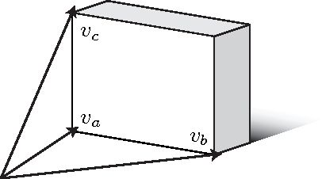

# 论文中的10张图

Generalized Perspective Projection
Copyright © 2008–2013 — Robert Kooima

# Introduction
Perspective projection is a well-understood aspect of 3D graphics. It is not something that 3D programmers spend much time thinking about. Most OpenGL applications simply select a field of view, specify near and far clipping plane distances, and call gluPerspective or glFrustum. These functions suffice in the vast majority of cases.
透视矩阵是3D图形中很好理解的。不是3D 程序员需要花费时间立即的，大多数OpenGL应用只选择一个视口FOV，声明近平面和远平面距离，然后调用gluPerspective 或是glFrustum。这些方法满足绝大多数情况。

But there are a few assumptions implicit in these. gluPerspective assumes that the user is positioned directly in front of the screen, facing perpendicular to it, and looking at the center of it. glFrustum generalizes the position of the view point, but still assumes a perspective rooted at the origin and a screen lying in the XY plane.
但这其中存在一些假设。gluPerspective 假定用户是在屏幕前方位置，垂直看向屏幕，并且是看向中间。glFrustum 形成观察点的位置，但是 仍然假定一个透视图基于起点和屏幕基于XY平面。

The configuration of the user and his screen seldom satisfy these criteria, but perspective projection remains believable in spite of this. Leonardo’s The Last Supper uses perspective, but still appears to be a painting of a room full of people regardless of the position from which you view it. Likewise, one can still enjoy a movie even when sitting off to the side of the theater.
用户和他的屏幕的配置很少满足这些要求,但是透视投影保持可信不管这个问题。

# Motivation
The field of Virtual Reality introduces circumstances under which these assumptions fail and the resulting incorrectness is not tolerable. VR involves a number complicating aspects: first-person motion-tracked perspective, stereoscopic viewing, and multi-screen, non-planar display surfaces. For example, here is the Varrier.

This technology was invented at the Electronic Visualization Laboratory (EVL) at the University of Illinois at Chicago. The Varrier installation pictured here was created at Calit2 on the campus of the University of California at San Diego. It is a 12×5 array of LCD screens arranged in a 180 degree arc, ten feet in diameter. Each LCD displays 1600×1200 pixels, with a parallax barrier affixed to the front, giving autostereoscopic viewing — 3D viewing without specialized 3D glasses. The display as a whole is driven by a cluster of sixteen Linux PCs, each with two GPUs, with four displays connected to each cluster node.

As is common in VR systems, a motion tracking system senses the position and orientation of the user’s head. This allows the 3D spatial positions of each of his eyes to be computed relative to the position of the display, which leads to the first-person tracked perspective aspect of VR. Here is a top-down view of the sixty-panel Varrier showing the coordinate system of the motion tracker.

The origin of the tracker coordinate system is on the floor at the center of the arc, the X axis points to the right, Y points up (out of this image), and Z points back. In the photo, I’m standing a bit right of center, and I’m 5’10’’, so my tracked head position is around (2.0, 5.8, 0.0).

To display a single coherent virtual environment, all sixty screens must define their projections in a common frame of reference. For convenience, we simply reuse the coordinate system above for this purpose. The positions of the corners of all sixty screens have been measured very precisely in this coordinate system using a digital theodolite. Given these positions, plus the tracked position of the user’s head, we can compute the positions of the user’s eyes, and thus the 120 distinct perspective projections necessary to render one scene consistently across the entire cluster.

Now, because the user is free to move about the space, the view position does not remain centered upon any of the screens and the gluPerspective function fails. Because the display wraps around the user, most screens do not lie in the XY plane and the glFrustum function fails. We must therefore formulate a more generalized perspective projection.

In the coming sections we will build up such a formulation from basic principles, mathematically, in stages. Our ultimate degree of generality will surpass even the needs of the Varrier. Following that, we will see the implementation of this more general approach to perspective projection in C using OpenGL. Finally, we will play with a very simple example which uses the generalized projection to render crossed-eye stereo pairs suitable for viewing on a normal 2D display.

# Formulation
The perspective projection is determined separately for each screen-eye pair, so we need only consider a single screen being viewed by a single eye.

Here we see one display screen. The important characteristics are the screen corners pa at the lower left, pb at the lower right, and pc at the upper left. Together, these points encode the size of the screen, its aspect ratio, and its position and orientation in the user’s space.

We can use these three points to compute an orthornormal basis for the screen’s local coordinate system. Recall from linear algebra class that an orthonormal basis for a 3D space is a set of three vectors, each of which is perpendicular to the others, and all of which have a length of one. In screen space, we refer to these vectors as vr, the vector toward the right, vu, the vector pointing up, and vn, the vector normal to the screen (pointing directly out of it.)

Just as the standard axes X, Y, and Z give us an orthonormal basis for describing points relative to the origin of 3D Cartesian space, the screen-local axes vr, vu, and vn give us a basis for describing points relative to the screen. We compute these from the screen corners as follows:

## On-axis perspective
Now we begin to consider the position of the user’s eye relative to the screen. This image shows an eye position pe.

In this specific example, the eye is centered on the screen. The line drawn perpendicular to the screen along vn strikes it directly in the middle. We refer that point of intersection as the screen-space origin. This coincides with the origin of the screen-space vector basis depicted above.

Also in this example, the pyramid-shaped volume, or “frustum,” having the screen as its base and the eye as its apex is perfectly symmetric. This is exactly the type of perspective projection producted by gluPerspective.

## Off-axis perspective
If we move the eye position away from the center of the screen, we find ourselves in a situation like this:

The frustum is no longer symmetric, and the line from the eye drawn along vn no longer strikes the screen in the middle. We defined the screen-space origin to be this point of intersection, and we continue to do so, thus we see that when the user moves then the screen-space origin moves with him.

This is where glFrustum comes in. As documented, this function takes parameters giving the left, right, bottom, and top frustum extents, plus distances to the near and far clipping planes. We will refer to these as variables l, r, b, t, n, and f respectively. The first four frustum extent variables may be understood as user-space distances from the screen-space origin to the respective edges of the screen, like this:

In this example, l and b are negative numbers, while r and t are positive numbers, but this need not be the case. If the user moves far to the side of the screen, then the screen space origin may not fall within the screen at all, and any of these parameters may be positive or negative. In the opposite extreme, an on-axis perspective (above) will have l = r and b = t.

## Determining frustum extents
Before we may use these values, we must compute them. As an intermediate step, we will need to know the vectors from the eye position pe to the screen corners.

These vectors are trivially computed as follows:

It is also useful to know a bit more about the screen-space origin. In particular, let d be the distance from the eye position pe to the screen-space origin. This also happens to be the length of the shortest path from the eye to the plane of the screen. This value may be computed by taking the dot product of the screen normal vn with any of the screen vectors. Because these vectors point in opposite directions, the value must be negated.

Given this, frustum extents may be computed. Take the frustum right extent r for example. When we take the dot product of the unit vector vr (which points from the screen origin toward the right) with the non-unit vector vb (which points from the eye to the right-most point on the screen) the result is a scalar value telling us how far to the right of the screen origin the right-most point on the screen is.

Because frustum extents are specified at the near plane, we use similar triangles to scale this distance back from its value at the screen, d units away, to its value at the near clipping plane, n units away.

The OpenGL function glFrustum inserts these values into the standard 3D perspective projection matrix using this definition:

This matrix is clever, and it is worth examining in order to form an intuitive understanding of its function. Perspective projection involves foreshortening. The greater the distance to an object, the smaller that object appears. To accomplish this, the x and y components of a vertex are divided by its z component.

This division is implemented using homogeneous coordinates. A homogeneous 3D vector has four components, (x, y, z, w), where w defaults to 1. This implicitly defines the 3D vector (x/w, y/w, z/w). Notice the third component of the bottom row of P is –1. When P is multiplied by a homogeneous vector, this –1 has the effect of moving the vector’s (negated) z value into the resulting homogeneous vector’s w component. Later, when this result vector is collapsed down to its equivalent 3D vector, the division by z implicitly occurs. This trick is the very basis of 3D computer graphics, and its importance cannot be overstated.

Unfortunately, this formulation means that the foreshortening effect, and thus perspective projection, only works when the view position is at the origin, looking down the negative Z axis, with the view plane aligned with the XY plane. The foreshortening scaling occurs radially about the Z axis. It is useful to understand these limitations and their source, as we’ll need to work past all three.

## Take a deep breath
Let’s take a step back and see where we are. We’ve started with basic constants defining the position of a screen in space pa, pb, and pc along with the position of an eye in space pe. We’ve developed formulas allowing us to compute from these the parameters of a standard 3D perspective projection matrix l, r, b, and t.

It’s a good start, and it’s useful when developing single-screen applications with user-centered perspective. But we haven’t seen anything more powerful than glFrustum yet. While we have the ability to create a frustum for an arbitrary screen viewed by an arbitrary eye, the base of that frustum still lies in the XY plane. If we applied this amount of knowledge to the Varrier, then all sixty screens would display nearly the same limited view of the virtual scene. We need two more capabilities: first we need to rotate the screen out of the XY plane, and second we need to correctly position it relative to the user.

## Projection plane orientation
We would like to rotate our XY-aligned frustum within the user space. We may do this with a simple matrix multiplication. It is more intuitive if we instead consider rotating the user space to be aligned with the XY plane.

Let’s review a bit more linear algebra. Define a 4×4 linear transformation matrix M using the screen space basis vectors vr, vu, and vn as columns, like so:

This is the transformation matrix for screen-local coordinates. It maps the Cartesian coordinate system onto the screen space coordinate system, transforming the standard axes X, Y, and Z into the basis vectors vr, vu, and vn. If something is lying in the XY plane, then this transformation matrix M will realign it to lie in the plane of the screen.

This is extremely useful in 3D graphics. A 3D model is created by an artist in its own coordinate system, with its own local orientation. To position such an object in a scene, a transformation such as this M is used. The column basis construction allows the programmer to orient the object in terms of the concepts “to the right,” “up,” and “backward” instead of fumbling with Euler angles, pitch, roll, and yaw.

Unfortunately, this is the exact opposite of what we want. We want something lying in the plane of the screen to be realigned to lie in the XY plane, so that we may apply the standard perspective projection to it. We need this mapping:

This mapping is produced by the inverse of M. Fortunately, M is an orthogonal rotation, so its inverse is simply its transpose, and we can produce the desired transform simply by loading the screen space basis vectors into M as rows instead of as columns.

We compose the perspective projection matrix P defined above with this matrix MT and we finally have something more powerful than glFrustum. We have a perspective projection that relaxes the projection plane alignment requirement. But we’re not quite finished yet.

## View point offset
The nature of the camera is one of the fundamentally confusing aspects of 3D computer graphics. Consider camera motion. While we would like to imagine that we are free to move the camera freely about 3D space, the mathematics of perspective projection as defined by matrix P disallow this. (Recall, above, the nature of the foreshortening division by z.)

The camera is forever trapped at the origin. If we wish to move the camera five units to the left, we must instead move the entire world five units to the right. If we wish to rotate the camera clockwise, we must instead rotate the world counterclockwise.

Above, when we wanted to rotate our frustum to align it within our user space, we instead rotated our user space backwards to align it with our frustum. Similarly now, we want to move our frustum to position the apex upon the motion-tracked eye position, so we instead must translate our tracked eye position to the apex of the frustum. The apex of the perspective frustum is necessarily at zero, thus we translate along the vector from the eye.

This can be accomplished using the OpenGL function glTranslatef, which applies the standard 3D transformation matrix:

## The composition of everything
That covers everything we need. We can compose these three matrices giving a single projection matrix, sufficiently general to accomplish all of our goals.

Beginning with constant screen corners pa, pb, pc, and varying eye position pe, we can straightforwardly produce a projection matrix that will work under all circumstances. Most significantly, an arbitrary number of arbitrarily-oriented screens may be defined together in a common coordinate system, and the resulting projection matrices will present these disjointed screen as a single, coherent view into a virtual environment.

# Implementation
The following C function computes this perspective matrix and applies it to the OpenGL projection matrix stack. It takes four float vectors, pa, pb, pc, pe, which are the screen corner positions and the eye position as defined above, plus n and f which are the near and far plane distances, identical to those passed to gluPerspective or glFrustum.

This function uses four vector operations: subtract, dot_product, cross_product, and normalize, which are not listed here. In all likelyhood, you already have a library containing functions performing the same tasks.

All variables defined in this function have the same names as in the description above. Note that this function is not optimized. The screen space basis vectors, vr, vu, and vn may be precomputed and stored per screen, as may be the screen-space basis matrix M which uses them.

void projection(const float *pa,
const float *pb,
const float *pc,
const float *pe, float n, float f)
{
float va[3], vb[3], vc[3];
float vr[3], vu[3], vn[3];

float l, r, b, t, d, M[16];

// Compute an orthonormal basis for the screen.

subtract(vr, pb, pa);
subtract(vu, pc, pa);

normalize(vr);
normalize(vu);
cross_product(vn, vr, vu);
normalize(vn);

// Compute the screen corner vectors.

subtract(va, pa, pe);
subtract(vb, pb, pe);
subtract(vc, pc, pe);

// Find the distance from the eye to screen plane.

d = -dot_product(va, vn);

// Find the extent of the perpendicular projection.

l = dot_product(vr, va) * n / d;
r = dot_product(vr, vb) * n / d;
b = dot_product(vu, va) * n / d;
t = dot_product(vu, vc) * n / d;

// Load the perpendicular projection.

glMatrixMode(GL_PROJECTION);
glLoadIdentity();
glFrustum(l, r, b, t, n, f);

// Rotate the projection to be non-perpendicular.

memset(M, 0, 16 * sizeof (float));

M[0] = vr[0]; M[4] = vr[1]; M[ 8] = vr[2];
M[1] = vu[0]; M[5] = vu[1]; M[ 9] = vu[2];
M[2] = vn[0]; M[6] = vn[1]; M[10] = vn[2];

M[15] = 1.0f;

glMultMatrixf(M);

// Move the apex of the frustum to the origin.

glTranslatef(-pe[0], -pe[1], -pe[2]);

glMatrixMode(GL_MODELVIEW);

}

Some may wonder why I’ve applied the glMultMatrixf and glTranslatef to the OpenGL projection matrix rather than the model-view matrix. It would work either way. I feel the use of the projection matrix lends the implementation better encapsulation. Applications may use it as a drop-in replacement for the standard perspective functions without worrying about smashing a valuable model-view stack with a later glLoadIdentity, as is a very common practice.

This distinction is even wider when you consider the OpenGL 3.0 forward compatible and OpenGL ES 2.0 programming models. Both of these APIs do away with the matrix stacks entirely. Applications that use them must construct their projection matrices on the CPU and upload them to vertex shader uniforms on the GPU. By composing the screen-space orientation and eye position translation matrices with the perspective projection on the CPU, the vertex shader need not concern itself with the nature of the projection.

# Example
To make this discussion as concrete as possible, we look at a specific example. A full-fledged multi-screen implementation like the Varrier would be beyond the scope of this document, given that a great deal of supporting software is necessary before we can even begin. For this reason, we consider a simple stereo pair renderer.

The following image shows the example output. To view this image properly, cross your eyes such that your right eye focuses upon the left image, and your left eye focuses upon the right image. If the image is scaled so that each of the two rectangles is 3’’ wide, and viewed from a distance of 18’‘, then the image of the teapot should appear to hover 2’’ in front of the screen.

Stereo rendering is an excellent application of this projection function, because many stereo application implementors do it wrong. Some applications offset the eyes horizontally but leave the view axes parallel. Some introduce a simple “toe-in” rotation without accounting for the off-axis perspectives. Neither of these approaches cause the left-eye and right-eye projection rectangles to coincide in virtual space, as they should.

The generalized perspective projection formulation allows you to do it correctly and automatically. You need only select one set of screen corners and a pair of eye positions, and the projection function produces a correctly skewed projection.

This image shows a top-down view of the virtual scene depicted by the teapot example. The eyes are positioned near the origin, offset using an average interocular distance of 2.5’‘. The teapot model is positioned at z=–16’‘, and the screen is at z=–18’‘. The image plane is defined to be 3’’ wide and 1.5’’ high. In summary, the screen corners are

The left and right eye positions are

# Extended Capabilities
As suggested in the motivation, this perspective function has generality beyond what is commonly needed. In particular, screens may have arbitrary orientation. They may even be rotated, installed upside down, laid flat on the floor, or hung from the ceiling. This makes the approach applicable to CAVE-like projector-based installations. The only requirement is that pa describe the screen’s structural lower left corner, rather its spatial lower left corner. (And so with pb and pc.)

Also note that the ostensibly rectangular screen is configured using only three points. The position of the fourth point is implicit. The formulation discussion refers to the screen-space basis (vr, vu, vn) as “orthonormal,” and the implementation does normalize it, but does not orthonormalize it. Thus, the configuration is free to introduce a skew transform, in addition to the screen-orientating rotation transform. I have never seen a circumstance where this is useful. If you ever find a rhombic display, let me know!

# Conclusion
This has been a rather lengthy document describing a fairly brief bit of code. By discussing it in detail, I hope to convey a thorough understanding of its function, correctness, and usefulness. This code has found use in several virtual reality research projects at EVL and elsewhere, and its value to us has been great. I hope you find it useful as well.
————————————————

                            版权声明：本文为博主原创文章，遵循 CC 4.0 BY-SA 版权协议，转载请附上原文出处链接和本声明。
                        
原文链接：https://blog.csdn.net/mrleoli/article/details/81114207

# 其他材料

VR Developer Gems

https://github.com/aug618/VR-on-2D
https://shopify.github.io/spatial-commerce-projects/WonkaVision/
https://medium.com/try-creative-tech/off-axis-projection-in-unity-1572d826541e 论文unity实现

https://edom18.medium.com/implementation-of-generalized-perspective-projection-on-the-unity-c9472a94f083

https://learnwebgl.brown37.net/08_projections/projections_perspective.html 
对于理解投影矩阵及焦点很有帮助
1. 焦点的作用应该在大多数引擎里就是确定view变换的
2. 远近投影平面到相机位置构成视椎体，这俩平面可以随意移动，只是裁剪范围不同，depth精度不同，别的没有
3. 近裁剪面跟焦点位置无关
4. view坐标系永远都是z轴由焦点指向相机位置。on-axis投影时，view坐标系正好在视椎体中间；off-axis投影时，视椎体是斜的

# 项目
1. 坐标系还是那些 model view projection world
2. 离轴透视投影论文，ProjectionPlaneOrientationMatrix，使得投影方向可以不是正对着屏幕，而是可以从任意方向看(投影)过去
3. 离轴透视投影中的vpex定点偏移放到了view transform里
4. 离轴透视投影需要屏幕的世界坐标(从而计算投影平面方向)，输入了屏幕的高度作为固定参数,单位mm
	  const float localScreenZ = 500.0;//这个可能是经验参数，其实就是确定一个局部坐标系，真正多少不重要总能转到世界坐标系下
    const float screenWidth = 698.0;
    const float screenHeight = 393.0;//这个可能是量出来的
    const float eyeDistance = 64.0

	以显示器平面建立显示器坐标系，左右为x，上下为y，屏幕往外为z，屏幕中心为(0,0,-localScreenZ)，也就是坐标系原点在屏幕中心往外localScreenZ距离的地方
	这个显示器平面实际计算的时候是按照viewport的宽高比来计算的，固定高度，求得宽度
	这个坐标系在代码里称为  本地local坐标系

5. 显示器坐标系到世界坐标系的转换
   要想从局部显示器坐标系得到屏幕世界坐标，需要一个变换矩阵，这个矩阵就是rigTransform，他的计算是通过求所有actor的包围球，得到半径radius，再根据HorizontalViewAngle得到距离distance，从包围球中心沿着屏幕坐标系z方向移动disntance距离，就是rigPosition(世界坐标系下)位置。

   坐标轴方向的确定:
   通用的是camera到focal point作为投影方向，up right指定，从而确定view matrix
   mou的投影方向改为rigPosition到focal point,再根据指定的up right计算得到rigTransform，
  **效果就是沿着camera position--focal point--rigPosition构造的平面，旋转到rigPosition方向，在世界坐标系下可能是斜的**

   猜测:是不是不用改这么多，直接添加一个显示器坐标系到相机坐标系的变换矩阵就搞定了啊?
   不对，应该只是解决了一个坐标转换的问题，还是无法输入两眼坐标

6. 裸眼3d显示器，双目立体显示器，左右眼看到的图像不一样，通过左右眼看到的图像差异，人脑可以感知到深度信息，从而感知到3d效果，需要实时追踪左右眼位置，也就是眼追模块，眼追模块也有一个坐标系。根据代码推测，眼追坐标系在显示器的平面上，左右为x，上下为y，屏幕往外为z，屏幕中心就是眼追坐标系原点
   
   眼追坐标系到显示器坐标系的变换，就是在z轴方向进行平移
   rig->setLocalEyePosition(
            camPos.lCamxFiltered, 
            camPos.lCamyFiltered, 
            camPos.lCamzFiltered - rig->localScreenZ,//左眼位置，local坐标系，显示器坐标系
            camPos.rCamxFiltered,
            camPos.rCamyFiltered,
            camPos.rCamzFiltered - rig->localScreenZ//右眼位置
          );

7. 通过眼追坐标，实时修改ProjectionPlaneOrientationMatrix，你眼动了，转变成屏幕被扭到了某个方向
