$\underline{\text{下划线}}$

OpenGL的参考资料

	glspec
	编程指南
	glslspec
	learnopengl
	ogldev

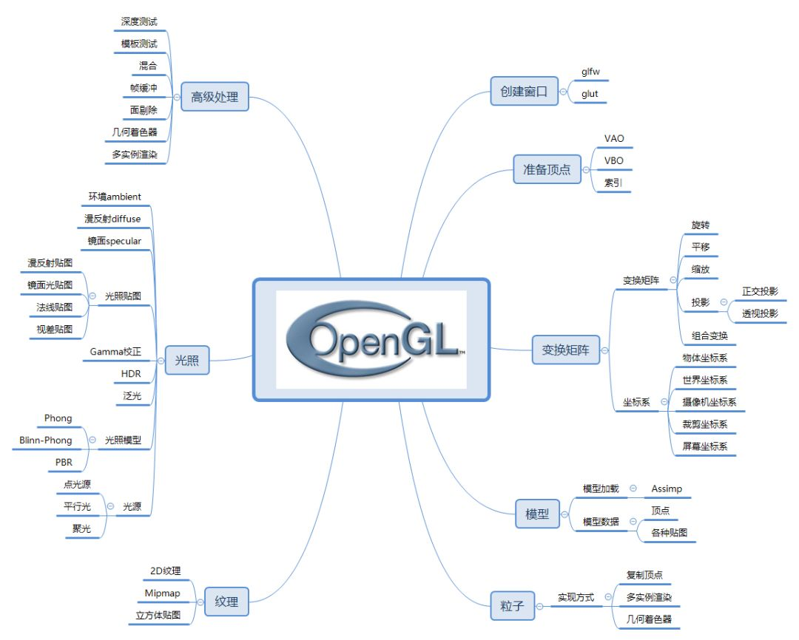 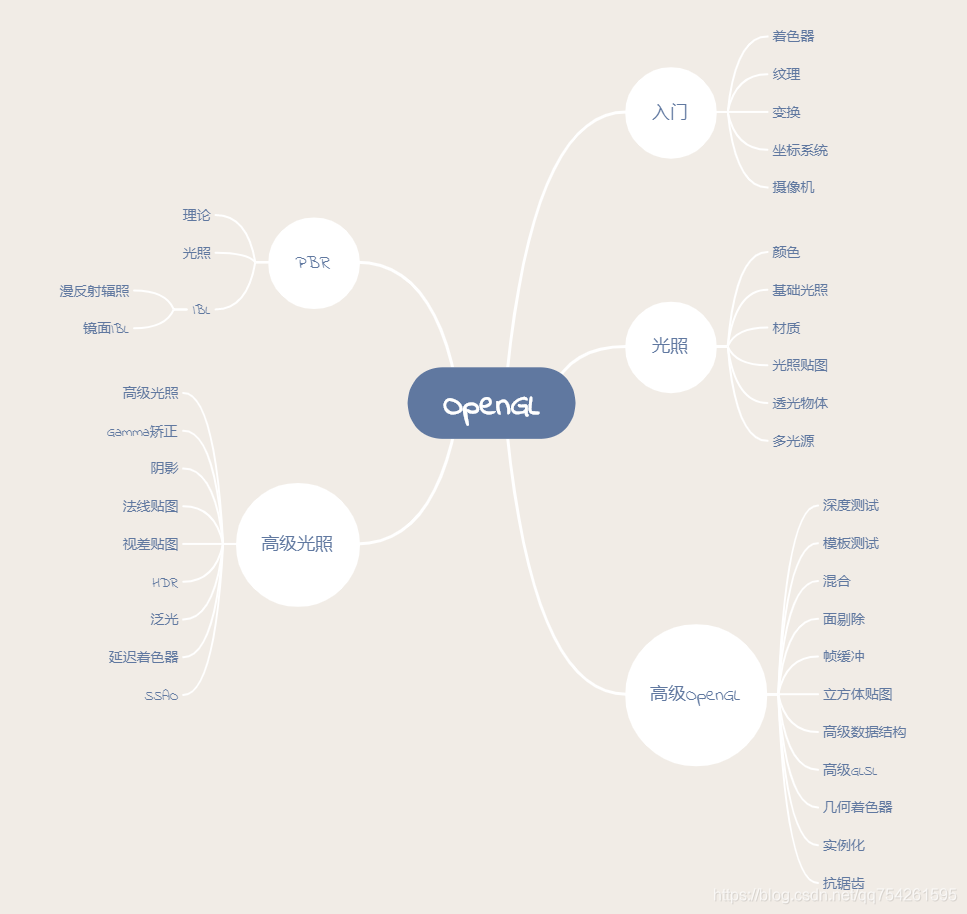

# Pipeline


Once initiated, the pipeline operates in the following order:

1. Vertex Processing:处理的是一个一个的顶点数据
	1. Each vertex retrieved from the vertex arrays (as defined by the VAO) is acted upon by a Vertex Shader. Each vertex in the stream is processed in turn into an output vertex.
	2. Optional primitive tessellation stages.处理组成一个图元的顶点集合,也是处理的顶点,只不过根据图元分组了
	3. Optional Geometry Shader primitive processing. The output is a sequence of primitives.处理组成一个图元的顶点集合,也是处理的顶点,只不过根据图元分组了. 可以增加删除顶点,修改顶点的图元类型. 对于简单且重复的图元是个很好的优化(例如大量草地 简单房屋等, 爆破效果(顶点沿着法线方向进行一定平移))
2. Vertex Post-Processing, the outputs of the last stage are adjusted or shipped to different locations.
	1. Transform Feedback happens here.
	2. Primitive Assembly.
   		
		The purpose of the primitive assembly step is to convert a vertex stream into a sequence of base primitives. For example, a primitive which is a line list of 12 vertices needs to generate 11 line base primitives.把前面阶段输出的顶点数据流转换成基本图元序列

	3. Primitive Clipping, the perspective divide, and the viewport transform to window space.
3. Scan conversion and primitive parameter interpolation, which generates a number of Fragments.扫描线算法进行光栅化处理
4. A Fragment Shader processes each fragment. Each fragment generates a number of outputs.
5. Per-Sample_Processing, including but not limited to:
	Scissor Test
	Stencil Test
	Depth Test
	Blending
	Logical Operation
	Write Mask


# Transformation
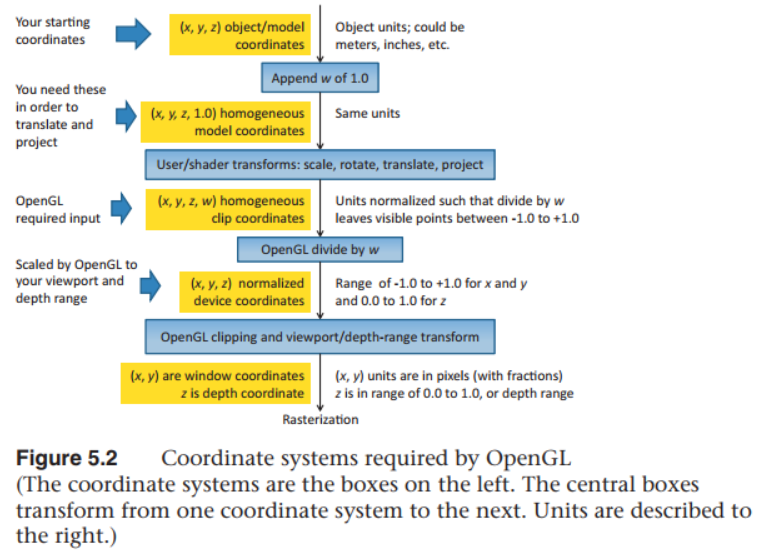这个图包括了逐顶点的mvp坐标变换,还包括了顶点后处理中图元装配之后的裁剪 NDC(透视除法) 视口变换
1. 可以改变传入数据的行\列主元,但shader是列主元的读取的(不可改变)
2. model space-->world space-->eye space-->clipping space-->ndc space-->window space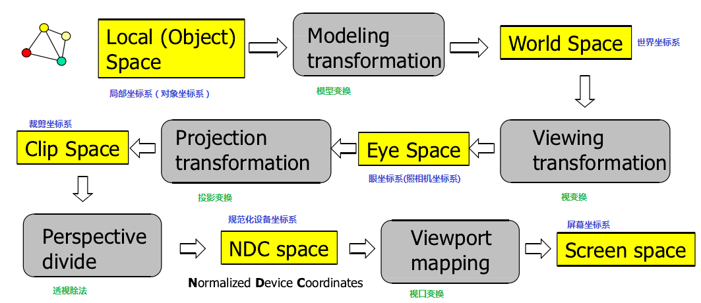
   投影矩阵得到裁剪坐标,近裁剪面 远裁剪面,坐标范围是[-1 1],z轴反向了
   进行透视除法(opengl固定功能)得到NDC,再进行视口变换(一个线性映射)
3. 缩放 旋转 平移都是可逆矩阵,缩放的逆变换是1/scale,旋转的逆变换就是它的转置矩阵,平移的逆变换是它的相反数
4. 三种变换都是针对坐标原点进行的,更准确的说是针对上一步的坐标系的原点,一般先在物体坐标系下进行缩放,然后旋转最后平移,这样一般是想要的结果,如果最后缩放,此时缩放的坐标轴跟物体的坐标轴不一样,缩放出来的可能完全不是你想要的
5. 针对任意轴的旋转或者缩放,应该先平移到原点,旋转\缩放完后,再平移回来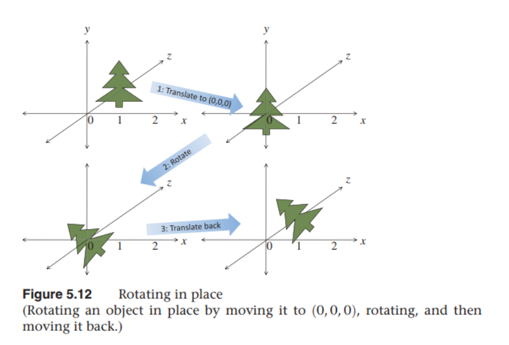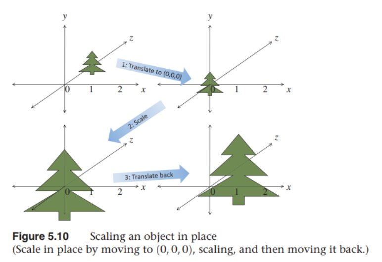
6. **坐标系A到B的变换,就是B在A中的表示**.
   1. 对于旋转来说,是target坐标系的axis(或者单位轴的端点)在source坐标系下的表示,(采用列向量的表示方式)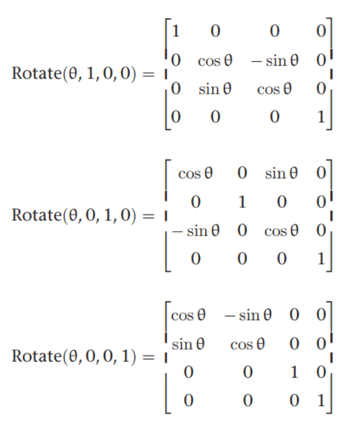,
   2. 对于缩放来说,也是target坐标系的坐标轴在source坐标系下的表示,如1变成3
   3. ~~对于平移来说,则是target坐标系的原点在source坐标系下的表示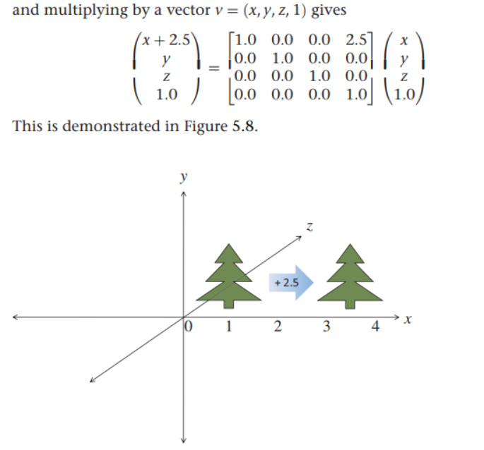，变换的数学表示就是从source原点指向target原点的向量，也就是source坐标系原点移动到(tx,ty,tz),也就是source到target的变换~~ 某个点从原来的坐标系下的(tx,ty,tz)移动到新的坐标系下的(0,0,0),变换数学表达上是(0,0,0)=(tx,ty,tz)+T,所以T=-(tx,ty,tz),这个是肯定对的.形式上，平移可以认为是target(tx,ty,tx)点变换到了(0,0,0),也就是从target指向(0,0,0)的向量，也就是-(tx,ty,tx),也符合target到原点的变换，就是原点在target坐标系下的表示，不是那么直观.
7. 点(x,y,z,1)向量(dx,dy,dz,0)
8. 旋转是绕当前坐标系的原点进行的(因为是绕某个向量旋转，这个向量一定是从当前坐标系的原点出发的),如果想要绕某个点进行旋转,可以先平移到该点(或者说叫当前坐标系的原点移动到该点，也叫translate this point to origin，vtk的注释,得到新的坐标系),旋转后再平移回来,这就是vtk azimuth elevation的代码原理
9. **法向量的变换不同于点的变换**,假设v n,经过变换M,得到v'=M*v;有nt*v=0-->n转置x(M逆)xMxv=0-->n转置x(M逆)xv'=0,又n'转置xv'=0
   所以n'转置=n转置x(M逆)-->n'=(M逆的转置)xn
10. 投影矩阵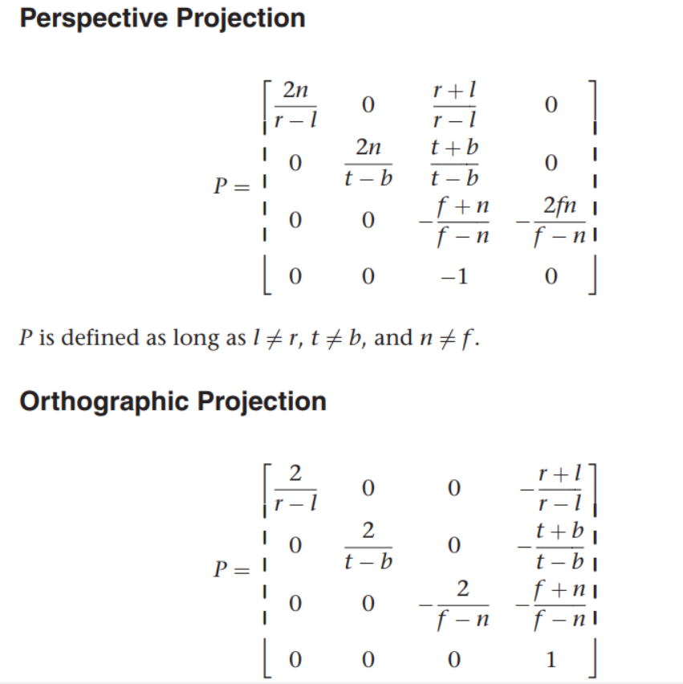 正交投影就是一个视景体的线性映射变换(缩放+平移), 透视投影推导见http://www.songho.ca/opengl/gl_projectionmatrix.html  
11. glDepthRange指定近/远裁剪面
12. 管线中矩阵变换多次都是由缩放+平移组成,比如投影矩阵 NDC变换 视口变换等,是有一个统一的公式的.
    
		缩放前坐标范围Xmin Xmax,缩放平移后坐标范围xmin xmax,求缩放前X坐标对应的缩放平移坐标x
		len = xmax-xmin;Len=Xmax-Xmin;L=X-Xmin;缩放前后点到起始坐标Xmin的距离占整体的比例不变,是L/Len--->映射到新坐标系后距离新起点的距离l=L/Len *len--->新坐标系下的坐标x=l*(xmax-xmin)+xmin
13. glTranslate glRotate glScale等函数,都是针对当前坐标系进行的变换
14. glOrhto是设置正交投影矩阵，glFrustum是设置透视投影矩阵,glOrtho的参数是left right bottom top near far,glFrustum的参数是left right bottom top near far
    gluPerspective是设置透视投影矩阵,参数是fovy aspect near far,fovy是视景体竖直方向上的张角,aspect是视景体宽高比,near far是视景体近远裁剪面
15. 透视投影是on-axis projection, off-axis projection用于VR场景, 屏幕也作为一个模型放置在场景中
    1.  有屏幕的pa pb pc以及眼镜的pe，都是世界坐标
    2.  得到屏幕的模型空间的坐标系vr=pb-pa vu=pc-pb vn=vr叉vu
    3.  眼睛沿vn反向与屏幕模型的交点，作为屏幕模型坐标系的原点，得到新的坐标系<每个eye-screen对都有自己的原点>,d是眼睛到屏幕的距离
    4.  va = pe - pa, vb = pe - pb, vc = pe - pc,得到眼睛到屏幕模型角点的向量
    5.  在屏幕坐标系下得到，根据透视的相似三角形，求得近裁剪面n上的l r b t
        1.  l = dot_product(vr, va) * n / d;
        2.  r = dot_product(vr, vb) * n / d;
        3.  b = dot_product(vu, va) * n / d;
        4.  t = dot_product(vu, vc) * n / d;
    6. glFrustum(l, r, b, t, n, f)就是屏幕坐标系下的垂直透视投影矩阵
    7. 再glRotate变换到世界坐标系同方向的坐标系下的斜透视投影矩阵
    8. 再glTranslate(-pe[0], -pe[1], -pe[2])变换到世界坐标系下的原点，这个有点疑问是眼睛坐标系还是世界坐标系啊？理论上应该是眼睛坐标系，因为投影是在camera下进行的
16. view矩阵的z轴是从焦点指向相机位置，投影方向是从相机位置指向焦点，正好相反 ViewPlaneNormal == -DirectionOfProjection,以相机为原点,z轴是指定的，xy是根据up right计算出来的
## 投影矩阵推导
无论是正交投影还是透视投影,其实变换矩阵的目的都是将view坐标系下的坐标转换到NDC[-1 1]空间,这个过程分解成了投影+透视除法两步,也就产生了(xe,ye,ze,1.0)-->(xp,yp,zp,wp)-->(xn,yn,zn,1.0)三种坐标

只不过正交投影时,投影坐标(xp,yp,zp,wp)就是view坐标系下的(xe,ye,ze,1.0)  xp=xe

透视投影的(xp,yp,zp,wp),xp!=xe,根据视景体的俯视图 侧视图画出相似三角形,有以下公式
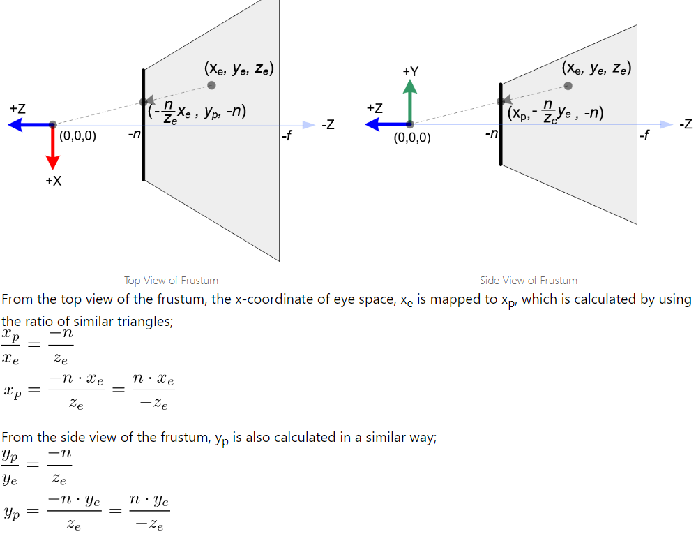

根据以下公式

将投影坐标映射到NDC,可以看到y=ax+b,a b就是正交投影的变换矩阵

在此基础上,再将xp=f(xe)带入,提出-1/ze(正是提出同类项,将剩余的作为裁剪或者投影坐标,才导致本来要归一化到NDC的坐标现在不是归一化了-->(-ze ze),进而产生了后序除以w也就是-ze的归一化步骤),投影矩阵第四行设为0 0 -1 0从而保存了每个顶点的ze坐标,等待后序透视除法,进而产生了z-fighting
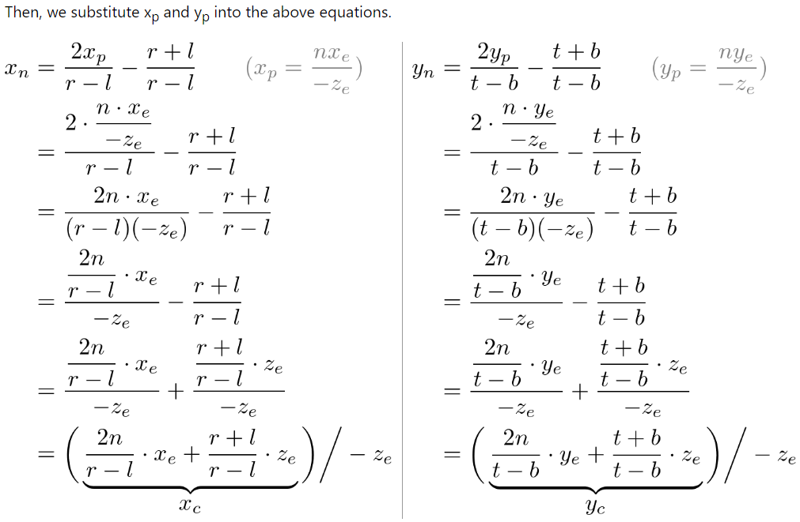

zn坐标的变换,已知与xe ye无关,直接第三行0 0 A B,然后映射到-1 1
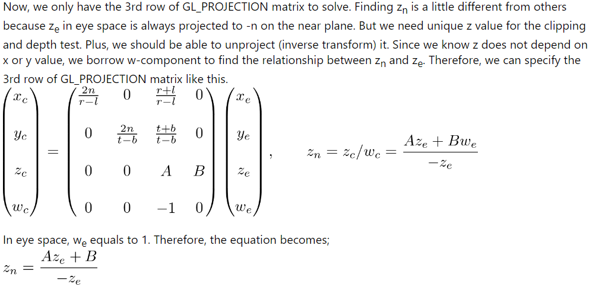

## VTK相关
1. vtkTransform的pre post是指，新的变换T(vtkTransform对象)相对于当前变换M(vtkTransform对象)，是先作用于点或向量(pre)，还是后作用于点或向量(post)

pre就是先执行新变换，再执行旧变换Mnew = Mold * T
post就是先执行旧变换，再执行新变换Mnew = T * Mold

vtkTransform的InternalUpdate && vtkTransformConcatenation::Concatenate(const double elements[16]) 能看出来本质
vtkTransform::InternalUpdate()
{
	....

  // concatenate PreTransforms
  for (i = nPreTransforms - 1; i >= 0; i--)
  {
    vtkHomogeneousTransform* transform =
      static_cast<vtkHomogeneousTransform*>(this->Concatenation->GetTransform(i));
    vtkMatrix4x4::Multiply4x4(this->Matrix, transform->GetMatrix(), this->Matrix);
  }

  // concatenate PostTransforms
  for (i = nPreTransforms; i < nTransforms; i++)
  {
    vtkHomogeneousTransform* transform =
      static_cast<vtkHomogeneousTransform*>(this->Concatenation->GetTransform(i));
    vtkMatrix4x4::Multiply4x4(transform->GetMatrix(), this->Matrix, this->Matrix);
  }


	....
}

2. vtkTransform的Concatenation有两种形式，
   1. Concatenate(const double elements[16])，不增加vtkTranform对象，仅仅是针对当前vtkTransform对象进行vtkMatrix的乘法运算，本质是改了当前vtkTransform对象的Matrix值
   2. Concatenate(vtkAbstractTransform* trans)，新增一个vtkTransform对象，并添加到Concatenation的list中
3. vtkTransform默认是pre的
4. pre1 pre2 pre3 pre4 post1 post2 post3 post4 这八个vtkTransform对象连起来就是**post4 x post3 x post2 x post1 x M x pre1 x pre2 x pre3 x pre4 x vec**
5. 由item2可知
    1. vtkNew<vtkTransform> transform1b;
		transform1b->PostMultiply();
		transform1b->Translate(10.0, 0.0, 0.0);
		transform1b->RotateZ(40.0);
		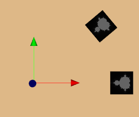
	2. 上面变换等价于
       vtkNew<vtkTransform> transform1b;
		transform1b->PreMultiply();
		transform1b->RotateZ(40.0);
		transform1b->Translate(10.0, 0.0, 0.0);
	3. 另一种变换顺序
        vtkNew<vtkTransform> transform1b;
		transform1b->PreMultiply();
		transform1b->Translate(10.0, 0.0, 0.0);
		transform1b->RotateZ(40.0);
		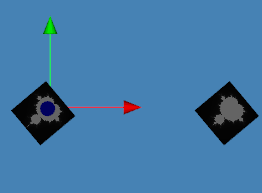
6. vtkTransform的piepline是通过SetInput连接的，这个不同于Concatenation，是改变了该vtkTransform对象初始矩阵，即八个连续变换公式中的M初始矩阵
   vtkNew<vtkTransform> transform1b;
  transform1b->PostMultiply();
  transform1b->Translate(10.0, 0.0, 0.0);
  vtkNew<vtkTransform> transform1b2;
  // transform1b2->PostMultiply();
  transform1b2->SetInput(transform1b);
  transform1b2->RotateZ(40.0);
  actor1b->SetUserTransform(transform1b2);
   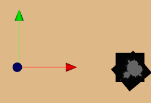在平移完的坐标系基础上进行旋转,其实也没改坐标系，还是前后的顺序问题，跟OpenGL的旋转平移顺序一样

	圆柱看不出来，用cow来研究
	armTransform->Identity();//每次都在固定坐标系开始变换，注掉后则是每次在上一次的坐标系下变换
	比如,平移这么理解没问题，旋转似乎有问题
	armTransform->Translate(10.0, 0.0, 0.0);//先在初始坐标系下沿X轴右移10，初始坐标系C0原点右移到x=10，得到右移坐标系C1
	armtransform->Translate(10.0, 0.0, 0.0);//再在平移后的坐标系C1下沿X轴右移10，C1的原点平移到C1中的x=10，初始坐标系原点C0右移到C0中的x=20
	
变换肯定是相对于上一次的坐标系,因为如果这个变换作用到点上之后，这个坐标点就变了，再接着进行其他的变换

旋转在任何情况下都是绕当前坐标系原点进行的

想绕物体中心点旋转，必须将物体移到当前坐标系原点，进行旋转，再平移回来
另一种理解就是，先把坐标系原点移动到物体中心，也就是坐标系变换到物体中心，在这个坐标系下进行旋转，再把坐标系由当前在物体中心点变换回旋转之前的原点，也就是把物体移回初始位置

平移A到B，变换就是从A指向B的向量

通过在原点的cow及平移了10的cow来验证vtk的pre/post以及绕物体自身中心旋转

vtk相对于OpenGL，只是多提供了一个矩阵左乘右乘的功能(OpenGL默认是pre)，数学原理及最终到opengl里的运算都没变

## DICOM坐标系

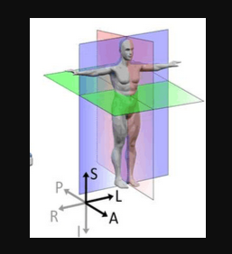

- 解剖学坐标系:基于人体解剖结构的固有坐标系，连续的物理空间，描述人体结构的位置
	三个观察位：冠 矢 轴
	六个指向:L-R A-P S-I
	 常见的有LPS RAS

- 患者坐标系:
  设备相关的三维笛卡尔坐标系，与扫描设备相关，固定于患者体位，描述患者相对于设备的位置及方向,所以能看出来有些人躺斜了，头歪了等等

- DICOM坐标系：
	(0020,0032) Image Position (Patient)：图像左上角在患者坐标系中的位置,就是vtk中的Origin
	(0020,0037) Image Orientation (Patient)：图像行/列方向的方向余弦
	(0028,0030) Pixel Spacing：像素物理间距 vtk中的spacing
	(0018,0050) Slice Thickness：切片厚度
	患者坐标系:在dicom标准中使用LPS右手系的解剖学坐标作为患者坐标系
	dicom坐标系,将患者坐标系称作参考系

	DICOM坐标系可能就是图像坐标系，或者有可能是原点在患者几何中心的LPS坐标系(平移得到图像坐标系)
	
- 图像坐标系:连续的物理坐标，包含spacing
	原点在图像左上角像素中心
	单位：毫米(mm)
	X轴：沿行方向 (从左到右)
	Y轴：沿列方向 (从上到下)
	Z轴：切片方向 (多切片时)
	
	// VTK 中的转换
	vtkImageData* image = reader->GetOutput();
	double origin[3]; // DICOM坐标系原点在患者坐标系中的位置
	double spacing[3]; // 物理间距
	image->GetOrigin(origin);
	image->GetSpacing(spacing);

	// 图像坐标 → 患者坐标
	/*
	这个其实不严谨，应该是患者坐标系与DICOM坐标系方向一致的情况
	更一般的情况应该是，
	先从图像坐标系乘上spacing得到DICOM坐标系，再乘上DICOM坐标系到患者坐标系的变换矩阵
	也就是origin的偏移以及(0020,0037) Image Orientation (Patient)的方向余弦矩阵
	MITK中的index2world实际应该是图像坐标到患者坐标系
	*/
	double patientX = origin[0] + imageX * spacing[0];
	double patientY = origin[1] + imageY * spacing[1];
	double patientZ = origin[2] + sliceIndex * spacing[2];

- 像素坐标系:离散的ijk值 像素索引
  	与图像坐标系关系:
	图像坐标X = (i + 0.5) * PixelSpacingX
	图像坐标Y = (j + 0.5) * PixelSpacingY
- 设备坐标系:CT MR等设备的坐标系，一般没啥用，可以认为跟患者坐标系重合
- 参考坐标系:dicom中的世界坐标系，或者说是到世界坐标系的一个中间坐标系，即解剖学坐标系/患者坐标系/设备坐标系

## VTK各坐标系的变换测试
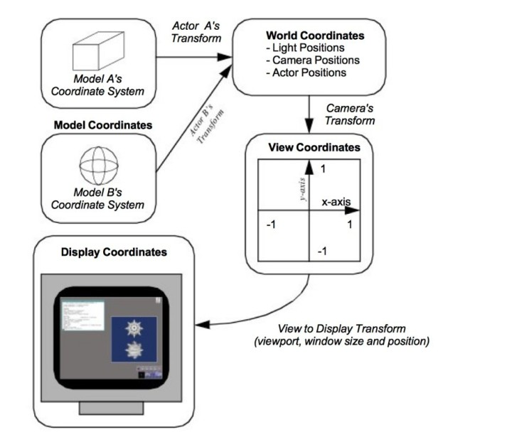
vtkRenderer 使用 vtkCamera里的MVP矩阵进行基本的坐标变换
vtkCoordinate使用vtkRenderer进行更多的坐标变换,进一步拆解了OpenGL的坐标系，添加了几个中间归一化的坐标系方便在UI上做一下渲染

#define VTK_DISPLAY 0
#define VTK_NORMALIZED_DISPLAY 1
#define VTK_VIEWPORT 2
#define VTK_NORMALIZED_VIEWPORT 3
#define VTK_VIEW 4
#define VTK_POSE 5
#define VTK_WORLD 6
#define VTK_USERDEFINED 7

* <PRE>
 *   DISPLAY -             x-y pixel values in window
 *      0, 0 is the lower left of the first pixel,
 *      size, size is the upper right of the last pixel
 *   NORMALIZED DISPLAY -  x-y (0,1) normalized values
 *      0, 0 is the lower left of the first pixel,
 *      1, 1 is the upper right of the last pixel
 *   VIEWPORT -            x-y pixel values in viewport
 *      0, 0 is the lower left of the first pixel,
 *      size, size is the upper right of the last pixel
 *   NORMALIZED VIEWPORT - x-y (0,1) normalized value in viewport
 *      0, 0 is the lower left of the first pixel,
 *      1, 1 is the upper right of the last pixel
 *   VIEW -                x-y-z (-1,1) values in pose coordinates. (z is depth) 应该是NDC坐标
 *   POSE -                world coords translated and rotated to the camera
 *                         position and view direction
 *   WORLD -               x-y-z global coordinate values
 *   USERDEFINED -         x-y-z in User defined space
 * </PRE>

void vtkRenderer::WorldToView(double& x, double& y, double& z)
{
  double view[4];

  // get the perspective transformation from the active camera
  if (!this->ActiveCamera)
  {
    vtkErrorMacro("WorldToView: no active camera, cannot compute world to view, returning 0,0,0");
    x = y = z = 0.0;
    return;
  }
  const auto& mat = this->GetCompositeProjectionTransformationMatrix();

  view[0] = x * mat[0] + y * mat[1] + z * mat[2] + mat[3];
  view[1] = x * mat[4] + y * mat[5] + z * mat[6] + mat[7];
  view[2] = x * mat[8] + y * mat[9] + z * mat[10] + mat[11];
  view[3] = x * mat[12] + y * mat[13] + z * mat[14] + mat[15];

//VTK里求一个屏幕坐标对应的世界坐标的时候，需要完整的坐标变换，因此透视除法也在矩阵之外单独加上了
  if (view[3] != 0.0)
  {
    x = view[0] / view[3];
    y = view[1] / view[3];
    z = view[2] / view[3];
  }
}

double* vtkCoordinate::GetComputedDoubleDisplayValue(vtkViewport* viewport)
{
  double val[3];

  // prevent infinite loops
  if (this->Computing)
  {
    return this->ComputedDoubleDisplayValue;
  }
  this->Computing = 1;

  val[0] = this->Value[0];
  val[1] = this->Value[1];
  val[2] = this->Value[2];

  // use our viewport if set
  if (this->Viewport)
  {
    viewport = this->Viewport;
  }

  // if viewport is nullptr, there is very little we can do
  if (viewport == nullptr)
  {
    // for DISPLAY and VIEWPORT just use the value
    if (this->CoordinateSystem == VTK_DISPLAY)
    {
      this->ComputedDoubleDisplayValue[0] = val[0];
      this->ComputedDoubleDisplayValue[1] = val[1];
      if (this->ReferenceCoordinate)
      {
        double* refValue = this->ReferenceCoordinate->GetComputedDoubleDisplayValue(viewport);
        this->ComputedDoubleDisplayValue[0] += refValue[0];
        this->ComputedDoubleDisplayValue[1] += refValue[1];
      }
    }
    else
    {
      this->ComputedDoubleDisplayValue[0] = static_cast<double>(VTK_INT_MAX);
      this->ComputedDoubleDisplayValue[1] = static_cast<double>(VTK_INT_MAX);

      vtkErrorMacro("Request for coordinate transformation without required viewport");
    }
    return this->ComputedDoubleDisplayValue;
  }

  // compute our DC
  switch (this->CoordinateSystem)
  {
    case VTK_WORLD:
      if (this->ReferenceCoordinate)
      {
        double* refValue = this->ReferenceCoordinate->GetComputedWorldValue(viewport);
        val[0] += refValue[0];
        val[1] += refValue[1];
        val[2] += refValue[2];
      }
      viewport->WorldToPose(val[0], val[1], val[2]);
      VTK_FALLTHROUGH;
    case VTK_POSE:
      viewport->PoseToView(val[0], val[1], val[2]);
      VTK_FALLTHROUGH;
    case VTK_VIEW:
      viewport->ViewToNormalizedViewport(val[0], val[1], val[2]);
      VTK_FALLTHROUGH;
    case VTK_NORMALIZED_VIEWPORT:
      viewport->NormalizedViewportToViewport(val[0], val[1]);
      VTK_FALLTHROUGH;
    case VTK_VIEWPORT:
      if ((this->CoordinateSystem == VTK_NORMALIZED_VIEWPORT ||
            this->CoordinateSystem == VTK_VIEWPORT) &&
        this->ReferenceCoordinate)
      {
        double* refValue = this->ReferenceCoordinate->GetComputedDoubleViewportValue(viewport);
        val[0] += refValue[0];
        val[1] += refValue[1];
      }
      viewport->ViewportToNormalizedDisplay(val[0], val[1]);
      VTK_FALLTHROUGH;
    case VTK_NORMALIZED_DISPLAY:
      viewport->NormalizedDisplayToDisplay(val[0], val[1]);
      break;
    case VTK_USERDEFINED:
      this->GetComputedUserDefinedValue(viewport);
      val[0] = this->ComputedUserDefinedValue[0];
      val[1] = this->ComputedUserDefinedValue[1];
      val[2] = this->ComputedUserDefinedValue[2];
      break;
  }
}


## 刚体旋转
刚体旋转有很多等价的表示方式

欧拉角:

	绕坐标轴旋转的表示,静态欧拉角,动态欧拉角,xyz,yzx, xyz等,对于动态欧拉角绕三个坐标轴旋转的情况,如果第二个旋转轴旋转+-90°,就会导致第三个轴与第一个轴重合,从而丢失了一个自由度,产生万向节锁, 
	欧拉角比较简单,但无法插值,有万向节锁问题

方向余弦矩阵:

	DCM,就是旋转矩阵,OpenGL就是用DCM

Rodrigues'旋转公式:
	
	向量绕任意向量旋转theta角的表示 
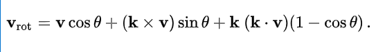

轴角表示:

	(theta, x,y,z)


四元数:不会产生万向节锁,且可以进行slerp,比较平滑

z-fighting:

	因为物体太近,浮点数精度有限,导致物体的depth不准确,甚至前后倒置

原因:
1. 两个物体相距太近
2. 显卡硬件配置低,或者depth buffer格式精度低
3. 透视除法加重影响

解决方法:
1. 调整物体位置,别让它们离得太近
2. 升级配置
3. polygon offset进行偏移

## 广义透视投影矩阵
Generalized Perspective Projection Matrix: 
默认的透视投影是camera在原点，正对着投影平面(屏幕)
推广后，投影平面可以任意摆放，也可以不在原点，只是多了两个变换，一个是把屏幕转到垂直位置，一个是把camera平移到原点

//摆正投影平面
void vtkCamera::ComputeScreenOrientationMatrix()
{
  if (this->ProjectionPlaneOrientationMatrix == nullptr)
  {
    // Compute the screen orientation matrix lazily, and only once.
    double vr[3] = { 0.0 };
    double vu[3] = { 0.0 };
    double vn[3] = { 0.0 };
    double screenDiag[3] = { 0 };

    for (int i = 0; i < 3; ++i)
    {
      vr[i] = this->ScreenBottomRight[i] - this->ScreenBottomLeft[i];
      vu[i] = this->ScreenTopRight[i] - this->ScreenBottomRight[i];

      this->ScreenCenter[i] = (this->ScreenBottomLeft[i] + this->ScreenTopRight[i]) / 2.0;
      screenDiag[i] = this->ScreenBottomLeft[i] - this->ScreenTopRight[i];
    }

    this->OffAxisClippingAdjustment = vtkMath::Norm(screenDiag);

    vtkMath::Normalize(vr);
    vtkMath::Normalize(vu);
    vtkMath::Cross(vr, vu, vn);
    vtkMath::Normalize(vn);

    this->ProjectionPlaneOrientationMatrix = vtkMatrix4x4::New();

    this->ProjectionPlaneOrientationMatrix->SetElement(0, 0, vr[0]);
    this->ProjectionPlaneOrientationMatrix->SetElement(0, 1, vr[1]);
    this->ProjectionPlaneOrientationMatrix->SetElement(0, 2, vr[2]);
    this->ProjectionPlaneOrientationMatrix->SetElement(1, 0, vu[0]);
    this->ProjectionPlaneOrientationMatrix->SetElement(1, 1, vu[1]);
    this->ProjectionPlaneOrientationMatrix->SetElement(1, 2, vu[2]);
    this->ProjectionPlaneOrientationMatrix->SetElement(2, 0, vn[0]);
    this->ProjectionPlaneOrientationMatrix->SetElement(2, 1, vn[1]);
    this->ProjectionPlaneOrientationMatrix->SetElement(2, 2, vn[2]);
  }
}

//基于投影平面的变换，计算投影矩阵
void vtkCamera::ComputeOffAxisProjectionFrustum()
{
  // This version of off-axis projection was implemented from the article
  // referenced below, and variable names in this method were chosen to match
  // those used in the article.
  //
  // TItle: Generalized perspective projection
  // Author: Robert Kooima
  // Date: 2009/6
  // Journal: J. Sch. Electron. Eng. Comput. Sci
  // Volume: 6

  this->ComputeScreenOrientationMatrix();

  double n = this->ClippingRange[0];
  double f = this->ClippingRange[1];
  double pe[3] = { 0.0 };

  // Create an eye at the origin so it's easy to do the left/right shifting
  double E[4] = { 0.0, 0.0, 0.0, 1.0 };
  double shiftDistance = this->EyeSeparation / 2.0;

  if (this->LeftEye)
  {
    E[0] -= shiftDistance;
  }
  else
  {
    E[0] += shiftDistance;
  }

  // Now transform the "origin eye" to its real position and orientation
  this->EyeTransformMatrix->MultiplyPoint(E, E);
  pe[0] = E[0];
  pe[1] = E[1];
  pe[2] = E[2];

  double pa[4] = { this->ScreenBottomLeft[0], this->ScreenBottomLeft[1], this->ScreenBottomLeft[2],
    1.0 };
  double pb[4] = { this->ScreenBottomRight[0], this->ScreenBottomRight[1],
    this->ScreenBottomRight[2], 1.0 };
  double pc[4] = { this->ScreenTopRight[0], this->ScreenTopRight[1], this->ScreenTopRight[2], 1.0 };

  double vr[3];
  vr[0] = this->ProjectionPlaneOrientationMatrix->GetElement(0, 0);
  vr[1] = this->ProjectionPlaneOrientationMatrix->GetElement(0, 1);
  vr[2] = this->ProjectionPlaneOrientationMatrix->GetElement(0, 2);

  double vu[3];
  vu[0] = this->ProjectionPlaneOrientationMatrix->GetElement(1, 0);
  vu[1] = this->ProjectionPlaneOrientationMatrix->GetElement(1, 1);
  vu[2] = this->ProjectionPlaneOrientationMatrix->GetElement(1, 2);

  double vn[3] = { 0.0 };
  vn[0] = this->ProjectionPlaneOrientationMatrix->GetElement(2, 0);
  vn[1] = this->ProjectionPlaneOrientationMatrix->GetElement(2, 1);
  vn[2] = this->ProjectionPlaneOrientationMatrix->GetElement(2, 2);

  double va[3] = { 0.0 };
  double vb[3] = { 0.0 };
  double vc[3] = { 0.0 };

  for (int i = 0; i < 3; ++i)
  {
    va[i] = pa[i] - pe[i];
    vb[i] = pb[i] - pe[i];
    vc[i] = pc[i] - pe[i];
  }

  double d = -vtkMath::Dot(vn, va);
  double nOverD = n / d;

  double l = vtkMath::Dot(vr, va) * (nOverD);
  double r = vtkMath::Dot(vr, vb) * (nOverD);
  double b = vtkMath::Dot(vu, va) * (nOverD);
  double t = vtkMath::Dot(vu, vc) * (nOverD);

  // Populate it as glFrustum would do
  this->ProjectionTransform->GetMatrix()->SetElement(0, 0, (2.0 * n) / (r - l));
  this->ProjectionTransform->GetMatrix()->SetElement(0, 1, 0.0);
  this->ProjectionTransform->GetMatrix()->SetElement(0, 2, (r + l) / (r - l));
  this->ProjectionTransform->GetMatrix()->SetElement(0, 3, 0.0);

  this->ProjectionTransform->GetMatrix()->SetElement(1, 0, 0.0);
  this->ProjectionTransform->GetMatrix()->SetElement(1, 1, (2.0 * n) / (t - b));
  this->ProjectionTransform->GetMatrix()->SetElement(1, 2, (t + b) / (t - b));
  this->ProjectionTransform->GetMatrix()->SetElement(1, 3, 0.0);

  this->ProjectionTransform->GetMatrix()->SetElement(2, 0, 0.0);
  this->ProjectionTransform->GetMatrix()->SetElement(2, 1, 0.0);
  this->ProjectionTransform->GetMatrix()->SetElement(2, 2, -(f + n) / (f - n));
  this->ProjectionTransform->GetMatrix()->SetElement(2, 3, -(2.0 * f * n) / (f - n));

  this->ProjectionTransform->GetMatrix()->SetElement(3, 0, 0.0);
  this->ProjectionTransform->GetMatrix()->SetElement(3, 1, 0.0);
  this->ProjectionTransform->GetMatrix()->SetElement(3, 2, -1.0);
  this->ProjectionTransform->GetMatrix()->SetElement(3, 3, 0.0);

  vtkMatrix4x4::Multiply4x4(this->ProjectionTransform->GetMatrix(),
    this->ProjectionPlaneOrientationMatrix, this->ProjectionTransform->GetMatrix());

  // The viewer offset translation matrix, T, described in the paper, is kept
  // in the view transform (see ComputeViewTransform()).  It's important to keep
  // it there for lighting purposes.
}

vtk进行stereo渲染时，可以选择不同的立体模式，其中左右排图常见的模式。左右排图是将左右眼图像并排显示
实际实现过程如下：
1. 一个vtkRenderWindow, 一个vtkRenderer, 一个vtkCamera, 一个FBO
2. 先渲染左眼图像，根据左眼位置计算离轴投影矩阵，将图像写入FBO，然后copy到cpu StereoBuffer
3. 再渲染右眼图像，根据右眼位置计算离轴投影矩阵，将图像写入FBO，然后copy到cpu ResultFrame
4. 利用vtkStereoCompositor::SplitViewportHorizontal将左右图像并排显示，然后渲染到屏幕上，这个过程实际是
   1. 将StereoBuffer每隔一个像素复制到ResultFrame
   2. 将ResultFrame每隔一个像素复制到ResultFrame
   3. 将ResultFrame渲染到屏幕上
   相当于左右眼视图被缩放到了一半，然后排图使其占据渲染窗口的左右半边


## row-major vs column-major order 行主序 vs 列主序
在OpenGL中，矩阵存储方式是一个容易混淆的点。需要明确以下几点：
1. **数学表示惯例**：
   - 在数学中，我们通常使用列向量（column vectors）来表示点和方向。这意味着变换矩阵作用于列向量时，矩阵乘法是右乘：`M * v`。
   - 使用列向量时，多个变换矩阵按从右到左的顺序相乘。例如，先旋转再平移的变换是 `T * R * v`。
2. **OpenGL的默认矩阵存储顺序**：
   - OpenGL 在传统固定管线中（如glLoadMatrix等函数）使用的是列主序（column-major order）存储。
   - 列主序：矩阵在内存中按列依次存储。例如一个4x4矩阵，内存中的顺序是：第一列、第二列、第三列、第四列。
3. **C/C++数组的内存布局**：
   - C/C++中，多维数组是行主序（row-major order）。例如，定义一个二维数组 `float m[4][4]`，内存中顺序是：第0行的4个元素，第1行的4个元素，依此类推。
4. **关键点**：
   - 当我们使用OpenGL函数（如glUniformMatrix4fv）传递矩阵时，OpenGL默认期望的是列主序存储的数据。
   - 但是，我们通常用C++数组（行主序）来定义矩阵，这就产生了不一致。
5. **如何解决**：
   - 方法一：我们可以在C++代码中按照列主序来填充数组（即先填第一列，再填第二列等），但这样写代码不直观。
   - 方法二（推荐）：在C++中按行主序的方式定义矩阵（这样更符合我们的思维），然后在传递给OpenGL时进行转置（或者告诉OpenGL这个矩阵是行主序的，但OpenGL默认需要列主序，所以需要转置）。
6. **OpenGL函数参数**：
   - 在函数 `glUniformMatrix4fv` 中有一个参数 `transpose`，可以指定是否需要对传入的矩阵进行转置。
   - 如果我们的矩阵在C++中是行主序，那么设置 `transpose=GL_TRUE`，OpenGL会在使用之前自动将其转置为列主序（即按列存储的矩阵）。
   - 但是，通常我们不希望每次传递都进行转置（因为转置有开销），所以更常见的做法是：我们直接在C++中按列主序存储矩阵，或者使用数学库（如GLM）来生成列主序的矩阵。
7. **现代OpenGL和数学库**：
   - 使用数学库（如GLM）时，GLM默认使用列主序存储矩阵，并且其内存布局与OpenGL期望的列主序一致。
   - 因此，当我们使用GLM创建矩阵后，可以直接将矩阵指针传递给OpenGL，而无需转置。
8. **例子**：
   - 假设我们有一个4x4矩阵，数学表示如下：
        [ a00, a01, a02, a03 ]
        [ a10, a11, a12, a13 ]
        [ a20, a21, a22, a23 ]
        [ a30, a31, a32, a33 ]
   - 行主序存储（C++数组）：
        float mat[16] = {
            a00, a01, a02, a03,
            a10, a11, a12, a13,
            a20, a21, a22, a23,
            a30, a31, a32, a33
        };
   - 列主序存储（OpenGL期望的默认顺序）：
        float mat[16] = {
            a00, a10, a20, a30,   // 第一列
            a01, a11, a21, a31,   // 第二列
            a02, a12, a22, a32,   // 第三列
            a03, a13, a23, a33    // 第四列
        };
9. **传递矩阵给OpenGL**：
   - 如果我们的矩阵在内存中是行主序（即第一种数组），那么调用：
        glUniformMatrix4fv(location, 1, GL_TRUE, mat);   // GL_TRUE表示需要转置
   - 如果是列主序（第二种数组），那么调用：
        glUniformMatrix4fv(location, 1, GL_FALSE, mat);  // 不需要转置
10. **重要结论**：
    - OpenGL内部使用列主序矩阵。
    - C++多维数组默认是行主序。
    - 为了高效，我们通常希望避免转置。因此，在C++中，我们有两种选择：
        a) 按列主序顺序填充数组（不直观，但高效）。
        b) 使用数学库（如GLM）生成列主序矩阵，然后以GL_FALSE传递（推荐）。
11. **GLM示例**：
    ```cpp
    #include <glm/glm.hpp>
    #include <glm/gtc/type_ptr.hpp>
    glm::mat4 model = glm::mat4(1.0f); // 单位矩阵，列主序存储
    glUniformMatrix4fv(modelLoc, 1, GL_FALSE, glm::value_ptr(model));
    ```
12. **注意**：在GLM中，矩阵是列主序存储，因此其内存布局就是OpenGL需要的列主序，所以传递时设置`transpose=GL_FALSE`。
13. **VTK**: vtk中的矩阵一开始是c++数组，是行主序的，在传给OpenGL之前，会转置成列主序的，所以不需要再转置了(glUniformMatrix4fv的参数用的GL_FALSE)

总结：OpenGL是列主序，但C++数组默认是行主序。为了避免混淆和错误，强烈建议使用GLM这样的数学库，它默认使用列主序，与OpenGL一致。
从数学表示 c++数组存储顺序 OpenGL数组存储顺序三个角度去理解

# 各种buffer
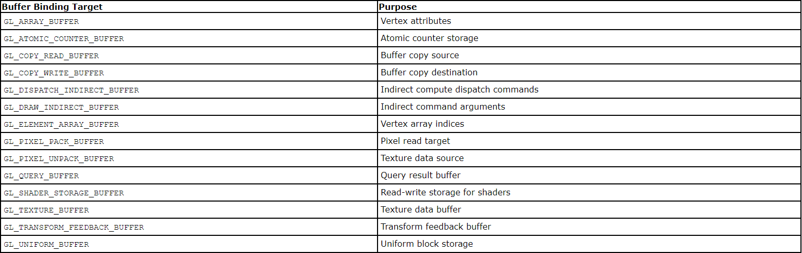

VAO VBO EBO PBO TBO SSBO

## PBO
https://www.khronos.org/opengl/wiki/Pixel_Buffer_Object
pbo:与纹理无关,只是pixel_pack_buffer pixel_unpack_buffer操作的对象
A Buffer Object that is used for asynchronous pixel transfer operations is called a Pixel Buffer Object用来异步传输像素的缓冲区
PBO是一种优化行为,主要是application跟opengl之间的异步行为的优化
OSG中用来实现离屏渲染和渲染到纹理
渲染到纹理的实现方案包括:glReadPixels pbo FBO

分为上传和下载


glbindbuffer vs glbindbufferrange(这个大概率是给interface block用的,用于数据交换)
[只接受L_ATOMIC_COUNTER_BUFFER, GL_TRANSFORM_FEEDBACK_BUFFER, GL_UNIFORM_BUFFER or GL_SHADER_STORAGE_BUFFER]

pack-download unpack-upload

## Tranform feed-back
	坐标变换后,图元装配及光栅化前的一个阶段,可以把顶点的属性返回给application
	在vertex shader里定义一些out 变量,在application里获取,应用到后边的shader pass里,比如粒子系统实现
	GL_TRANSFORM_FEEDBACK_BUFFER
	glGenTransformFeedbacks 
	glTransformFeedbackVaryings

# Multiple Viewports and Layered Rendering
fragment shader的gl_Layer gl_ViewportIndex对应分层 多视口渲染
分层渲染:将不同元素渲染到不同图层上,实现更灵活高效的渲染--->地图图层 Layered rendering is the process of having the GS send specific primitives to different layers of a layered framebuffer. Layered images are used with Layered Rendering

用一个GL_TEXTURE_2D_ARRAY实现多个层的render target
glScissorIndexed glDepthRangeArray glFramebufferTextureLayer

# glViewPort blitFrame 帧缓冲区大小 窗口大小
OpenGL需要创建一个上下文context,这个context会被attached到一个window
viewport就是指定了这个window的可绘制区域(GLint x, GLint y, GLsizei width, GLsizei height)，实际是帧缓冲区的一个矩形子区域，**以设备像素为单位**,而不是设备无关像素

OpenGL直接操作的是物理设备像素,而不是逻辑像素,
glViewport glScissor glReadPixels glBlitFramebuffer都是基于物理像素的

**//Qt源码中使用设备像素传给OpenGL**
QVTKOpenGLWindow::paintGL()
{
  const QSize deviceSize = this->size() * this->devicePixelRatioF();//设备无关像素转换到设备像素,用于OpenGL
  const auto fmt = this->context()->format();
  if (fmt.stereo() && this->RenderWindow->GetStereoRender() &&
    this->RenderWindow->GetStereoType() == VTK_STEREO_CRYSTAL_EYES)
  {
    this->RenderWindowAdapter->blitLeftEye(
      this->defaultFramebufferObject(), GL_BACK_LEFT, QRect(QPoint(0, 0), deviceSize));
    this->RenderWindowAdapter->blitRightEye(
      this->defaultFramebufferObject(), GL_BACK_RIGHT, QRect(QPoint(0, 0), deviceSize));
  }
  else
  {
    this->RenderWindowAdapter->blit(
      this->defaultFramebufferObject(), GL_BACK_LEFT, QRect(QPoint(0, 0), deviceSize));
  }
}


ostate->vtkglViewport(destX, destY, destWidth, destHeight);
ostate->vtkglScissor(destX, destY, destWidth, destHeight);
ostate->vtkglBlitFramebuffer(srcX, srcY, srcX + srcWidth, srcY + srcHeight, destX, destY,
destX + destWidth, destY + destHeight, bufferMode, interpolation);


设置视口有两种情况:
1. 窗口创建时
2. 每次窗口大小改变时

需要注意的是，当使用窗口系统时(如GLFW、SDL、Qt等),可能会遇到两种尺寸:   
- 窗口尺寸（Window Size）：以屏幕坐标（或称为设备无关像素）为单位。在高DPI屏幕上，一个屏幕坐标可能对应多个设备像素。
- 帧缓冲区尺寸（Framebuffer Size）：以像素（设备像素）为单位。
  在Retina显示屏（Mac）或高DPI显示器上，窗口尺寸（比如800x600）可能对应一个更大的帧缓冲区尺寸（比如1600x1200）。
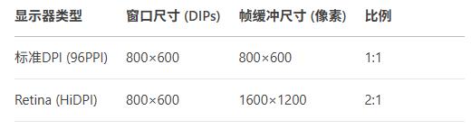

调用`glViewport`时，我们应该使用帧缓冲区的尺寸（设备像素），而不是窗口的尺寸（设备无关像素）。这是**因为OpenGL的渲染操作最终作用于帧缓冲区，而帧缓冲区是由设备像素组成的。**

在HiDPI上，窗口尺寸和帧缓冲区尺寸不同，正确获取帧缓冲区大小如下
// 错误做法：使用窗口尺寸（DIPs）
glfwGetWindowSize(window, &winWidth, &winHeight); // 800×600
glViewport(0, 0, winWidth, winHeight); // 渲染区域只有1/4屏幕

// 正确做法：使用帧缓冲尺寸
glfwGetFramebufferSize(window, &fbWidth, &fbHeight); // 1600×1200
glViewport(0, 0, fbWidth, fbHeight); // 完整渲染

# shader
## built-in variables
https://www.khronos.org/opengl/wiki/Built-in_Variable_(GLSL)
| Stage | IN | OUT |
|--|--|--|
|VertexShader| gl_VertexID gl_InstanceID gl_DrawID gl_BaseVertex gl_BaseInstance|gl_Position gl_PointSize gl_ClipDistance|
|TesselationControl| 同vertex shader out + gl_PatchVerticesIn gl_PrimitiveID gl_InvocationID| gl_TessLevelOuter gl_TessLevelInner|
|TesselationEvaluation| gl_TessCoord gl_PatchVerticesIn gl_PrimitiveID| 同vertex shader|
|GeometryShader| 同vertex shader out + gl_PrimitiveIDIn gl_InvocationID| 同vertex shader|
|FragmentShader| gl_FragCoord gl_FrontFacing gl_PointCoord gl_SampleID gl_SamplePosition gl_SampleMaskIn gl_ClipDistance gl_PrimitiveID gl_Layer gl_ViewportIndex| gl_FragDepth|
|ComputerShader|gl_NumWorkGroups gl_WorkGroupID gl_LocalInvocationID gl_GlobalInvocationID gl_LocalInvocationIndex||
**gl_Position**:the clip-space output position of the current vertex. ~~投影后[-1.0 1.0]的裁剪坐标~~ 应该是投影后的坐标,每个顶点的坐标范围是自己的z坐标(-ze,ze),还没有做透视除法

**gl_FragCoord**:The location of the fragment in window space. The Z value will be written to the depth buffer if gl_FragDepth is not written to by this shader stage

**gl_FragDepth**:This output is the fragment's depth. If the shader does not statically write this value, then it will take the value of gl_FragCoord.z.

**gl_ClipDistance**:allows the shader to set the distance from the vertex to each user-defined clipping half-space

## built-in functions
参考opengl45-reference-card.pdf
三角函数:

	sin cos tan, sinh cosh tanh, asin acos atan, asinh acosh atnah

指对幂函数:

	pow(x,y) = x^y log(x)= ln(x) log2 exp(x)=e^x  exp2(x)=2^x

算术运算:

	abs mod[就是数学里的取余], round ceil floor

逻辑运算:

	all any equal not lessthan notequal

矩阵矢量运算:

	cross dot distance normalize, inverse transpose determinant, reflect refract

平滑噪声:

	step
	smoothstep(genType edge0, genType edge1, genType x):
		genType t;  /* Or genDType t; */
		t = clamp((x - edge0) / (edge1 - edge0), 0.0, 1.0);
		return t * t * (3.0 - 2.0 * t);
	mix
	noise1234

微分:

	dFdx dFdy是求表达式对屏幕空间(像素)坐标x y的偏导数,mipmap求level时用到

# data flow
## data type
1. OpenGL的函数都是针对shader的基本类型(fundamental types, vec mat)定义的
2. 在跟客户端交互的时候,glGetUniformLocation等只能识别基本类型,对于聚合类型如struct,使用name.member形式,递归引用
3. Arrays work differently, depending on whether they are arrays of basic types or arrays of aggregates (structs or arrays are aggregates)
   1. uniform vec3 anArray[7]; **"anArray[0]"**
   2. struct Aggregate
	{
		vec2 main;
		vec2 sec[3];
	};

	uniform Aggregate unifArray[5]; **"unifArray[2].sec[0]"**
4. interface block 
   1. uniform BlockName2
	{
	int mem;
	} instanceName2; //shader中用 "instanceName2.mem", api中用"BlockName2.mem"
   2. uniform BlockName3
	{
	int mem;
	} instanceName3[4]; //shader中用 "instanceName3[2].mem", api中用"BlockName3.mem"
## data 交互 接口块
An Interface Block is a group of GLSL input, output, uniform, or storage buffer variables.
storage_qualifier block_name
{
  <define members here>
} instance_name;
存储类型有:
1. uniform 客户端提供给shader,整个application是统一的
2. buffer shader可以进行读写,并返回给application
3. in out shader各个阶段进行数据交互,那些内嵌变量就是这种

uniform texture image ssbo atomic-operation fencesync

# Type Qualifier (GLSL)
https://www.khronos.org/opengl/wiki/Type_Qualifier_(GLSL)
shader变量属性有 类型 以及类型修饰符
1. storage 修饰符
   1. 插值 flat smooth
   2. uniform buffer in out shared等
2. layout 修饰符
   1. binding point layout(binding = 3) uniform sampler2D mainTexture;
   		*Buffer backed interface blocks* and *all opaque types* have a setting which represents an *index in the GL context* where a buffer or texture object is bound so that it can be accessed through that interface. These binding points, like input attribute indices and output data locations, can be set from within the shader.
   2. image formats uniform layout(binding=4,rgba8ui) writeonly uimage2D someImage;
   3. layout(location = 2),location可以是:
      1. vertex attribute的index(~~glBindAttribLocation~~), 
      2. fragment的output index(~~ glBindFragDataLocation~~),
      3. Program separation linkage时,不同shader stage的变量匹配的index
   4. layout(location = 0, component = 2) out vec2 arr2[4]
   5. memory-layout-qualifier: packed shared std140 std430
   6. row_major, column_major
3. precision修饰符
4. Memory qualifiers: restrict, readonly, writeonly, coherent, volatile
5. Invariance qualifiers:invariant out vec3 Color;

Qualifier order:invariant-qualifier interpolation-qualifier layout-qualifier other-storage-qualifier precision-qualifier

# Texture
## 概念:
纹理映射
*texture unit*: 纹理单元, GL_TEXTURE0 *glActiveTexture*

*texture target*: 纹理目标, 其实是纹理数据的dimensionality

	GL_TEXTURE_1D, GL_TEXTURE_2D, GL_TEXTURE_3D, GL_TEXTURE_1D_ARRAY, GL_TEXTURE_2D_ARRAY, GL_TEXTURE_RECTANGLE, GL_TEXTURE_CUBE_MAP, GL_TEXTURE_CUBE_MAP_ARRAY, GL_TEXTURE_BUFFER, GL_TEXTURE_2D_MULTISAMPLE or GL_TEXTURE_2D_MULTISAMPLE_ARRAY cubemap是特殊的纹理array

  Rectangle Texture(GL_TEXTURE_RECTANGLE)是二维的，但不是GL_TEXTURE_2D，只包含一张image，无mipmap，没有纹理坐标的归一化，坐标是像素坐标，坐标范围是[0, width] [0, height]，size可以不是2的幂 sampler使用sampler2DRect，纹理坐标自动使用texel-space坐标 是在非2次幂纹理支持之前使用不规则尺寸纹理的方案，尤其是用作render target；现代视角来看，用处变少了
	
	*glBindTexture*(target,id) glBindImageTexture

*texture object*: 纹理对象 glGenTextures

*texture image*: 纹理图像 纹理对象包含的真正数据 

	glTexStorage3D(GLenum target, GLsizei levels, GLenum internalFormat, GLsizei width, GLsizei height, GLsizei depth)分配不可变纹理空间
	
	glTexImage3D(	GLenum target, GLint level, GLint internalformat, GLsizei width, GLsizei height, GLsizei depth, GLint border, GLenum format, GLenum type, const void * data);分配可变纹理空间并赋值,比如可以改变size和format

	glCopyTexSubImage3D

	glTexSubImage3D

纹理参数: 

	glTexParameter
	glSamplerParameter 

	GL_TEXTURE_MIN_FILTER GL_TEXTURE_MAG_FILTER GL_TEXTURE_MIN_LOD GL_TEXTURE_SWIZZLE_A GL_TEXTURE_BORDER_COLOR

Proxy texture:

	代理纹理 用来嗅探OpenGL的纹理实现到什么程度
	GL_PROXY_TEXTURE_1D GL_PROXY_TEXTURE_3D

*Sampler*:采样器,opaque 数据类型,用于在shader中获取纹理的texel,对应 纹理单元

sampler2D image2D

纹理类型: 包括 3d texture, 纹理数组, cube map, shadow map, depth-stencil纹理

texture views:
	同一个纹理数据,进行不同的类型 格式等解释,从而变成两个纹理

texture compressed:
	
	移动端跟桌面端支持的格式区别较大
	S3TC/DXTn/BCn directx 纹理压缩
	ASTC
	GL_COMPRESSED_RED_RGTC1 
	glCompressedTexImage3D


Procedual texture:

	用shader生成纹理,而不是从内存传给OpenGL


## 纹理数据的存储 查询(采样器)
*texture format*: 纹理格式 纹理对象的数据类型,包括内部格式 外部格式
1. internal format:OpenGL用来在内部存储纹理图像的格式
	GL_R8:假的浮点型,[0.0, 1.0],0-255归一化到[0 1]
	GL_R8_SNORM:有符号的归一化,[-1.0, 1.0]
	GL_R8UI:位无符号整型[0 255]
	GL_R16F:真正的16bit float
2. 外部格式: format + type,是application用来给OpenGL提供数据的格式和数据类型
   format: GL_RED GL_RGBA GL_DEPTH_COMPONENT GL_DEPTH_STENCIL
   type: GL_UNSIGNED_BYTE GL_SHORT GL_FLOAT GL_UNSIGNED_INT_8_8_8_8

*texture type*: 纹理类型 纹理对象的类型

纹理数据的内存布局:
	
	glPixelStore 改变从application到opengl server或者 server到application的像素数据的内存布局格式

### 内部格式 外部格式的含义
1. internalformat（GPU 内部存储格式）​​
  定义纹理在 GPU 内存中的存储格式，影响：
    ​​通道数​​（如 R、RG、RGB、RGBA）。
    ​​每个通道的位数​​（如 8-bit、16-bit、32-bit）。
    ​​数据类型​​（如默认、SNORM、无符号整数、有符号整数、浮点数、深度、压缩格式）。
2. format（cpu端数据通道）​​GL_RED GL_RG GL_RGB GL_RGBA等
3. type（cpu数据类型）定义cpu内存中每个通道的数据类型 GL_UNSIGNED_BYTE GL_FLOAT等​​

纹理内部格式的组成：
For each format listed in Table 6.2 the full format is made up of an
identifier representing **the base format, one or more size indicators, and an optional type**. 
1. **The base format** essentially determines which components
of the texture are present. Formats starting with GL_R have only the red
component present, GL_RG formats have both red and green, GL_RGB
formats contain red, green, and blue, and finally, GL_RGBA contain red,
green, blue, and alpha.
2. **The subsequent size indicator** determines the number of bits that are used
to store the texture data. In many cases, only a single size parameter is
included. In such cases, all components present receive the same number
of bits. 
By default, OpenGL stores textures in unsigned normalized format.
When data is stored in unsigned normalized format, the values of the
texels are stored in memory as an integer which when read into a shader is
converted to floating point and divided by the maximum representable
value for the corresponding size of integer. This results in data in the range
0.0 to 1.0 (i.e., normalized data) being presented to the shader. If the
_SNORM modifier is present (as in GL_RGBA8_SNORM, for example) then
the data is signed normalized. In this case, the data in memory is treated as a
signed integer, and before it is returned to the shader, it is converted to
floating point and divided by the maximum representable signed integer
value, resulting in floating-point values in the range −1.0 to 1.0 being
returned to the shader.
3. **Type specifiers** may be present in the internal format name. These type
specifiers are I, UI, and F, indicating signed integer, unsigned integer, and
floating-point data, respectively. The signed and unsigned integer internal
formats are designed to be used with signed or unsigned integer sampler
types in your shader (isampler2D or usampler2D, for example). The
floating point internal formats are true floating-point formats in that the
data is stored in memory in a floating-point representation and returned to
the shader with the full precision supported by the OpenGL implementation. 

也就是说
1. 内部格式带有数据类型时，gpu存储值及shader读取的值就是指定类型
2. 内部格式不带数据类型时，gpu存储的是有无符号整型，shader读取后会自动归一化到[0.0, 1.0]

### sampler类型及texel 查询
sampler有几种格式:
1. sampler3D，不带前缀的，采样结果是浮点数据，对应的内部格式包括真正的浮点数GL_R16F格式和gpu内存中不带数据类型的有符号/无符号整型归一化之后的值
2. isampler3D，采样结果是有符号整数数据，对应的内部格式包括GL_R8I格式
3. usampler3D，采样结果是无符号整数数据，对应的内部格式包括GL_R8UI格式
4. sampler2DShadow，shadow sampler专门用于含有深度通道的纹理采样，采样结果是[0.0, 1.0]的浮点数据，对应的内部格式包括GL_DEPTH_COMPONENT16格式
5. gsampler2DRect or gsampler2DRectShadow 采样GL_TEXTURE_RECTANGLE纹理，使用非归一化的纹理坐标，旧时代对不规则尺寸纹理的支持，如render target
6. 深度通道的纹理被当做 单通道浮点型纹理(actual floats or unsigned Normalized Integers)，模板通道的纹理被当做单通道无符号整型纹理
7. sRGB对应的内部格式有GL_SRGB8 GL_SRGB8_ALPHA8, 使用sampler1D浮点采样器，自动转换到线性空间 

texture lookup functions:
1. 纹理坐标 可以是归一化[0.0, 1.0]的纹理坐标(可以独立于纹理size)或texel-space [0, size-1]的纹理坐标，取决于对应dimension的size，如GL_TEXTURE_RECTANGLE
2. shader任意stage都可以读取纹理，但可能有一些限制，如mipmap因为实际实现需要计算texel占据的窗口尺寸(理论上需要计算图元到相机的距离)，所以只能在fragment shader中读取
3. textureSize(gsampler sampler​, int lod​)查询texture size
4. textureQueryLevels(gsampler sampler​);查询mipmap level数量, textureLOD等函数就在这个范围内使用
针对不同使用情景，有不同的纹理坐标使用方式，对应不用的texture api，如下   
5. texture(gsampler sampler​, vec texCoord​[, float bias​])获取texel值的基础api，返回值类型由sampler类型决定
6. textureOffset(gsampler sampler​, vec texCoord​, ivec offset​[, float bias​]);坐标加上偏移后再查询
7. textureProj(gsampler sampler​, vec projTexCoord​[, float bias​]);投影纹理坐标查询，相对于texture api，projTexCoord​坐标比需要的通道数多了一个通道，其他texture真正需要的纹理坐标通道除以这个通道作为texture真正的输入纹理坐标 用于阴影纹理 投影贴花等
8. textureLod(gsampler sampler​, vec texCoord​, float lod​);显式指定mipmap level，而不是硬件自动计算
9. textureGrad(gsampler sampler​, vec texCoord​, gradvec dTdx​, gradvec dTdy​);显式指定lod的梯度，而不是硬件自动计算
10. textureGather(gsampler sampler​​, vec texCoord​​, int comp​);不进行filtering，直接从纹理中获取纹理坐标最近的四个texel的某个通道的值，这4个相同通道的值放到了XYZW的vec里
11. textureProjOffset
    textureProjLod
    textureProjLodOffset
    textureProjGrad
    textureProjGradOffset
    textureLodOffset
    textureGradOffset
12. texelFetch(gsampler sampler​, ivec texCoord​[, int lod​] [, int sample​]); 直接用texel-space坐标获取纹理值，不滤波

其中，The "Grad" and "Lod" versions of functions do not require implicit derivatives. If either "Grad" or "Lod" is not present, then the function does require implicit derivatives，用来计算mipmap level的，需要计算dFdx和dFdy

``` c
float computeManualLOD(vec2 texCoord, vec2 textureSize)
{
    // 计算纹理坐标的屏幕空间导数
    vec2 dx = dFdx(texCoord * textureSize);
    vec2 dy = dFdy(texCoord * textureSize);
    
    // 计算覆盖的纹素数量 可以理解为一个屏幕像素代表的texel的步长
    float max_span = max(length(dx), length(dy));
    
    // 计算LOD：log2(覆盖纹素数)
    return log2(max_span);
}
```

### 纹理的存储格式与Shader中的采样行为的 AI总结
在 OpenGL 中，纹理的 **内部格式（`internalFormat`）** 决定了数据在 GPU 内存中的存储方式，而 **Shader 中的采样行为** 则取决于纹理的存储格式和采样器的类型。以下是纹理在 Shader 中的存储、采样、归一化及符号行为的详细解析：

---
**一、纹理内部格式（`internalFormat`）分类**
OpenGL 纹理的内部格式可以分为以下几类：
1. **无符号归一化格式（Normalized Unsigned）**  
   - 存储：整数（如 `GL_RGBA8` 存储 `0-255` 的整数值）。  
   - Shader 访问：自动归一化为 `[0.0, 1.0]` 的浮点数。  
   - 典型格式：
     - `GL_R8`、`GL_RG8`、`GL_RGB8`、`GL_RGBA8`（8-bit 每通道）
     - `GL_R16`、`GL_RG16`、`GL_RGB16`、`GL_RGBA16`（16-bit 每通道）

2. **有符号归一化格式（Normalized Signed）**  
   - 存储：有符号整数（如 `GL_RGBA8_SNORM` 存储 `-128` 到 `127`）。  
   - Shader 访问：自动归一化为 `[-1.0, 1.0]` 的浮点数。  
   - 典型格式：
     - `GL_R8_SNORM`、`GL_RG8_SNORM`、`GL_RGB8_SNORM`、`GL_RGBA8_SNORM`
     - `GL_R16_SNORM`、`GL_RG16_SNORM`、`GL_RGB16_SNORM`、`GL_RGBA16_SNORM`

3. **浮点格式（Floating-Point）**  
   - 存储：直接存储浮点数（如 `GL_R32F`）。  
   - Shader 访问：直接返回原始浮点值（无归一化）。  
   - 典型格式：
     - `GL_R16F`、`GL_RG16F`、`GL_RGB16F`、`GL_RGBA16F`（16-bit 半精度浮点）
     - `GL_R32F`、`GL_RG32F`、`GL_RGB32F`、`GL_RGBA32F`（32-bit 单精度浮点）

4. **整数格式（Integer）**  
   - 存储：直接存储整数（无归一化）。  
   - Shader 访问：返回原始整数值（`int` 或 `uint`）。  
   - 典型格式：
     - `GL_R8UI`、`GL_RG8UI`、`GL_RGB8UI`、`GL_RGBA8UI`（无符号整数）
     - `GL_R8I`、`GL_RG8I`、`GL_RGB8I`、`GL_RGBA8I`（有符号整数）
     - `GL_R16UI`、`GL_RG16UI`、`GL_RGB16UI`、`GL_RGBA16UI`
     - `GL_R32UI`、`GL_RG32UI`、`GL_RGB32UI`、`GL_RGBA32UI`

5. **深度/模板格式（Depth/Stencil）**  
   - 存储：深度值或模板值。  
   - Shader 访问：通过 `sampler2DShadow` 或 `imageLoad` 读取。  
   - 典型格式：
     - `GL_DEPTH_COMPONENT16`、`GL_DEPTH_COMPONENT24`、`GL_DEPTH_COMPONENT32F`
     - `GL_DEPTH24_STENCIL8`、`GL_DEPTH32F_STENCIL8`

6. **压缩格式（Compressed）**  
   - 存储：块压缩（如 DXT/S3TC、ASTC）。  
   - Shader 访问：解码后返回归一化值（`[0.0, 1.0]`）。  
   - 典型格式：
     - `GL_COMPRESSED_RGBA_S3TC_DXT1`（BC1）
     - `GL_COMPRESSED_RGBA_S3TC_DXT5`（BC3）
     - `GL_COMPRESSED_RGBA_BPTC_UNORM`（BC7）

---

**二、Shader 采样与数据访问**
**1. 采样器类型决定数据解释方式**
| 采样器类型 | 适用纹理格式 | 返回值类型 | 归一化行为 |
| :-------- | :---------- | :-------- | :-------- |
| `sampler2D` | 无符号归一化（`GL_RGBA8`） | `vec4`（`[0.0, 1.0]`） | ✅ 自动归一化 |
| `sampler2D` | 有符号归一化（`GL_RGBA8_SNORM`） | `vec4`（`[-1.0, 1.0]`） | ✅ 自动归一化 |
| `sampler2D` | 浮点（`GL_RGBA16F`） | `vec4`（原始浮点值） | ❌ 无归一化 |
| `usampler2D` | 无符号整数（`GL_RGBA8UI`） | `uvec4`（`0-255`） | ❌ 无归一化 |
| `isampler2D` | 有符号整数（`GL_RGBA8I`） | `ivec4`（`-128-127`） | ❌ 无归一化 |

**示例：**
```glsl
uniform sampler2D colorTex;       // 无符号归一化纹理（[0.0, 1.0]）
uniform sampler2D normTex; // 有符号归一化纹理（[-1.0, 1.0]）
uniform sampler2D hdrTex;  // 浮点纹理（直接返回浮点值）
uniform usampler2D idTex;        // 无符号整数纹理（返回 uint）

void main() {
    vec4 color = texture(colorTex, uv); // [0.0, 1.0]
    vec4 normal = texture(normTex, uv);  // [-1.0, 1.0]
    vec4 hdr = texture(hdrTex, uv);      // 原始浮点值
    uvec4 id = texture(idTex, uv);       // 无符号整数
}
```

**2. 归一化（Normalization）的影响**
- **无符号归一化纹理（`GL_RGBA8`）**：
  - 存储：`255`（`0xFF`） → Shader 读取：`1.0`。
  - 存储：`127`（`0x7F`） → Shader 读取：`127/255 ≈ 0.498`。
- **有符号归一化纹理（`GL_RGBA8_SNORM`）**：
  - 存储：`127`（`0x7F`） → Shader 读取：`1.0`。
  - 存储：`-128`（`0x80`） → Shader 读取：`-1.0`。
- **浮点纹理（`GL_R32F`）**：
  - 存储：`3.14` → Shader 读取：`3.14`（无归一化）。

**3. 整数纹理的特殊性**
- **`usampler2D` / `isampler2D`**：
  - 直接返回整数，不进行归一化。
  - 适用于存储 ID、索引、计数器等数据。
  - **不能使用 `textureLod` 或 `textureGrad`**（仅支持 `texture` 或 `texelFetch`）。

---

**三、典型用例**
**1. 颜色贴图（sRGB 颜色空间）**
```cpp
glTexImage2D(GL_TEXTURE_2D, 0, GL_SRGB8_ALPHA8, width, height, 0, GL_RGBA, GL_UNSIGNED_BYTE, data);
```
- **Shader 访问**：
  ```glsl
  uniform sampler2D colorTex;
  vec4 color = texture(colorTex, uv); // 自动 sRGB → 线性空间
  ```

**2. 法线贴图（有符号归一化）**
```cpp
glTexImage2D(GL_TEXTURE_2D, 0, GL_RGBA8_SNORM, width, height, 0, GL_RGBA, GL_BYTE, data);
```
- **Shader 访问**：
  ```glsl
  uniform sampler2D normalTex;
  vec3 normal = texture(normalTex, uv).xyz * 2.0 - 1.0; // [-1.0, 1.0]
  ```

**3. HDR 环境贴图（浮点）**
```cpp
glTexImage2D(GL_TEXTURE_2D, 0, GL_RGBA16F, width, height, 0, GL_RGBA, GL_FLOAT, data);
```
- **Shader 访问**：
  ```glsl
  uniform sampler2D envMap;
  vec3 radiance = texture(envMap, uv).rgb; // 直接读取浮点值
  ```

**4. 整数 ID 贴图（无符号整数）**
```cpp
glTexImage2D(GL_TEXTURE_2D, 0, GL_R32UI, width, height, 0, GL_RED_INTEGER, GL_UNSIGNED_INT, data);
```
- **Shader 访问**：
  ```glsl
  uniform usampler2D idTex;
  uint objectId = texture(idTex, uv).r; // 直接读取 uint 值
  ```

---

**四、总结**
| 纹理格式类型 | Shader 采样器 | 返回值范围 | 适用场景 |
| :---------- | :------------ | :-------- | :------ |
| **无符号归一化**（`GL_RGBA8`） | `sampler2D` | `[0.0, 1.0]` | 颜色贴图、漫反射 |
| **有符号归一化**（`GL_RGBA8_SNORM`） | `sampler2D` | `[-1.0, 1.0]` | 法线贴图、矢量场 |
| **浮点**（`GL_RGBA16F`） | `sampler2D` | 原始浮点值 | HDR、光照计算 |
| **无符号整数**（`GL_R32UI`） | `usampler2D` | `0` 到 `2^32-1` | ID 贴图、索引 |
| **有符号整数**（`GL_R32I`） | `isampler2D` | `-2^31` 到 `2^31-1` | 特殊计算 |

**关键结论：**
1. **归一化纹理**（`GL_RGBA8`）自动映射到 `[0.0, 1.0]`，适合颜色数据。
2. **浮点纹理**（`GL_RGBA16F`）保留原始值，适合 HDR 和物理计算。
3. **整数纹理**（`GL_R32UI`）直接返回整数，适合 ID 存储。
4. **采样器类型必须匹配纹理格式**，否则行为未定义或返回错误数据。


# per fragment op
1. scissor
2. multisample frag operations:https://www.khronos.org/opengl/wiki/Multisampling
3. stencil test
4. depth test
5. blending
6. dithering
7. logical operation

# 命令辨别 可以通过reference以及参数列表进行对比
## DrawCall 
1. glDrawArray glDrawElement 绘制命令的基础
2. glMultiDraw* glMultiDrawArrays(	GLenum mode, const GLint * first, const GLsizei * count, GLsizei drawcount);按照mode类型，绘制drawcount次(也就是相当于drawcount次DrawArray)从first数组里作为第一个，对应count数组的个数个图元, **一次绘制多个模型**
3. glDraw*Instanced GLenum mode, GLint first, GLsizei count, GLsizei instancecount,**同一个模型绘制instancecount次**(instancecount个实例)
4. glDraw*InstancedBaseInstance：解释不明，可能是每个实例进行偏移
5. glDrawElementsBaseVertex(GLenum mode, GLsizei count, GLenum type, void *indices, GLint basevertex) 就是DrawElements，只是每个索引值都基于basevertex(也就是相对于dtawelements偏移basevertex， **index[i]+basevertex**)
6. glDrawArrayIndirect == glDrawArraysInstancedBaseInstance  glDrawElementsIndirect== glDrawElementsInstancedBaseVertexBaseInstance,就是渲染的参数不是直接作为实参传给drawcall,而是封装成一个struct,传递这个struct对象到indirect类函数
7. glDrawRangeElements(GLenum mode, GLuint start, GLuint end, GLsizei count, GLenum type, const void * indices)就是加了起止点范围的drawelements glDrawRangeElementsBaseVertex 
8. glPrimitiveRestartIndex(index) 把多个模型的索引放到element数组,并添加合适的重启索引,就可以调用一次drawelement完成多个物体的绘制,功能同multidraw,但是不需要存储每个物体的first count数组

# color pixel & framebuffer
## color space
cmyk rgb srgb gamma hdr

## framebuffer
color buffer depth buffer stencil buffer
glClearColor\Depth\Stencil glClear

抗混叠:

	Jaggies, popping, sparkling, stair steps, strobing, and marching ants.
	They’re all names used to describe the anathema of computer graphics---
	aliasing. 
	几何图元的多重采样抗混叠:	
		Multisampling works by sampling each geometric primitive multiple times
		per pixel.通过创建窗口时指定多重采样功能,指定要不要多重采样

	per-primitive anti-aliasing:
		逐图元抗混叠(指定多重采样后的差值方式) glHint[设置某种OpenGL运算的插值模式;如图元,纹理,导数]

	fragment的多重采样:
		glSampleCoverage glSampleMask

裁剪测试:glScissor,裁剪范围外的不渲染,而viewport全部都渲染了只是看不见

depth test:
glclearDepth():清空深度缓存,指定初始深度值
glDepthFunc():用于深度比较的运算符,GL_LESS GL_GEQUAL等
glDepthMask():深度缓冲是否可写
glEnable(GL_DEPTH_TEST)
glDepthRange(GLdouble nearVal, GLdouble farVal)

stencil测试:通过指定一个屏幕上的模板形状(通常是不规则的),来阻止这个区域的绘制,深度测试通过深度值筛选片元,模板测试通过模板值筛选片元, 可以看做深度测试的推广
glClearStencil:设置初始stencil value
glStencilMask:控制stencil buffer每个bit plane是不是能够写入, GLuint mask 0xFF 0x00
glStencilFunc(GLenum func, GLint ref, GLuint mask):跟depthfunc一样,是通过还是不通过
	stencil:stencil buffer里的值
	GL_NEVER
	Always fails.

	GL_LESS
	Passes if ( ref & mask ) < ( stencil & mask ).

	GL_LEQUAL
	Passes if ( ref & mask ) <= ( stencil & mask ).

	GL_GREATER
	Passes if ( ref & mask ) > ( stencil & mask ).

	GL_GEQUAL
	Passes if ( ref & mask ) >= ( stencil & mask ).

	GL_EQUAL
	Passes if ( ref & mask ) = ( stencil & mask ).

	GL_NOTEQUAL
	Passes if ( ref & mask ) != ( stencil & mask ).

	GL_ALWAYS
	Always passes.
	
glStencilOp(GLenum sfail, GLenum dpfail, GLenum dppass):

| value | 含义 |
|--|--|
|GL_KEEP|保留当前值|
|GL_ZERO|模板缓冲区置零|
|GL_REPLACE|值设置为glStencilFunc指定的ref|
|GL_INCR|值++|
|GL_DECR|值--|
|GL_INVERT|按位翻转当前值|


在OpenGL中使用模板缓存的步骤：

	①启用模板缓冲的写入。
	②渲染物体，更新模板缓冲的值。
	③禁用模板缓冲的写入。
	④渲染（其它）物体，这次根据模板缓冲的值筛选片元。

Stencil Testing和Depth Testing结合可以把**被遮挡物体渲染成填充式轮廓**的效果 描边效果 CSG等


1. glEnable(GL_STENCIL_TEST) 开启关闭 stencil test
2. glStencilMask(~0); clear的时候必须有,才能clear成指定值
3. glStencilMask是一个bit位的写使能mask,某个bit位是1时,stencil的这个bit plane才可以写入,最终是否真正的写入了以及写入的到底是几,还得接着看stencilop & stencilfunc,也就是stencil test是否通过
4. glStencilFunc:stencil测试时,使用的测试比较函数 测试参考值 测试mask bit位 
   if ( ref & mask ) func ( stencil & mask ) 代表通过stencil 测试
5. glStencilOp(	GLenum sfail, GLenum dpfail, GLenum dppass)模板操作,代表了stencil测试的写入动作是啥.
   1. stencil测试失败时,color/depth不变,sfail代表着对stencil buffer的写入操作
   2. dpfail表示depth test失败时的写入操作
   3. dppass表示depth test成功时的写入操作
6. glStencilFuncSeparate  glStencilOpSeparate glStencilMaskSeparate可以分别设置前后stencil 的条件

现在算法有个坑:
默认是从A的front开始消减,如果是从后边消减呢?因为看不见所以不渲染?
CSG Algorithm Step:
1. render A front depth
2. get stencil where 1 represent the front surface of A was enclosed by B's volume
   1. render B front with stencil ++
   2. render B back with stencil --
3. real draw A where stencil != 1
4. capping A where stencil ==1
   1. render A back depth
   2. real draw, capping A with B where in front A Back

polygon offset:通过解决z-fighting问题

遮挡查询:

	通过bbox,确定物体是否被遮挡,如果遮挡了,就不绘制 genQeury begin/endquery getQueryObject,遮挡查询的结果不是同步的,需要设置mode或者等待

条件渲染:

	遮挡查询存在的问题是会打断显卡并返回结果,严重影响性能,为了消除暂停显卡的影响,条件渲染根据oculussion query object 的id以及query mode,由显卡判断是否进行渲染

glColorMask glDepthMask可以只进行遮挡测试而不实际写fragment out

FBO:

	需要添加附件,color-attachments或者render-buffer
	glGenFramebuffer glGenRenderbuffers glRenderbufferStorage
	glFramebufferRenderbuffer glFramebufferTexture
	glBlitFramebuffer
	GL_COLOR_ATTACHMENTi

**Multiple Render Target**:

	一个fragment(那肯定是一个render pass了)可以同时写到多个输出上
	实现方式:
	1. layout (location = i) out vec4 color; 将输出绑定到fbo的attachment i上或者
	2. glBindFragDataLocation

	MRT时,blend会有所不同,可以将两个out进行混合,而不单单是一个输出里的fragment混合

	glDrawBuffer  glDrawBuffers glReadBuffer

	glReadPixels GL_RED GL_RGB GL_RGBA pixel format


https://paroj.github.io/gltut/Basic%20Optimization.html 一些优化技巧

概念理解参考https://www.khronos.org/opengl/wiki/Main_Page
api使用参考https://registry.khronos.org/OpenGL-Refpages/gl4/
api及shader内嵌函数等分类列表参考ref-card

# OpenGL Context:
https://www.khronos.org/opengl/wiki/OpenGL_Context
https://www.khronos.org/opengl/wiki/Platform_specifics:_Windows
1. Contexts are localized within a particular process of execution (an application, more or less) on an operating system. A process can create multiple OpenGL contexts. Each context can represent a separate viewable surface, like a window in an application.一个进程可以有多个独立的gl context

2. Each context has its own set of OpenGL Objects, which are independent of those from other contexts. A context's objects can be shared with other contexts. Most OpenGL objects are sharable, including Sync Objects and GLSL Objects. Container Objects are not sharable, nor are Query Objects.
   context可以共享资源 wglShareLists或者wglCreateContextAttribsARB 
   
3. In order for any OpenGL commands to work, a context must be current; all OpenGL commands affect the state of whichever context is current. The current context is a thread-local variable, so a single process can have several threads, each of which has its own current context. However, a single context cannot be current in multiple threads at the same time.一个进程的多个线程可以每个都有自己的current context并渲染,但是同一个context只能不能同时在多个thread里作为current

# OpenGL and multithreading
https://www.khronos.org/opengl/wiki/OpenGL_and_multithreading
支持多线程,一个线程可以有多个context,一个context也可以被多个thread使用,但是一个thread同一时刻只能有一个current context,一个context也只能被一个线程make current
多线程共享资源的方法:
1. 创建共享的context,如glShareList wglShareLists或者wglCreateContextAttribsARB older gl
2. gl 2.1引入了PBO,异步传输数据

# 优化(OpenGL方面的优化)
https://paroj.github.io/gltut/Basic%20Optimization.html
## 可能的优化技巧
传给gpu之前数据优化: 
	
	frustum culling, occlusion culling + conditional rendering, model LOD

传给GPU时优化:

	1. 顶点属性数据: 格式,数据大小,组织方式 内存对齐等等 vertexattribpointer gl_normalized

	颜色可以用glVertexAttribPointer(#, 4, GL_UNSIGNED_BYTE, GL_TRUE, ...);

	法线可用 glVertexAttribPointer(#, 4, GL_INT_2_10_10_10_REV, GL_TRUE, ...);
	
	纹理坐标: 一般16bit是合适的,但c++没有对应 数据, 用glm:thalf

	顶点坐标: 不好优化,参考https://paroj.github.io/gltut/Basic%20Optimization.html

	2. 纹理数据:颜色 法线等纹理数据大小 数据格式 压缩纹理 mipmap

状态管理:

	场景图 渲染树,减少状态机的改变

数据传输上OpenGL的进化:
1. 立即模式 glenable glvertex glnormal glcolor一个一个指定数据
2. 3.0使用了vertex array模式 
   glenableclientstate指定当前操作的是哪个属性,可以指定的属性如下
   *GL_COLOR_ARRAY*, GL_EDGE_FLAG_ARRAY, GL_FOG_COORD_ARRAY, GL_INDEX_ARRAY, *GL_NORMAL_ARRAY*, GL_SECONDARY_COLOR_ARRAY, GL_TEXTURE_COORD_ARRAY, and *GL_VERTEX_ARRAY* 
   然后调用glVertexPointer glColorPointer glNormalPointer glSecondaryColorPointer glFogCoordPointer glTexCoordPointer指定数据
3. 显示列表,是一堆命令的集合,可以处理静态数据
4. 4.0以后使用VBO+VAO方式,glVertexAttribPointer指定通用属性,静态动态数据都可以处理
## 找到瓶颈

使用工具找到瓶颈,然后优化, 继续测试找到新的瓶颈,往复循环

性能测量:就是用每一阶段或者每一段代码的耗时,fps只是最终的总体目标

GPU设计成pipeline,每个阶段都是独立并行的, 找到是vertex shader,还是rasterization还是fragment shader是瓶颈
GPUs are designed as a pipeline. Each stage in the pipeline is functionally independent from the other. A vertex shader can be computing some number of vertices, while the clipping and rasterization are working on other triangles, while the fragment shader is working on fragments generated by other triangles.

However, a vertex generated by the vertex shader cannot pass to the rasterizer if the rasterizer is busy. Similarly, the rasterizer cannot generate more fragments if all of the fragment shaders are in use. Therefore, the overall performance of the GPU can only be the performance of the slowest step in the pipeline.

cpu不等待GPU返回,需要调用glFinish保证完成了所有命令执行,但返回的时间点仍然不确定,只是在完成命令后的某个时间点返回了并不是完成立即返回

测试性能时,关闭垂直同步 turn vertical synchronization, or vsync, off.
Vsync is controlled by the window-system specific extensions GLX_EXT_swap_control and WGL_EXT_swap_control. They both do the same thing and have similar APIs. The wgl/glxSwapInterval functions take an integer that tells how many vsyncs to wait between swaps. If you pass 0, then it will swap immediately.

按照以下顺序测试耗时:

1. fragment processing:增大2X分辨率,如果耗时也增大2倍甚至以上,明显这就是瓶颈,否则fragment 不是瓶颈
2. vertex processing 如果fragment不是瓶颈,那vertex很可能是瓶颈,关掉fragment,测试 To turn off fragment processing, simply glEnable(GL_RASTERIZER_DISCARD​).
3. cpu 如果GPU不是瓶颈,那cpu就是瓶颈
4. 如果一些瓶颈无法解决,那就不要加重类似瓶颈,比如vertex是瓶颈,那就把一些功能移到fragment里去做


sinc函数跟box函数互为逆傅里叶变换

OpenGL数据处理 上下
https://www.jianshu.com/p/3c264f6bfbe1
https://www.jianshu.com/p/513afcb71c97

一个location 指代 一个vec4,也就是4component的float数据

computer shader  workgroup localgroup 与cuda grid block thread

# glx egl wgl不同平台上的OpenGL
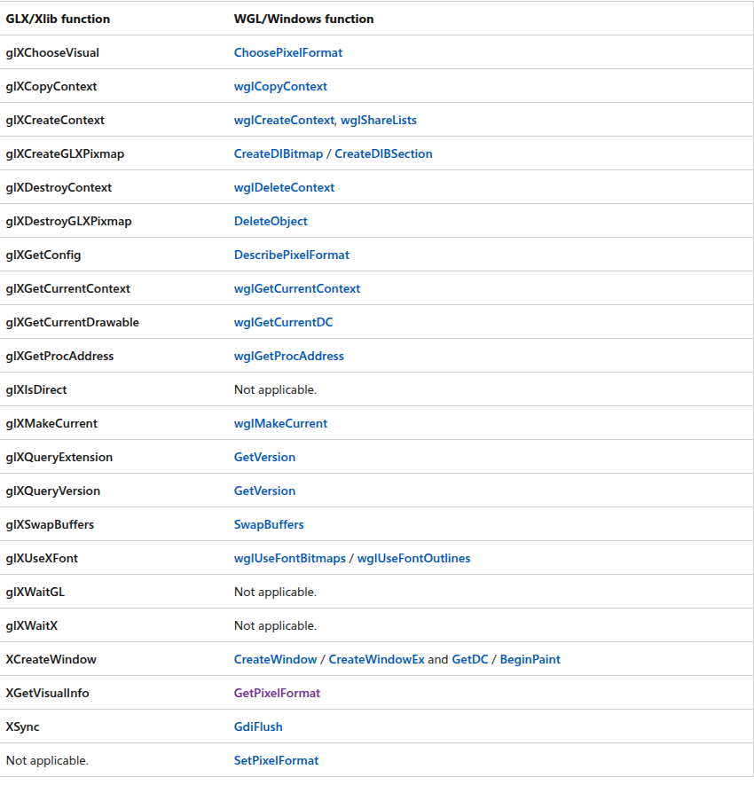
Display是X11下server与client的connection

|glx|wgl|egl|
|--|--|--|
|GLXContext|GLRC||
|GLXDrawable|HDC||
|XVisualInfo|PixelFormat||
|GLXFBConfig|||
 

## Windows
## Linux
### X Window system
1. Windows gives you a single implementation of a single desktop on top of a single implementation of a single API / framework, all done by Microsoft.

2. On Unix systems, you get an API / framework (X11 / X Window System) for which exist multiple implementations (Xorg, Xfree86), on top of which you get various "higher level" API / frameworks (GTK+, Qt, ...) because raw X11 is so primitive, on top of which you get various desktops (Gnome, KDE, ...), all done by different people.

3. Moreover, the X11 system has been designed from the ground up with remote GUIs in mind - i.e., a lokal machine displaying the GUI of a remotely running application - which introduces the concepts of a "X Server" and "X Client".

4. Then there is a nomenclature that "feels" the wrong way around for newcomers: **Your local machine is running the "X Server" providing the "display a GUI" service**, while the remote machine is the "X Client" making use of the services on your machine to display the GUI.

Well, that's the quick overview; once you got that sorted out, understanding any articles / forum posts on the subject should become much easier.

Edit: To answer the two first comments of the OP.

5. Yes, "X11" is merely a protocol, and Xorg / XFree86 are two implementations. At its basic level, **X11 is only about drawing lines and dots**, which is not terribly useful if you want to do a GUI.

6. On top of the X11 protocol, people implemented many things, and it is pretty difficult to do a 1:1 comparison with Windows because Microsoft never bothered to really keep things separate. Also I am not a GUI-type developer, i.e. my actual experience with either system is minimal.

7. At the bottom, a "window manager" provides a window (handling borders, close / minimize / maximize buttons, resizing etc.), and offers the "real estate" within the window to the widget toolset. There are many window managers, some mimicking other systems (Windows, MacOS, AmigaOS, whatever), and they are mostly interchangeable transparent to the remaining system.

8. The "widget toolset" offers you buttons, sliders, text fields etc. on which to build your GUI. This is what you (as an application developer) actually get to "see", API wise, and what decides most of the "look & feel" of your application.

A "desktop" builds a number of applications on top of a certain widget toolset / window manager combination, in order to provide a consistent look & feel. You don't have to bother with these unless you actually want to develop the desktop itself.

The desktop "Gnome" uses the widget toolset "GTK+" on top of the window manager "Metacity".

The desktop "KDE" uses the widget toolset "Qt" on top of the window manager "KWin".

Note that especially those two, GTK+ and Qt, have evolved far beyond simple "widget toolsets" into "application development frameworks". If you want to develop GUI apps for Linux, effectively you have to pick which one of those two you want to use. There are more choices, if you want a more "lightweight" app (not needing the big library dependencies), but today most systems have GTK+ and Qt libs already installed anyway.

It's perfectly possible to use Qt apps on a Gnome desktop or GTK+ apps on a KDE desktop (it wasn't always like that), so you have to worry little about compatibility. Given a choice between two apps of comparable functionality, people will usually prefer the app using the "native" widgets of their desktop of choice, but I wouldn't worry about that.

Other, more important bullet points in the choice of "widget toolset": Licensing terms, support for your language of choice, cross-platform compatibility.


the X Window System uses a client-server architecture. The X server (the Xorg binary) listens for connections from X client applications via a network or local loopback interface. The server communicates with the hardware, such as the video card, monitor, keyboard, and mouse. X client applications exist in the user-space, creating a graphical user interface (GUI) for the user and passing user requests to the X server.

1. X是一种窗口协议,目前到了第11版,所以也称之为X11,
2. 有多种实现,如xfreex86 xorg等
3. 是一种C/S架构
4. 用户本地主机运行XServer,XServer负责管理键盘 鼠标 显示器 打印机 显卡等设备,并提供“显示GUI”的服务,也就是绘图功能;
5. XServer将硬件设备的输入事件转发给XClient应用程序,XClient对这些事件进行处理后得到**绘图数据**,这些数据回传给XServer,XServer根据这些绘图数据在显示器上进行绘图显示服务
6. XClient最重要的工作就是将XServer的动作转译成绘图数据 XClient相互之间不知道对方的存在
7. X Window Manager是一种特殊的XClient,用来管理所有的XClient,常见的窗口管理器如下:
   GNOME (GNU Network Object Model Environment)：http://www.gnome.org/
   KDE (K Desktop Enviroment)：http://kde.org/
   twm (Tab Window Manager)：http://xwinman.org/vtwm.php
   XFCE (XForms Common Environment)：http://www.xfce.org/
   显示管理器（Display Manager），可以认为是登陆页面。在你输入用户名和密码后，立即启动显示服务器并加载桌面环境。

桌面环境 （Desktops Environment），一个较完整的图形操作界面，提供启动程序的入口，否则只能使用命令行进行交互。

常见的显示管理器：lightdm、gdm3、kdm、sddm

常见的桌面环境：GNOME、KDE、Xfce、LXDE

### X Terminology
The world of X follows an ambiguous and rather confusing set of terminologies, here you will find a list of some that are relevant for the library.

**Display** The term displays usually refers to an underlying X server instance. It is commonly referenced by the environment variable DISPLAY.

**Window** A self contained area on a screen that usually can be moved around and manipulated.

**Screen** A screen is an abstraction of a seamless viewable field. This means that, in a screen. all Windows can be moved around anywhere and all input devices can access the screen. Note that, a screen is NOT a physical screen, in fact a screen can be represented by multiple physical screens. Input devices can generally be used across multiple screens; however, windows belong to one screen.

**Monitors** A monitor is an abstraction used to represent a physical screen. In principle, each monitor belongs to a screen.

**Output** An output abstracts actual output ports on a display device such as HDMI, DVI or VGA ports. For some drivers, It is possible to configure Virtual display ports.

**Modes & Modelines** Modes are a configuration for the output describing things such as Resolution, Color Depth and Refresh Rate. Modelines are a standard format for describing modes. In general, modelines contain very low level information regarding format and each modeline differs depending on the hardware. For generating modelines, the command tool cvt can be used, for example cvt 1920 1080 60 generates the modeline for **1920x1080@60Hz** Modelines are mostly automatically calculated by the X server for connected display devices.

**Frambuffer** In general, A portion of video RAM that has specific properties relevant from a graphics oriented memory perspective.

**CRTC** A legacy reference to Cathode Ray Tubes that stuck. Very roughly, this corresponds to an in memory structure in the video device that is responsible for one output view, i.e., whatever you see on your screen now is represented by a CRTC. Each video device has a limited set of CRTCs, this limit is the limit on how many distinct physical views it can support.

**Xlib** Xlib is a client library used to manipulate the X server.

**Xrandr** X resize and rotate is an extension for Xlib and a command-line tool that displays info regarding the current configuration for a display server, e.g., Screens, outputs, modes, etc... It also allows manipulation of the screen configurations.

**Multihead** A Multihead setup may refer to one of 2 things.

	1. An X screen having more than 1 monitor attached
	2. Having multiple physical displays by configuring a multi Screen setup each with 1(or more) monitors
**EDID** An Extended Display Identification Data is a data format used by a physical display to export its capabilities. It contains data such as manufacturer name, serial number, display sizem etc... .

**PNP** ID The Plug and Play ID is basically a 3 letter manufacturer ID of the physical display in the context of this library. A list of manufacturers can be found here Any monitor which exposes an EDID is a PnP monitor

## Android
