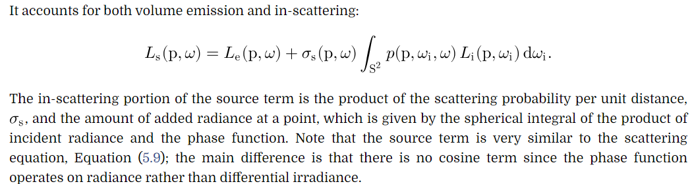
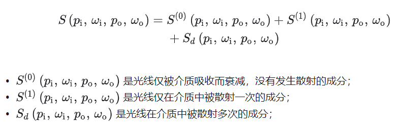
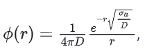

PBRT v3 学习
mitsuba渲染器 https://github.com/mitsuba-renderer 根据pbrt写的
PBRT翻译总结 https://blog.csdn.net/libing_zeng/category_6955196.html

# Chapter 5 Color and Radiometry

## 术语
dispersion:色散
scattering：散射，micro scale
reflection：反射
transmite：透射，同一种物质内部
refraction：两种物质界面
difraction：衍射
interfrence：干射
polarization:偏振

## 5.4 Radiometry
### Basic Quantities
与RTR相互对照
1. Energy Q:  (辐射)单个光子的能量
2. Flux Phi:  光(辐射)通量 单位时间内的能量 就是功率power
3. irradiance E:  辐射照度 辐射通量面积密度
4. Intensity I:  辐射强度 辐射通量角度密度
5. Radiance L:  辐射亮度(辉度) 单位面积单位角度的辐射通量
6. incident and exitant radiance  入射辉度 出射辉度

所以radiance L=d^2^(phi)/d(omega)dAcos(theta)=d(d(f(Q))/dt)/d(omega)dAcos(theta)=>d(f(hc/lambda))/d(omega)dAcos(theta)=>d^2^(f(lambda))/d(omega)dAcos(theta)d(lambda),即L是波长的函数，
从而可以定义spectral radiance L~lambda~ = dL/d(lambda)
第4版中 

进而每一个radiometry变量都有对应的spectral radiometric quantity

irridance falloff

传感器(眼睛 镜头等)接受的变量是radiance.
为啥是radiance? 首先肯定是与面积有关的一个变量,还得排除距离衰减(到眼睛的距离,而不是到光源的距离)的falloff??

rtr:
An important property of radiance is that it is not affected by distance,
ignoring atmospheric effects such as fog. In other words, a surface will have the same radiance regardless of its distance from the viewer. 
The surface covers fewer pixels when more distant, but the radiance from the surface at each pixel is constant.

solid angle w:
角度在三维的扩展,
arch_length = theta * radius-->圆周角2pi,圆周长2pi * r
surface_area = omega * radius^2--->立体角4pi,球面积4pi*r^2

### 5.4.3 Luminance and Photometry 光度学
photometry:光度学,研究可见电磁波(可见光)辐射的物理性质,包括辐射强度,辐射照度,辐射亮度等

1. 由radiometric quantity得到 spectral radiometric quantity, 也就是波长的函数
2. Each spectral radiometric quantity can be converted to its corresponding photometric quantity by integrating against the spectral response curve V(lambda) , which describes the relative sensitivity of the human eye to various wavelengths.波普辐射量再根据人眼对波普的响应曲线V(lambda)进行积分得到光度量

定义luminance Y , Y解释了同等能量下，不同spd普功率分布的绿光**看起来**比蓝光更亮

Y、V(lambda)与XYZ表示的颜色紧密相关，CIE Y(lambda)三刺激曲线被选择为与V(lambda)成比例
CIE Y(lambda) = 683 * V(lambda)

 这两量是通过 spectral radiometic quantity(radiometic量对波长的函数)及spectral response curve V(lambda)相乘得到的

各种颜色空间 rtr+pbrt 讲清楚了，都是CIE XYZ推导的,CIE XYZ又是基于物理推导(物理学)+实验测量(生理学)得到的，整个从电磁辐射到人眼感知最终量化为颜色的过程就清晰了

## 5.6 Surface Reflection 引入BRDF

内容放到后面的总结,统一来看

光线入射到表面,表面会对光线进行散射(反射+折射),其中一部分会被反射回环境中.
对反射的光进行建模,主要有两方面,反射光的谱分布和方向分布, spectral distribution & directional distribution
translucent surface反射更复杂,光线从一个点射入,从另一个点射出.称为次表面散射,次表面散射有两种解决方法

基于物理的BFDR满足两个属性:
1. 可逆性 wo  wi可互换
2. 能量守恒

 vs 
3. Reflection/Scattering Function 
4. BSSRDF 
5. 

### Rendering Equation

方程推导及简化到 最简单的模型: 物体颜色*光源颜色
https://computergraphics.stackexchange.com/questions/9241/difference-betwen-rendering-equation-lighting-model-ray-tracing-global-illumi

渲染方程的fr系数
brdf:半球积分,只考虑反射
bsdf:整个球积分,考虑反射加透射

The function fr
 referred to as the BRDF (or more generally the BSDF) describes the interaction of materials with light. Often in real-time graphics this is referred to as the illumination or reflectance model - one such example is the Blinn–Phong reflection model, there is the Cook-Torrance model too, and several others. All of those are brdfs/bsdfs, or constituent parts of brdfs/bsdfs.

BRDF BTDF--->BxDF
BSDF== R+T

Cook-Torrance BRDF模型的PBR技术是目前的主流技术,表达式如下

# Chapter 6 Camera Model
## 6.1 pin-hole针孔相机
‌小孔成像的原理是光的直线传播。‌

小孔成像是一种基于光的直线传播原理的现象。当一个带有小孔的板遮挡在屏幕与物体之间时，屏幕上会形成物体的倒像。这种现象反映了光线直线传播的性质。

小孔成像的特点是形成倒立的实像，
像的大小与物体到小孔的距离和光屏到小孔的距离有关。具体来说，如果孔到屏的距离不变，物体离孔越远，成像越小；物体离孔越近，成像越大。反之，若物体到孔的距离不变，孔和屏间距离越大，像越大；反之则像越小

此外，小孔成像的像与孔的形状无关，即像的形状由物体的形状决定

小孔成像的孔实际就是薄透镜的aperture

理论上可以认为: 
1. 小孔成像相机,任意一个点a的光线都只有一条光路(就是通过小孔的那条)能够进入到像平面,并在像平面成像
2. 透镜成像时,任意一个点的光线则有多条可以通过光圈,包括通过光心(小孔)的那条

## 6.2 thin lens模型与景深

光心 光轴 焦点 焦距 聚焦平面

### 透镜的两个假设:
通过光心的直线不会发生偏转(就是小孔成像)
平行于光轴的光线在另一侧汇聚到焦点

### gaussian lens equation
像距 物距 焦距公式 初中物理应该是错的

### 透镜聚焦光路

1. 从透镜一侧的一个点发出的不同光路的光线，经过透镜后，会在透镜的另一侧聚焦(光路可逆原理),**然后继续各自沿直线传播**
2. 以此类推，若光源从透镜的一个平行平面(这个平面上每个点都发出1中的光路)中发出，经过透镜后，会在透镜的另一侧的一个平行平面(叫聚焦平面)聚集。所以成像了
3. 由1) 2)可知,如果在这个位置(焦平面)放置挡板,则能够形成物体清晰的像.如果
   移动挡板靠近或远离透镜,则由于同一点的光线还没有聚焦(靠近时)或聚焦后继续直线发散(远离时),就会在挡板形成失焦的模糊图像,就是circle of confusion,弥散圆直径可以根据公式求得

焦平面 
circle of confusion:弥散圆 
景深:照片中清晰区域的深度或距离, 光圈越大,景深越小,只有焦平面附件的物体清晰 背景模糊;较小的光圈,景深大,大部分景物都清晰

物体距离相机不同,焦平面不同,在同一个成像平面上就会有聚焦失焦,形成弥散圆,根据模糊程度变成了景深

焦距:一个物理透镜的焦距是固定的

aperture:光圈 光圈越大,进入镜头的光越多,照片更亮 可以认为就是透镜大小
shutter:快门
曝光时间:
进光量:光圈大小,曝光时间
焦散效果:大光圈产生焦散,背景虚化 突出主体

## 6.4 实际相机(复杂)

# Chapter 7 Sampling & Reconstruction
## Stratified Sampler

将采样域或者积分域分成一块块的非重叠区域,从每一个小区域中进行采样

以更好的方式确保采样点在域上的分布

通过创建更紧凑的小方块,减少方差,有点八叉树的感觉,只不过是n维空间,应该叫2^n叉树

很多小块保证了,整体上采样点不会聚成一块,但每一小块内部不是均匀分布,或者说在不同维度上不是均匀的

## Halton Sampler
相比stratified sampler,保证了整体不会聚成一团,同时在各个维度上又是均匀分布的 
让采样点分布比伪随机数更均匀 low-Discrepancy[https://en.wikipedia.org/wiki/Low-discrepancy_sequence#Definition_of_discrepancy]

Hammersley and Halton Sequences:两种低差异性的点集
数学原理是radical inverse以及van der Corput sequence

## Sobol Sampler

# Chapter 8 Reflection Models 主要讲BSDF

表面反射模型来源有很多:
1. Measured data:很多实际表面的反射分布性质在实验室测出来了,可以直接用表格法或者基函数计算
2. Phenomenological models:应该是经验模型吧
3. Simulation
4. Physical (wave) optics:详细建模光照,求解maxwell方程,计算惊人
5. Geometric optics:忽略极化 干涉 衍射等波动光学的现象,相对简化计算

根据反射光的distribution,将反射分为四类:
diffuse, glossy specular, perfect specular, and retro-reflective

## 8.1 BxDF接口

理想镜面反射 理想折射 理想漫反射
光泽镜面 ...一步一步不断增加模型复杂度

fr函数在实时图形学中称为 反射模型,光照模型
1. BxDf f()
2. BxDf rho reflection function
3. rho = 
4. specular reflection 
5. Specular Reflection/Transmition(delta distribution), Lambertian Reflection
   (constant value in all directions), Microfacet Models

## 8.4 Microfacet Reflection Models

很多基于几何光学来建模反/折射的方法都是建立在微表面理论基础上,即rough surfaces can be modeled as a collection of small microfacets粗糙表面可以由一系列小的微表面来建模

### 8.4.1 Oren–Nayar Diffuse Reflection

1994年, Oren–Nayar model  v-shape microfacets假设, spherical Gaussian distribution的法线, 微表面当做漫反射表面而不是现在常用的理想镜面reflector

   

### 8.4.2 Microfacet Distribution Functions

1. 1963年, Beckmann–Spizzichino: based on a Gaussian distribution of microfacet slopes 各向同性+各向异性  

2. 1975年, Trowbridge and Reitz (1975): 

 GGX有更高的拖尾(higher tail),即更缓慢的接近0

DisneyMicrofacetDistribution

### 8.4.3 Masking and Shadowing
Smith’s masking-shadowing function G1
从某个方向w不可见的微表面的概率,通过可见微元与不可见微元面积比近似
一个方向的可见性

显然,有某种NDF,就会有对应的G1,因为NDF不一样了,那可见不可见的微元面积一定不一样

对于光照效果,需要既能被光看到,又能被人眼看到,即G,两个方向的可见性

G的两种模型:

 PBRT里使用非常接近真实

### 8.4.4 The Torrance–Sparrow Model

1967年,Torrance and Sparrow,认为微表面是完美镜面反射表面
然后跟前面的Beckmann Trowbridge-Reiz啥关系??Torrance-Sparrow是理论模型,Beckmann\Trowbridge-Reits等是具体的函数表达

## 8.5 Fresnel Incidence Effects
Fresnel Blend

## 8.6 Fourier Basis BSDFS

# Chapter 11 Volume Scattering 介绍更一般化的体积散射

## 11.1 Volume Scattering Process

1. Absorption: the reduction in radiance due to the conversion of light to another form of energy, such as heat 
2. Emission: radiance that is added to the environment from luminous particles
3. Scattering: radiance heading in one direction that is scattered to other directions due to collisions with particles
   1. 由于散射到其他方向而导致的Lo的衰减
   2. 

由于absorption以及outgoing散射导致的总的radiance衰减attenuation or extinction
 sigma_t = sigma_a + sigma_s

albedo散射相对于衰减的概率 [0 1]

transmittance 两点间的透射率 [0 1],代表穿透体积粒子的光线所占比例-->Beer-Lambert Law
两点间的optical thickness: 透射率的指数部分
   

由于发射以及in-scattering增加的radiance
The total added radiance per unit distance due to in-scattering is given by the source term 

## 11.2 Phase Function
Just as there is a wide variety of BSDF models that describe scattering from surfaces, many phase functions have also been developed. 

BSDFVS BSSRDF VS PhaseFunction
      
      BSDF用来描述物体surface(表面)与光的交互,表面散射,包括反射 透射

      phase function用来描述粒子系统的与光的交互,体积散射,包括反射 透射,进入参与介质内部,可以理解成空间中的BSDF

      BSSRDF应该是对次表面散射过程的模拟估计,没有像phase function一样实际进入介质内部物理建模

将wo wi之间的夹角称为散射角（scattering angle），是光线入射方向和散射后的出射方向之间的夹角。
1. Henyey-Greenstein phase function 

1. 各向同性相函数（isotropic phase function）假设光线在介质内部散射后，向各方向散射的概率相同
2. Rayleigh Phase Function,用于大气散射 
3. Mirco-Flake Model,布料绘制

## 11.3 Medium 类
粒子的表示方式

## 11.4 BSSRDF 介绍两种简化版

**15.5有进一步的简化函数**

### BSSRDF 的 simplification
1. SeparableBSSRDF 解耦空间位置与方向
   The simplified SeparableBSSRDF interface casts the BSSRDF into a separable form with three independent components (one spatial and two directional):
 
(11.6)
The Fresnel term at the beginning models the fraction of the light that is transmitted into direction  after exiting the material. A second Fresnel term contained inside  accounts for the influence of the boundary on the directional distribution of light entering the object from direction . The profile term  is a spatial distribution characterizing how far light travels after entering the material.
2. Tabulated BSSRDF

# Chapter 12 Light Sources

点光源(point light)
面光源(area light)
聚光灯(spot light)
平行光(distant light)

# Chapter 13 Monte Carlo
The Monte Carlo method is a numerical method of solving mathematical problems by random sampling (or by the simulation of random variables).

主要包括求函数期望、对无法求解解析解的函数积分等
Monte Carlo (MC) methods all share the concept of using randomly drawn samples to compute a solution to a given problem. These problems generally come in two main categories:

1. Simulation: Monte Carlo or random sampling is used to run a simulation. If you want to compute the time it will take to go from point A to point B, given some conditions such as the chances that it will rain on your journey or that it will snow, the chances that there will be a traffic jam, that you will have to stop on your way to get some gas, etc. you can set these conditions at the start of your simulation and run the simulation 1,000 times to get an estimated time. As usual, the higher the number of runs or trials (here 1,000), the better your estimate.

2. Integration: this is a technique useful for mathematicians. In The Mathematics of Shading, we learned how to compute simple integrals using the Riemann sum technique. As simple as this can be, this approach can be quite computationally expensive as the dimension of the integral increases. MC integration though, while not having the greatest rate of convergence to the actual solution of the integral, can give us a way of getting a reasonably close result at a "cheaper" computational cost.

## 13.1 统计基础
概率 pdf cdf 分布 期望 方差 抽样 事件 独立 

## 13.2 Monte Carlo Estimator

mc estimator用来估算一个函数的积分

biased unbiased:无偏估计器的期望==积分,有偏估计器!=积分
有偏估计器如果收敛速度快的话仍然是一个好多估计器

### 离散变量:

积分==mc estimator的证明:

### 连续随机变量:

通用Monte Carlo Estimator:

f(x)是待求积分的函数,pdf(x)是进行蒙特卡洛采样时所采用的采样点的特定概率分布的概率密度函数

### 提高估算的准确性的数学原理
常量函数的积分用mc估算时,不受采样点分布的影响

Since Monte Carlo integration applied to a constant function has no variance (regardless of the way samples are distributed), we can take advantage of the general Monte Carlo estimator (in which the integrand f(x) is divided by pdf(x)) to create the same effect. Indeed, if the pdf(x) (in the numerator) is a function whose shape is exactly proportional (the ideal case) or as similar as possible to the integrand, then variance will either be 0 (the ideal case) or potentially greatly reduced:

这意味着,要想减小variance,我们的任务就是找到一个采样点的pdf使得它尽可能与被积函数的shape一致

https://www.scratchapixel.com/lessons/mathematics-physics-for-computer-graphics/monte-carlo-methods-in-practice/variance-reduction-methods.html

## 13.3 采样随机变量
inverse tranform sampling
随机数生成的方式
重要性采样
variance reduction:增加实验次数 重要性采样 
随机变量X,Y是随机变量X的函数,Y=f(X),则Y也是随机变量

由离散随机变量的期望公式,随机变量的期望就是随机变量所有可能的值*取得该值的概率的求和,扩展到连续随机变量,只需要知道取得x的概率,也就是pdf在微小距离的积分,黎曼和

 

variance reduction:
importance sampling：函数重要的地方增加采样点，防止丢失重要特征
quasi-monte carlo

### reject sampling

假设我们想对 PDF 为 p(x) 的函数进行采样，但是由于种种原因（例如这个函数很复杂），对其进行采样是相对困难的。
但是另外一个 PDF 为 q(x) 的函数则相对容易采样，例如采用 逆变换采样方法可以很容易对它进行采样，甚至就是一个均匀分布。那么，当我们将 q(x) 与一个常数 M 相乘之后，可以实现下图所示之关系，即 M·q(x)将p(x)完全“罩住”。

可以看出最后返回的样本是按照p(x)分布的

从直观的角度来看，显然，上下两个曲线(p(x)与M·q(x))所示之函数更加接近的地方接受概率较高，也即是更容易被接受，所以在这样的地方采到的点就会比较多，而在接受概率较低（即两个函数差距较大）的地方采到的点就会比较少，这也就保证了这个方法的有效性。

## 13.4 Metropolis Sampling
MCMC Markov Chain MC

## 13.8 Careful Sample Placement
减少方差的一类有效技术就是 仔细放置采样点位置,以便更好地捕捉函数特征(更不容易丢失特征)

1. 第七章的startified sample
2. Quasi Monte Carlo

## 13.7 Russian Roulette and Spliting
MC估计的效率可以用方差 耗时的倒数来表示

俄罗斯轮盘赌：

      通过概率，去掉计算困难但对结果贡献较小的样本,提高了计算效率,增加了方差, 实际使用用于结束光线的递归过程

spliting：

      对于多维变量,常规的估计器是多重重要性采样,每个维度独立进行n*n次采样,获得n*n(二维)个样本,splitting是在第一维的采样点上进行第二维采样,这样共需要进行n次第一维采样 乘上 m次第二维采样就能得到n*m个样本,减少了采样次数.

      解决了维数灾难
      
      相当于光追时,一条光线往外扩散多条子光线而不是每条光线都从眼睛发出

## 13.10 Importance Sampling
### 重要性采样
减少方差的强大技术
主要思想是采样时,选用偏向于更重要部分的pdf,增加对结果贡献大的点的采样频率
### 多重重要性采样：解决f(x)*g(x)的积分问题

分别使用不同的pdf对样本进行采样,并添加权重,这比单独使用一种pdf要好,因为方差是可加的,一种pdf可能适应一个函数而完全不适应另一个函数

权重函数有balance heuristic和power heuristic

## 总结

在已知被积函数f(x)的情况下:

逆变换采样:已知CDF函数,利用0-1均匀随机变量生成CDF,求逆invCDF,得到符合分布的样本,用于模拟随机过程,不直接采样样本,而是通过求样本cdf的逆,得到样本

感觉这个是采样随机变量的的基础,就是按照某种pdf去采样,就可以模拟随机变量,采用的pdf越接近真实的pdf则结果越准确--->这就是重要性采样吧?

重要性采样 metropolis采样

拒绝采样 效率很低,很多采样点都被拒绝了
metropolis采样会好点

Markov chain Monte Carlo (MCMC) methods 
Gibbs采样

# Chapter 14 Light Transport I:Surface Reflection

## 14.4 The Light Transport Equation
就是渲染方程,叫法不一样

由基本的渲染方程
其中Li可以是另外一个点的Lo,即

得到递归式的渲染方程 

求解:
是一个递归求积分的问题,通过Russian Roulette或者光线bounce次数来终止递归

三种形式的积分:

半球方向上的积分,方向太多,太复杂,从随机方向开始进行计算，立体角积分

场景表面的积分,从随机点出发进行光追，面或者点积分，three-point-form 三点式

从面积的积分形式出发,推导出更灵活的path integrate，变成显式积分而不是递归的隐式积分

路径的throuthput：路径上各个brdf与几何项的连乘

有了路径形式的积分方程，要计算长度为n的路径上的光照对某个点p0的radiance的蒙特卡罗估计，
只需要在场景中，用正确的采样密度pdf采样创建一条路径计算即可
至于这条路径是从相机开始还是光源开始，还是从中间的某个点开始，那只是一个影响权重的细节

## 14.5 Path Tracing
一个积分器 代码实现解读https://blog.csdn.net/libing_zeng/article/details/75093237

# Chapter 15 Light Transport II:Volume Rendering
## 15.1 The Equation of Transfer

传递方程是介质吸收 发射 散射光照的理论基础

解释了第11章体积散射中的所有过程

第14章LTE是传递方程的简化,即1)不考虑参与介质 2)只考虑表面散射

## 15.2 Sampling Volume Scattering
相函数与介质采样
## 15.3 Volumetric Light Transport
VolPathIntegrator实现
## 15.4 Sampling Subsurface Reflection Functions 
SeparableBSSRDF与Tabulated BSSRDF的实现
## 15.5 Subsurface Scattering Using the Diffusion Equation

**11.4有两种简化方式**本章继续简化
photon beam diffusion (PBD):2013年提出是本章的基础

### 15.5.1 Principle of Similarity
### 15.5.2 Diffusion Theory
### 15.5.3 Monopole Solution
### 15.5.4 Non-classical Diffusion
### 15.5.5 Dipole Solution
论文介绍https://zhuanlan.zhihu.com/p/508588218
A Practical Model for Subsurface Light Transport 提出

归一化系数 射入射出点两个Fresnel折射项 以及一个diffuse项Rd

主要就是求diffuse项
有以下几种公式

 Dipole Solution解法的核心

Normalized Diffusion:Approximate Reflectance Profiles for Efficient Subsurface Scattering
### 15.5.6 Beam Solution
### 15.5.7 Single Scattering Term
### 15.5.8 Filling the BSSRDFTable

# Chapter 16 Light Transport III:Bidirectional Methods
## 16.1 The Path-Space Measurement Equation
各种光源的采样 camera的采样

## 16.2 Stochastic Progressive Photon Mapping
光子映射blog:
   https://zhuanlan.zhihu.com/p/208356944
   https://zhuanlan.zhihu.com/p/238115894
### 16.2.1 Theoretical Basis for Particle Tracing
photon mapping
progressive photon mapping
stochastic progressive photon mappint
参考https://zhuanlan.zhihu.com/p/208356944

数学公式上看,光子映射实际是把对irridance的积分变成了对辐射通量phi(也就是辐射功率)的积分

构造过程上看,光子映射可以认为是BDPT中,对光源路径保存了中间结果,再与摄像头路径结合

With photon mapping, we can trace photons leaving the light, let them refract through the glass, and deposit illumination on the diffuse surface. With a sufficient number of photons, the surface will be densely covered, and the photons around a point give a good estimate of the incident illumination.
当光子布满整个场景时,场景中任意一点的radiance都可以通过它周围的光子进行速算

这一技术称为 density estimate

针对漫反射,无法处理大量镜面反射的场景

实现步骤:

      Pass1:建立photon mapping
         1. 基于光源进行采样,确定射线ray以及power
         2. 光子在场景中循环迭代
            1. 找到场景的hit点
            2. 计算交点的bsdf
            3. 是漫反射就记录光子信息,包括位置 方向 power
            4. RR判断是否被吸收,没有被吸收就进行下次碰撞迭代
         3. 迭代结束时,已经有了一个粒子场,构建一个KD-tree,方便求NN

      Pass2:从相机进行传统的路径追踪（path tracing），在追踪到漫反射表面的时候，统计附近的光子信息，并根据这些信息计算出最终的辐射率(radiance)
      

## 16.3 Bidirectional Path Tracing
BDPT的基本思路是：
1，对每个像素点进行多次采样；
2，每个采样点对应：一条CameraSubpth（含t个顶点）；一条LightSubpath（含s个顶点）；连接CameraSubpath和LightSubpath，则可能产生（t*s）条完整路径。
3，计算每一条完整路径的贡献。累加这（t*s）条完整路径的贡献作为当前像素点最终的颜色值。

可以解决无法找到光源(小光源或者间接光)而产生的白色小高光(萤火虫现象,fireflies)

## 16.4 Metropolis Light Transport
BDPT的 t*s条路径中,可能很多都是零贡献的,mlt进行改进
1. 采样点只对应一条路径
2. 基于当前采样点进行metropolis采样获得下一个采样点

实际是Metropolis-Hasting算法

采样过程:实际是一个MCMC过程
1. 给定初始采样点X0
2. 迭代进行N次采样
3. 每次采样时,根据上一次的状态(采样点Xi),由扰动\偏差函数产生新的采样点Xi+1
4. 计算一个Xi+1的接受概率accept
5. 随机生成一个0-1概率p
6. 比较accept与p,如果>p就接受这个采样点,Xi+1作为下次采样的初始状态
   如果<p,就拒绝这个采样点,也就是下次采样仍然使用Xi作为初始状态

### 16.4.1 Primary Sample Space MLT
### 16.4.2 Multiplexed MLT

# 个人总结(相关理论的总结理解)

PBRT结构:
1. 先引入渲染方程这个积分
2. 接着介绍被积函数f L的各种形式,即各种BRDF模型 各种光源
3. 然后围绕着怎么解方程,介绍采样理论 光追 蒙特卡洛等技术

## 各种渲染算法(Integrator)比较
  参考https://blog.csdn.net/libing_zeng/article/details/77711782

## 各种采样可能的用途
https://blog.csdn.net/libing_zeng/article/details/77600436
1. 对单位正方形进行采样；
   1. 不同采样的区别是采样点分布不同,也就是pattern不同
   2. 第7章,随机采样 均匀分层 抖动分层 Halton采样
2. 对Film上的每个像素点进行多次采样；
3. 对交点处的BSDF进行采样；
4. 对具体光源进行采样；
5. 从所有光源中随机选取一个光源；
6. Metropolis Sampling（这个是用在MLT Integrator中

知道概率分布时,可以采用的采样方法:
1. 逆变换采样
2. 拒绝采样
3. Metropolis采样

## BRDF总结
理想镜面反射 理想折射 理想漫反射 理想透射

8.4.1 Oren–Nayar Diffuse Reflection, 1994, 物体不是完美漫反射,-->用球面高斯函数表征法线分布, 并取了个近似函数

D 项: Beckmann and Spizzichino (1963)

