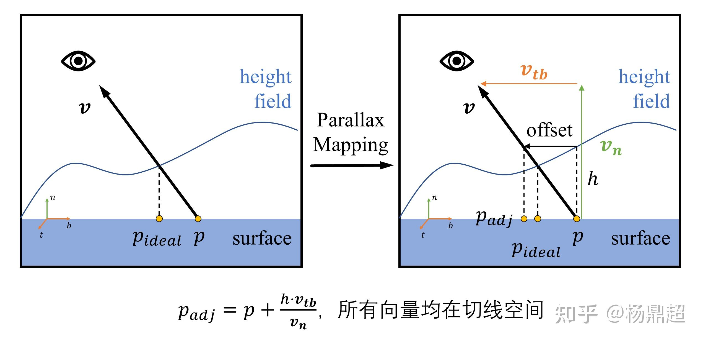
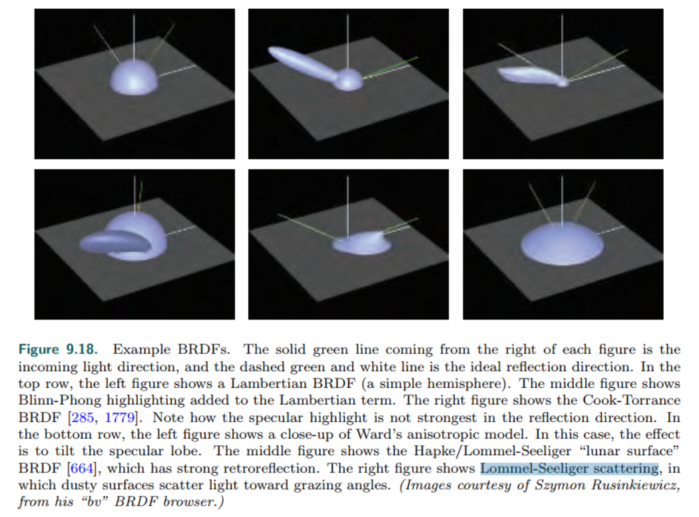

Real Time Rendering 4thed

# Chapter 1
# Chapter 2
# Chapter 3
# Chapter 4
# Chapter 5 Shading Basics

## 5.2 Light Sources
理想光源的两个主要属性：方向与颜色

根据方向，把光源分为以下类型：

      directional light
      punctual light 精准光{point/omni light， spotlight}

实际光源还有尺寸 形状，并向多个方向发射光线：称为面积光

## 5.4 Aliasing and AntiAliasing
### 采样理论
任何一个信号都可以表示为多个正弦波的叠加
采样理论:采样频率大于最大的正弦波分量的频率,也就是说采样间隔小于周期最小

     
      当采样频率大于信号频率时,第一个采样点在波峰,下一个采样点至少在信号的下一个波峰之后了,甚至采样频率更小,那可能都过了100个周期了,采样肯定无法表示信号的变化,一个采样间隔采样了多个信号周期,在频谱上表现为多个波峰

      当采样频率等于信号频率时,第一个采样点在信号波峰,下一个采样点在信号下一个周期的波峰,一直都是波峰,采样结果是一条直线

      只有当采样频率大于2倍的信号频率时,才能把信号一个周期里的波峰波谷都采样到,才能重建出波形的变化来,采样频率越高就越接近复现信号

### 抗混叠技术

screen-based AA:对屏幕空间像素使用一种sample pattern,将采样的像素进行加权求和,来表示该像素的color

1. SSAA:
   
      SSAA 是对每一个采样点计算深度、遮挡、颜色和光照，然后解析(down sampling)

      SSAA(SuperSamplingAA, FullScreenAA):以更高的分辨率渲染整个屏幕到离屏缓存上,然后滤波得到图像,效果好,消耗大,一般作为ground truth

      Accumulation Buffer:以前是硬件支持,现在废弃了,通过增加颜色的bit数+分四次微小改变view位置渲染,得到周围的四邻域图 
      累积缓存提供了一种在保持好的颜色分辨率下实现在场景中“多重曝光（multiple exposures）”的方法。使用累积缓存可以产生许多图像效果来提高图像的真实性，其中包括：反走样、运动模糊、软阴影、深度域（景深）和卷积。要产生这些效果，必须将图像渲染多次，对场景位置（或所选的物体）进行微小的、渐增的改变，然后累积结果。

2. MSAA:
      
         每个sample只计算depth 以及材质颜色,然后多个sample进行一次光照计算
         pixel的center(中心,box的中心) centroid(形心,图元占据部分的形心)

         CSAA(Coverage Sampling AA, nvidia)==EQAA(Ehanced Quality AA, AMD)进一步减少颜色计算的采样点

         选了4个sample,这四个sample如何分布是由硬件决定的
MSAA SSAA基本上一样,顶点着色器跟rasterization阶段完全一样,后边的fragment shader时,SSAA每个sample都要执行,MSAA只执行一个center或者sample

DLSS:Deep Learning Super Sample,可以利用深度学习,先渲染低分辨率的图像,然后重建出高分辨率额图像
1. 显著提升帧率
2. 保持甚至提高画质
3. 适用范围广

下面的AA技术都是后处理技术,本质就是平滑

3. DAEAA(Directionally-Adaptive Edge AA)
   着重处理了边缘,边界数量变化会影响帧率
   找到边缘处的像素 拟合出线段来 线段两侧的像素进行加权平均(权重与到边缘距离成反比)  
4. Morphological AA
   形态学抗锯齿,是一种后处理,可以用于延迟渲染
   找到边缘 根据边缘长度以及形状(可以用面积或者啥的)计算混合权重系数 加权平均 
5. SRAA(Subpixel Reconstruction AA)
6. FXAA 根据梯度确定是不是边缘,是的话根据二阶导确定主方向,根据主方向选择左右邻居(竖直边界时)或者上下邻居(水平边界时)中差值大的那个进行平均 https://blog.simonrodriguez.fr/articles/2016/07/implementing_fxaa.html
   对比MLAA,fxaa只需要考虑边界的走向(求二阶导就可以),不考虑形状大小,计算简单
7. TAA(Temporal AA 帧间抗锯齿)
   SSAA是每一帧都超采样,TAA将采样点分摊到了一帧一个采样点,

         偏移采样点jittering sample: 常用的方式是投影矩阵微信改变

         对于静止场景，每个像素点对应的上一帧位置是确定的

         对于运动场景，需要找到每个像素在前一帧对应的位置，利用的是反向投影

         1. Reverse reprojection：
         基本思想是：将当前帧渲染好后，存储在一张离屏帧缓冲里面，在渲染下一帧时，先将某个点反向投影，看是否可以在上一帧的帧缓冲里面找到(此处判断是否找到：根据物体ID、深度等信息)，如果找到那么使用，否则认为此点在上一帧被遮挡，其值不能使用，具体参考[Accelerating Real-Time Shading withReverse Reprojection Caching]

         velocity buffer(motion buffer):

         2. 采样点累加 加权累加 注意Tone Mapping
         3. 数据验证：拒绝与修正
         根据深度 法系 物体id 颜色 速度等拒绝历史数据
         修正历所以需要在混合前对历史数据进行验证，常用的方法是拒绝 (Rejection) 和修正 (Rectification).

         拒绝：比较直接的方法，往往对比历史数据和当前数据的深度、法线、物体ID、运动速度和颜色值等，来设置条件考虑是否拒绝历史数据。比如在前面反向投影的时候，就使用了深度信息作为拒绝数据的条件，也可以对比两者的颜色值来考虑是否拒绝，但是在运动剧烈或者光照变化频繁的场景，一味地拒绝历史数据会导致 TAA 效果大减，所以折衷的方法就是修正历史数据。

         修正：基本思想是考察历史数据与当前数据颜色的“距离”。

         a) 一种比较复杂的方法是：用当前数据颜色值及其周围八个点的颜色值，在 RGB 颜色空间计算一个凸包，如果历史数据颜色值在凸包里面，则直接使用，如果在凸包外面，则连接两个颜色值得到一根线，并求这根线与凸包的交点，使用交点处的颜色值进行混合。可预想的是，计算凸包以及连线与凸包的交点这两个操作十分复杂。

         b) 另一种近似的方法是：将计算凸包转化为计算 AABB，并且计算连线与 AABB 的交点。

         c) [3]中进一步改进：不在 RGB 空间计算，而是在 YCoCg 颜色空间操作，但是有可能点的颜色分布很散，导致 AABB 范围很大，不能很好的修正历史颜色。

         d) [4]中进一步改进：不直接使用近邻点颜色的最大值和最小值来确定 AABB，而是用均值和标准差：

## 5.5 透明 alpha 混合
over运算： 从后往前一层层叠加，不需要计算混合后的alpha(实际上，由于是跟不透明物体混合，每次混合后的alpha都是1)，只能混合不透明背景
under运算： 从前往后一层层叠加，需要计算混合后的aplha，用于下次under操作

两种运算顺序物理结果肯定是一样的，公式推导也是一致的，注意over默认基础是(0,0,0,1)的背景色
under也要加上，每次的颜色要乘以alpha

### depth peeling
逐层剥离（Depth Peeling）的思想就是：从前往后逐层对半透明物体执行 under 操作，使所有要渲染的半透明物体都混合为一层，最后与底层的不透明物体执行 over 操作。

### A buffer
A-buffer 是另外一个 OIT 技术，其主要思想为：在每个像素存储一个链表，此链表存储着这个像素重叠的多个片元的信息，都渲染完之后，对每一个链表排序，进行混合

DirectX 有linked list，两个UAV实现
一级UAV跟FBO尺寸一样，代表了每一个fragment，里面存储的是该frag对应的二级UAV链表的偏移地址
缺点：无法预先知道需要多少空间

以上两种是accurate 算法
下面的是approximate算法

### Multi-Layer Alpha Blending
解决Abuffer无法确定需要内存的问题，申请固定大小的内存分层计算混合，以下每一层内的片元直接混合(没有排序)

### Weighted Sum & Weighted Average
把over算法的因项式分解，划分成依赖于顺序、不依赖顺序，

取前几项，作为近似，特别透明时效果挺好，不透明度高时效果一般

## 5.6 color encoding
gamma correct
sRGB

显示器由于电压特性会对图像做一个2.2的幂
为了让人眼看到的跟显示器显示的一样，在显示之前做个gamma1/2.2的变换，补偿显示器

微软惠普开发了一种颜色标准，sRGB，对应的就是gamma0.45的空间，性当于存储时就做了一次gamma校正

gamma校正的另一种原因

1. 显示器的输出在Gamma2.2空间。
2. 伽马校正会将颜色转换到Gamma0.45空间。
3. 伽马校正和显示器输出平衡之后，结果就是Gamma1.0的线性空间。
4. sRGB对应Gamma0.45空间。

gamma2.2渲染出来偏暗，线性空间更真实

如果所有的输入，计算，输出，都能统一在线性空间中，那么结果是最真实的

到底什么纹理应该是sRGB，什么是Linear？
关于这一点，我个人有一个理解：所有需要人眼参与被创作出来的纹理，都应是sRGB（如美术画出来的图）。所有通过计算机计算出来的纹理（如噪声，Mask，LightMap）都应是Linear。
这很好解释，人眼看东西才需要考虑显示特性和校正的问题。而对计算机来说不需要，在计算机看来只是普通数据，自然直接选择Linear是最好的。

# Chapter 6 Texturing
## 6.1~6.2 纹理使用:
https://zhuanlan.zhihu.com/p/369977849

### 第一步 生成纹理坐标
	顶点对应的uv坐标
	规则形状的模型可以project得到
	更常用的方式是美工利用unity或者建模工具展uv 展uv的算法未研究

### 第二步 纹理坐标变换
   1. 
   2. 纹理坐标平移旋转等
   3. 纹理坐标转到纹理图像空间
   [0,1]的纹理坐标转换到纹理图像空间,比如 uv 坐标为 [0.25,0.3]，纹理的宽高为 [256,256]，那么相乘可得到 [64,76.8]，出现了小数
### 第三步 纹理采样
Applying a texture to a primitive implies a mapping from texture image space to framebuffer image space
纹理贴到模型上,显示在屏幕的一定区域,则有一个texel到pixel的映射过程,也就是确定屏幕上一个像素对应的纹素是哪些

#### 纹理放大
纹理图像分辨率太小,需要放大后显示在屏幕,上采样过程,
1. nearest插值
2. bilinear插值
3. cubic三次插值

#### 纹理缩小
纹理图像分辨率太大,需要缩小后显示在屏幕,下采样过程,多个texel都映射到一个pixel
介绍三种方法:

1. mipmap:

	glGenerateMipmap,

	建立一系列不同尺寸的多级纹理，在纹理采样时，计算对应的细节级别，再用三线性插值 (Trilinear interpolation) 进行混合。

      建立不同尺寸的纹理时,纹素可以通过box, Gaussian, Lanczos, Kaiser等滤波器得到

	Level的确定理论上是根据距离camera的远近划分范围,实际上GPU是根据单个纹素占据的像素大小确定lod
	当不缩放时,[0 1]的纹理坐标占据1000*1000个像素的屏幕空间,此时单个像素占据的纹素大小是1/1000==0.001;当只占据500*500的像素时;单个像素占据的纹素大小是1/500==0.002,变大了;这个值可以理解成尺子的刻度,是uv坐标的差值,dfdx dfdy的用处,是求一个表达式f在窗口坐标x y下的偏导数

      
      

      float4 _MipMapColors[11];
      float4 _MainTex_TexelSize;

      fixed4 frag (v2f_img i) : SV_Target
      {
      float2 uv = i.uv * _MainTex_TexelSize.zw;
      float2 dx = ddx(uv);
      float2 dy = ddy(uv);
      float rho = max(sqrt(dot(dx, dx)), sqrt(dot(dy, dy)));
      float lambda = log2(rho);
      int d = max(int(lambda + 0.5), 0);
      return _MipMapColors[d];
      }

	Mipmapping 的优缺点：

	1） 优点：Mipmap 建立好后，占用内存固定，且使用时计算量固定

	2） 缺点：各向同性，当同一个 pixel 在横纵方向覆盖的 texel 的个数不同时，却对横纵两个方向计算了相同的纹理细节等级。比如横向长度大于纵向，且由此确定了细节等级 d，那么纵向就会过度模糊。下面要讲的 SAT 技术解决了这个问题 **只管横或者纵,长的那一个方向**
2. Summed-Area Table

	是一种各项异性技术，其思想为：确定该 pixel 在纹理空间上覆盖 texel 区域四边形的轴向最小 包围盒 (Axis-Aligned Bound Box, AABB)，然后求取该包围盒的纹理值的平均值，作为该 pixel 的采样纹理值 c **兼顾了横纵轴,但对角线有问题**

	总结 SAT 技术的优缺点：

	1） 优点：解决了横向和纵向过度模糊与抗锯齿的平衡问题

	2） 缺点：SAT 纹理内存占用高；不能解决对角线方向的过度模糊问题

3. 各向异性过滤:

	Texram 是：沿着主方向增加采样点，再平均混合,

### 第四步 纹理转换
获取纹理值后,不一定当做颜色使用,可以作为normal bump等,具体的变换需要根据纹理的意义进行

## 6.5~6.9 各种纹理
### material mapping 改变材质

就是根据几种光照模型定义的

   环境光:

      ao
      environment-map

   diffuse:

      diffuse/albedo color map

   specular:

      roughness控制高光衰减,集中程度

### alpha mapping 改变alpha值
decal 或者 镂空效果 用于进行alpha test 或者alpha blend

mipmap情况下,同一个alpha值会出现远处树叶消失的问题

   1. 手动修改每个LOD的alpha值
   2. 限制LOD的层级数量
   
   3. 根据通过alpha test的像素占比coverage,自适应调整alpha:

      1） 先求出 d=0 纹理等级时，自定义的一个阈值 a_0 对应的 coverage = c_0，

      2） 随后在 d=1,2,3… 等各级纹理中 coverage 与 c_0 相近的前提下，用二分查找求出不同等级的透明度阈值 a_d，此时理论上只需要对不同等级的纹理透明度施加不同的透明度阈值即可，但是现有管线的透明度测试中，只能用同一个透明度阈值。所以等效为：

      3） 对各级纹理的透明度进行 a_0 / a_d 倍缩放，在透明度测试时，用 d=0 级处的透明度阈值 a_0 阈值即可。

alpha blending:
预乘alpha 还是后乘

### bump mapping 改变shading normal
一大类改变小细节表达的技术,不改变object normal的情况下,改变了shading normal

物体的细节可以分成三个层次:

      1） 宏观特征 (Macro-Feature)：由vertex triangle or 其他几何图元表征,往往是跨三角形的，主要用几何体来表征。比如一个人的头或者胳膊，都是用三角形构成的几何体

      2） 微观特征 (Micro-Feature)：往往是亚像素的，主要是用着色方程来表征。光照(着色)模型模拟了物体微观几何与光线的交互,比如衣服的材质和皮肤的材质、粗糙度等不一样

      3） 中观特征 (Meso-Feature)：中观特征位于宏观和微观之间，往往是在一个三角形内跨像素的，比如衣服上的褶皱或者脸上的皱纹，这些特征用细小的三角形建模显得过于浪费了，于是就用凹凸贴图的方式表征。

bump 贴图改变了着色法线,不改变几何体,通常从高模导出,用到低模上
有三种存储方式

   1. Blinn method:存储(bu,bv),作为法线的偏移量,offset map
   2. 直接存储法线:(nx,ny,nz)
   3. 高程图:height-field,存储高度的变换,利用中间差分求出法线

tangent line space:要统一法线与光照 视线方向到一个坐标系,世界坐标系或者TBN都行,统一就行
好处:物体可以任意变换orientation,便于复用

horiziontal mapping:给法线加阴影 11.4 DO

缺点:
   
      凹凸贴图的缺点在于：没有真正改变表面的几何凹凸性，所以在观察角度过于倾斜的时候，越会觉得表面像贴了一张纸上去，这是因为没有考虑由于高程带来的视差和遮挡

### parallax mapping
视差贴图: 利用height-field计算一个纹理坐标的offset,得到更准确的点,体现视角变化带来的影响

问题:

   1. 视线远离法线方向或者高程变化剧烈时,一点点高程就会导致偏移调整很多,造成问题-->因此限制偏移量在高程内
   2. 高程遮挡问题:ray marching方法检测,--->叫parallax occlusion map(POM),或者叫relief mapping(地势贴图),self-shadow

有各种变体

### displacement mapping 改变表面结构

凹凸贴图(法线贴图)、视差贴图和地势贴图，都只是在计算光照时对法线或者其他光照方程的输入进行了微调，没有修改表面结构

此处所介绍的移位贴图 (Displacement Mapping) 则实际性地修改了表面结构，其主要依赖于渲染管线的曲面细分 (tessellation) 功能，即根据贴图中对三角形进行曲面细分，生成足够多更小的三角形，并对每个三角形的顶点位置都进行移位，实际上得到了更为精细的几何体。

可想而知，这种技术是效果最好的，但也是最复杂的。

Kalos 在 06 年有一篇综述https://www.researchgate.net/publication/220506016_Displacement_Mapping_on_the_GPU_-_State_of_the_Art

### Textured Lighting 改变光源
project mapping 
各种带有图案的光照效果

### shadow mapping

两个pass
      pass1 相机放在点光源位置,记录一个depth mapping,以及一个投影矩阵M
      pass2 正常渲染场景,每个像素位置比较相对于光源的深度(通过M矩阵求解)

点光源 硬阴影

问题：

      1. 聚光灯的shadow mapping好生成,点光源的是四面八方都有，所以应该生成一个cube map
      2. 深度数值精度有限，z-fighting现象,需要加一个bias
      3. shadow map分辨率有限，每个像素占用一定空间，离光源越远代表的片元就越多，采样+重建会有混叠

此技术有三大难点：

      1） Omnidirectional Shadow Maps：全方向的阴影贴图 

      2） Depth Bias：比较深度时的偏差问题

      3） Aliasing：阴影贴图的采样和重采样问题

抗混叠方式主要有：

      采样（贴图生成时）：Fitting、Warp(PSM, LiSPSM, TSM)、Partition(CSM)

      重采样（贴图使用时）：PCF、CSM、ESM、VSM、LVSM、EVSM

Fitting：

      贴图生成时，使贴图视椎体尽量贴近场景视椎体，最紧凑的情况是只对可见物体进行pass1
      原理就是更充分的使用xy分辨率以及z的深度值分辨率

Warp：

      近处分辨率高点，远处分辨率低点，使得近处效果更好

Partition：

      z-partition cascaded SM得到z方向一系列的sm，适用于定向光的大场景

PCF: percentage closer filter 百分比近似滤波
数学上看,是对0 1的离散值进行卷积,得到0到1的连续值

Percentage Closer Soft Shadows(PCSS):在pcf的基础上,根据光源 shadow-caster shadow-receiver的距离调整kernel的大小,从而越近阴影越深,更符合实际效果 

filter kernel可以是

      box 容易出条纹
      bilinear 容易在gpu实现 
      possion-disk 在一个圆盘里找到符合possion分布的随机采样点,可以减少采样点数量 减少条纹

pcf的数学表达:

对于 PCF, 每一个fragment都需要对周围滤波核内的frag做一次计算,性能影响很大,但却无法进行预计算,有两个原因：

      1、 因为 PCF 里面的 H 函数在最终渲染时才能确定，此函数不能预计算

      2、 因为 H 函数是一个 step 函数，是非线性函数，即使可以预计算（此假设就是再多一次 pass），也不能用于 mipmapping 技术

这就衍生出了一些新的预计算的滤波阴影贴图算法，此类算法有两个方向：信号处理思想 和 统计思想

1. 信号处理:
   
   

   1.1 将H阶梯函数用傅里叶展开代替:
   Convolution SM:
   傅里叶展开的截断会产生振铃现象

   1.2 将H用简单的指数函数代替:
   Exponential Shadow Map,ESM

2. 统计思想

在基础的阴影贴图里，如果某一点经过阴影映射得到的深度z>z0 ，那么得到的“阴影值”为 1，反之如果z<z0 ，则值为 0，这就是前面所述的 step 函数

而 VSM 方式为了不让阴影的判断那么绝对，也就是不让阴影那么硬，就确定：把z>z0的概率值，替代“阴影值”，由于此处我们可在阴影贴图里面获得的是很多值，于是就把z当作随机变量。

      方差阴影贴图（Variance shadow map,VSM）
      分层方差阴影贴图（Layered variance shadow map，LVSM）:解决渗光问题

### environment mapping

用途:

   场景的背景色
   镜子里的场景

实现方式:

      cube map
      latitude-longitude map
      sphere map

# Chapter 7

# Chapter 8 Light and Color

## 8.1 Light Quantities
### 8.1.1 Radiometry 辐射度量学 
纯物理现象
与pbrt相互对照
deal with the measurement of electromagnetic radiation研究电磁辐射的测量

电磁波:

波长lambd:范围极广,从几百分治一纳米的gamma波到几十几千米的radio wave(无线电波)

gamma射线 x射线/伦琴射线 紫外射线/ultraviolet 可见波:400nm~700nm 红外波 微波 无线电波

以上基本变量都有spectral distribution,直接除以长度即可

### 8.1.2 Photometry 光度学
考虑人眼的感受,跟radiometry变量一一对应,**转换为人眼感知的亮度**
radiometry变量通过乘上CIE photometric curve,得到光度学变量
 将radiance转换成了luminance

### 8.1.3 Colorimetry 色度学
考虑人眼的感受,跟radiometry变量一一对应,**转换为人眼感知的颜色**
Colorimetry deals with the relationship between spectral power distributions and the perception of color

人眼有三种视锥细胞,可以感受不同波长S M L,三刺激值决定了我们看到的颜色。

CIE规定了一系列条件,进行color-mathcing 实验,得到了颜色匹配曲线

先选了645 nm for r, 526 nm for g, and 444 nm for b三种颜色,得到的曲线有负值

然后提出了三种理论光源,使得所有匹配函数都是正值,新的color-match curve是rgb curve的线性组合

其中y curve就是光度学转换曲线

xyz color matching curve通过乘法\积分将任意的spd(lambd)转换成XYZ三刺激值

XYZ三刺激值就是CIE XYZ 颜色空间的三个权重值

为了方便,常把颜色表示成luminance(brightness)和Chromaticity(色度)两个独立变量
CIE定义了一个二维的色度空间

图中概念:
三角形是电视机或者显示器显示颜色范围
黑点是白色
外围的曲线轮廓代表了可见光谱的颜色
连接波普范围两端的直线叫purple line

颜色映射到X+Y+Z=1平面得到2D色度空间

XYZ到RGB有一个转换矩阵，然后再转到HSV HSL等空间

saturation饱和度 and hue色调
HSV和HSI区别
HSV (色相hue, 饱和度saturation, 明度value), 也称HSB
(B指brightness) 是艺术家们常用的，因为与加法减法混色的术语相比，使用色相，饱和度等概念描述色彩更自然直观。
HSV是RGB色彩空间的一种变形，它的内容与色彩尺度与其出处——RGB色彩空间有密切联系。

HSL (色相hue, 饱和度saturation, 亮度lightness/luminance),
也称HLS 或 HSI (I指intensity) 与
HSV非常相似，仅用亮度（lightness）替代了明度（brightness）。

### 8.1.4
严格来说,RGB代表感知而不是实际物理量

## 8.2 屏幕中的颜色表示

### 8.2.2 Tone Mapping
Tone mapping or tone reproduction is the process of converting scene radiance values to display radiance values
基本上就是HDR图像到LDR图像的转换,因为显示器基本上都是LDR
也就是超过[0 255]范围的radiance转换到[0 255]

HDR也是RGB表示,只不过每个分量不止8bit,可能是12bit 14bit 16bit等
LDR是每个分量都是固定8bit的RGB

实现技术:都是一个s曲线, 17年以后新出了不少算法
1. float3 ReinhardToneMapping(float3 color, float adapted_lum) 
{
    const float MIDDLE_GREY = 1;
    color *= MIDDLE_GREY / adapted_lum;
    return color / (1.0f + color);
}
2. float3 CryEngineToneMapping(float3 color, float adapted_lum) 
{
    return 1 - exp(-adapted_lum * color);
}
3. float3 F(float3 x)
{
	const float A = 0.22f;
	const float B = 0.30f;
	const float C = 0.10f;
	const float D = 0.20f;
	const float E = 0.01f;
	const float F = 0.30f;
 
	return ((x * (A * x + C * B) + D * E) / (x * (A * x + B) + D * F)) - E / F;
}

float3 Uncharted2ToneMapping(float3 color, float adapted_lum)
{
	const float WHITE = 11.2f;
	return F(1.6f * adapted_lum * color) / F(WHITE);
}

4. float3 ACESToneMapping(float3 color, float adapted_lum)
{
	const float A = 2.51f;
	const float B = 0.03f;
	const float C = 2.43f;
	const float D = 0.59f;
	const float E = 0.14f;

	color *= adapted_lum;
	return (color * (A * color + B)) / (color * (C * color + D) + E);
}

### 8.2.3 Color  Grading

# Color 总结

## CIE XYZ三刺激值颜色空间
基于物理学、生理学的客观标准
从radiometric quantity到spectral radiometric quantity，再加上人眼的生理感知spectral response curve V(lambda)，得到XYZ三刺激值曲线

## 三维到二维的降维 色度&亮度分离 CIE chromaticity diagram

人眼对颜色的感知可以分为两个相对独立的属性：
1.  **色度**：描述颜色的“质”，即色调Hue和饱和度Saturation，与亮度无关。比如“鲜艳的红色”或“暗淡的蓝色”。
2.  **亮度**：描述颜色的明暗程度。

为了人眼感知及应用等的方便，将三维的XYZ三刺激值映射到二维的色度图Chromaticity Diagram，从而将色度与亮度分离。

CIE XYZ color space的色度图Chromaticity是色调和饱和度的二维图形，而亮度是第三维。

CIE XYZ三刺激值到二维色度空间映射原理的详细解释。这个过程是整个现代色度学的核心基础。
### 核心思想：从三维到二维的降维

CIE XYZ系统定义的三刺激值 \(X\), \(Y\), \(Z\) 是一个三维空间，其中既包含了色度信息，也包含了亮度信息。为了单独研究颜色的“质”，我们需要将亮度因素分离出去，从而将三维空间压缩到一个二维平面上。这个二维平面就是**色度图**。

---

### 关键原理与步骤

#### 1. 归一化处理 - 消除亮度影响

映射的核心是**色度坐标** 的计算。我们通过将每个三刺激值除以它们的总和，来得到一组相对值。

 (x,y)就是色度图的色度坐标 (x,y)+Y就对应XYZ
**改变亮度时，色度坐标没有改变**。这就成功地将色度信息与亮度信息分离开了。

#### 2. 构建二维色度图

以 \(x\) 为横坐标，\(y\) 为纵坐标，我们就可以建立一个二维的直角坐标系。所有可能的颜色色度都会落在这个坐标系内一个特定的区域内，这个图就是著名的 **CIE 1931 色度图**。

### CIE 1931 色度图的特性与意义

这个映射产生的色度图具有几个非常重要的特性：

1.  **光谱轨迹**：
    - 色度图外围的马蹄形曲线代表了**单色光**（从380nm的蓝紫色到780nm的红色）。这些是饱和度最高的颜色。
    - 连接马蹄形底部两端的直线称为**紫红线**，它代表的是由红色和蓝色混合产生的各种紫色和洋红色，这些颜色在自然界中没有对应的单色光。

2.  **白色点**：
    - 图中有一个点被标记为“E”或“D65”。**等能白光点 (E)** 代表的是理论上所有波长能量相等的光源，其坐标为 \((x, y) = (1/3, 1/3)\)。在实际应用中，更常用的是**标准 illuminant D65**（模拟日光），它位于E点附近。
    - 任何颜色的“白平衡”或“中性色”都指向这个白点。

3.  **颜色混合 - 加色原理的体现**：
    - **格拉斯曼定律**在色度图中得到了完美的体现：两种颜色混合产生的所有可能颜色，在色度图上一定位于这两点之间的连线上。
    - 三种颜色（例如RGB）混合所能产生的所有颜色，构成了以这三者为顶点的三角形内部区域。这就是显示器、电视机色域的原理。显示器无法显示其RGB三角形之外的颜色。

4.  **互补色**：
    - 通过白点画一条直线，与光谱轨迹相交于两点，这两点所代表的颜色即为互补色。混合它们可以得到白光。

5.  **颜色饱和度**：
    - 在白点，饱和度为零（白色/灰色）。
    - 颜色点越靠近光谱轨迹，其饱和度就越高。
    - 从白点到光谱轨迹上某点的连线，代表了该色调下所有不同饱和度的颜色。

### 总结与局限性

**映射原理总结**：
通过归一化处理 \((x = X/(X+Y+Z), y = Y/(X+Y+Z))\)，将包含亮度的三维XYZ空间投影到以 \(x, y\) 为坐标的二维平面上，从而得到一个纯粹表示颜色“质”（色调和饱和度）的色度图。

**局限性**：
1.  **感知不均匀性**：这是CIE 1931 xy色度图最大的问题。在色度图上，相等的几何距离并不代表相等的视觉感知差异。例如，绿色区域的一个很大范围，在人眼看来可能差别很小；而蓝色区域一个很小的移动，人眼却能感觉到明显的差异。
2.  **为了解决这个问题**，后续发展出了更均匀的色度空间，如 **CIE 1976 (u‘, v’)** 色度图，它对CIE 1931的坐标进行了非线性变换，使得图上的距离更接近人眼的感知差异。

总而言之，从CIE XYZ到二维色度空间的映射，是一个巧妙的数学处理，它通过归一化剥离亮度，利用 \(x+y+z=1\) 的约束实现降维，从而创造出了一个能够可视化、计算和比较颜色的强大工具——色度图。

## 常见颜色空间
CIE XYZ、色度、HSV/HSB/HSL等颜色模型在颜色表示和描述上有不同的目的和特点。下面是对这些模型的详细比较：

### 1. CIE XYZ Color Space

这是基于人眼对颜色的视觉响应而建立的色彩空间，是国际照明委员会（CIE）在1931年提出的。

它使用三个刺激值X、Y、Z来描述颜色，其中Y代表亮度。

通过归一化可以得到色度坐标：x = X/(X+Y+Z), y = Y/(X+Y+Z), z = Z/(X+Y+Z) 且 x+y+z=1。

因此，我们可以用(x,y)来表示色度，而Y表示亮度，这样就分离了亮度和色度。

Chromaticity（色度）：

通常指的是颜色的属性，包括色调和饱和度，而不包括亮度。

在CIE中，色度通常用(x,y)坐标表示，并可以在色度图上表示。

色度图可以显示所有可见颜色的范围，并且可以用于比较不同颜色的色度。

#### CIE XYZ 与 Chromaticity（色度）

- **CIE XYZ**：
    - **是什么**：一个由国际照明委员会在1931年确立的颜色空间，基于人类平均视觉匹配实验。它用三个虚构的原色X、Y、Z来量化描述任何物理光色。
    - **核心维度**：
        - **X**：大致对应红原色刺激量。
        - **Y**：**关键维度**，不仅代表绿原色刺激量，更被定义为**光亮度**。所以Y本身包含了亮度信息。
        - **Z**：大致对应蓝原色刺激量。
    - **特点**：**设备无关**。一个颜色的XYZ值是绝对的，不依赖于显示器或打印机。它是连接物理光和人类颜色感知的桥梁。

- **Chromaticity（色度）**:
    - **是什么**：从CIE XYZ中**分离出亮度信息**后，剩下的纯颜色属性。它描述了颜色的"种类"和"鲜艳程度"，即我们常说的**色调**和**饱和度**。
    - **如何得到**：通过**归一化**计算出色度坐标 `(x, y)`。
        \[ x = \frac{X}{X+Y+Z}, \quad y = \frac{Y}{X+Y+Z} \]
    - **特点**：二维的 `(x, y)` 坐标只能定义颜色的"质"。要唯一确定一个颜色，必须同时给出色度 `(x, y)` 和亮度 `(Y)`。我们看到的"马蹄形"色度图就是 `(x, y)` 的二维图。

### 2. RGB Color Space
是一个加色模型。通过不同强度的红色、绿色和蓝色光来混合产生各种颜色。这是所有电子显示器（屏幕、电视）的工作原理

用于图像采集、显示和存储，如显示器 网络等

设备相关性极强

### 3. sRGB Color Space
standard RGB Color Space
微软和惠普在1996年创建, 旨在统一显示器和网络上的颜色显示,降低设备相关性

它仍然是 (R, G, B)，但它精确定义了：
1. 原色的色度坐标（基于CIE XYZ）。

2. 伽马值（亮度与电压的非线性关系）。

3. 白点（D65，模拟日光）。

### 4. HSV/HSB/HSL
对RGB的转换，使得颜色更易于人类理解和操作
这些模型都是将RGB颜色空间转换为更直观的属性。它们通常通过圆锥或圆柱形状来表示。

这些都是基于视觉感知的颜色模型，用于在计算机图形中更直观地表示颜色。

HSV（Hue, Saturation, Value）和HSB（Hue, Saturation, Brightness）实际上是同一个模型，只是名称不同。

HSL（Hue, Saturation, Lightness）与HSV类似，但对亮度的定义不同。

Hue（色调）：表示颜色的类型（如红、黄、蓝等），通常用角度（0°-360°）表示。

Saturation（饱和度）：表示颜色的纯度，从0%（灰色）到100%（完全饱和）。

Value/Brightness/Lightness：

在HSV/HSB中，Value/Brightness表示颜色的明暗程度，从0%（黑）到100%（最亮）。

在HSL中，Lightness表示颜色的明暗程度，从0%（黑）到50%（标准颜色）到100%（白）。

#### 4.1 HSV / HSB / HSL（感知模型）

这一组模型都是为了在计算机上更直观地选择和指定颜色而设计的，它们是对RGB模型的更人性化封装。

- **HSV 和 HSB**:
    - **本质上是同一个模型**，只是名称不同（V for Value, B for Brightness）。
    - **核心维度**：
        - **H（色相）**：颜色的基本外观（红、橙、黄、绿...）。用一个角度（0°-360°）表示，形成一个色相环。
        - **S（饱和度）**：颜色的纯度或鲜艳程度。0%为灰色，100%为完全饱和的纯色。
        - **V/B（明度/亮度）**：颜色的明暗程度。0%为黑色，100%为颜色最鲜艳的状态（纯色）。
    - **几何模型**：通常被想象为一个**六棱锥**或圆柱体。色相在顶面上绕圈，饱和度从中心（灰色）到边缘（纯色）变化，明度从底部（黑色）到顶部（最亮）变化。

- **HSL**:
    - **核心维度**：H和S的定义与HSV相同。
    - **L（亮度）**：这是与HSV的关键区别。
        - 0%为黑色。
        - 50%为颜色最鲜艳、最纯的状态。
        - 100%为白色。
    - **几何模型**：通常被想象为一个**双六棱锥**或双圆锥。色相和饱和度在"赤道"位置最纯，亮度从底部的黑色经过中间的纯色，到达顶部的白色。

#### 4.2 HSV 与 HSL 的直观区别

假设你有一个纯蓝色（H=240°, S=100%）：
- 在 **HSV** 中：
    - `V=100%`：是你最亮的纯蓝色。
    - `V=50%`：是较暗的蓝色。
    - 要得到浅蓝色（比如天蓝色），你需要**降低饱和度(S)**。
- 在 **HSL** 中：
    - `L=50%`：是你最纯的蓝色。
    - `L=25%`：是较暗的蓝色。
    - `L=75%`：是较浅的蓝色（感觉像加了白色）。
    - `L=100%`：是白色。

**简单总结**：**HSV的V通道混合了黑色，而HSL的L通道同时混合了黑色和白色**。许多设计师认为HSL在创建颜色主题（如一组深浅不一的同色系颜色）时更直观。

### 5. YUV

## 颜色空间比较
目的：

CIE XYZ是一种基于物理和生理学的颜色模型，用于精确地表示颜色，是许多颜色标准的基础。

Chromaticity（色度）是CIE XYZ的一个衍生概念，专注于颜色的色调和饱和度，忽略亮度。

HSV/HSB/HSL是为了在计算机图形中更直观地选择和控制颜色而设计的，它们更符合人类对颜色的感知描述。

维度：

CIE XYZ是三维的（X,Y,Z），但可以通过归一化得到二维的色度图（x,y）。

HSV/HSB/HSL也是三维的，但通常使用一个三维的几何模型（如圆柱）来表示。

感知均匀性：

CIE XYZ和其色度图在感知上并不均匀，即图上相等的距离并不代表相等的感知颜色差异。因此后来有了CIE Lab等更均匀的颜色空间。

HSV/HSL等也不是感知均匀的，但它们在某些方面更直观，比如调整色调时，人眼感觉到的变化是均匀的。

应用：

CIE XYZ和色度图主要用于颜色科学、工业颜色标准、颜色测量等专业领域。

HSV/HSB/HSL广泛应用于颜色选择器、图像编辑软件（如Photoshop）、计算机图形学等。

转换：

这些颜色模型之间可以相互转换，但转换通常需要通过RGB作为中介。例如，可以从CIE XYZ转换到RGB，然后再从RGB转换到HSV。

总结：

CIE XYZ和色度是建立在科学测量和人类视觉基础上的，用于精确描述颜色。

HSV/HSB/HSL是为了方便人工使用而设计的，更直观，但不精确，常用于计算机图形界面。

### 概念比较与关系

| 对比维度 | CIE xy Chromaticity | HSV / HSL |
| :--- | :--- | :--- |
| **本质** | **科学的、物理基础的** | **直觉的、感知导向的** |
| **目的** | 精确测量、定义和沟通颜色；计算色域。 | 在软件中方便用户选择、调整和创建颜色。 |
| **亮度处理** | 完全分离到Y维度，色度图本身无亮度信息。 | 亮度/明度是模型的一个内在维度。 |
| **感知均匀性** | **差**。图上相等的距离不代表相等的感知差异。 | **也差**。但在其自己的坐标系内调整更符合人的直觉。 |
| **设备相关性** | **设备无关**。是颜色标准的基石。 | **设备相关**。它们通常建立在sRGB等特定RGB色彩空间之上，最终需要转换到RGB来显示。 |
| **关系** | **上层基础**。一个显示器的RGB色域，可以在CIE色度图上用一个三角形区域表示。 | **下层应用**。HSV/HSL是操作RGB值的工具，而RGB色彩空间本身是CIE XYZ的一个子集。 |

- **CIE XYZ & Chromaticity**：是颜色科学的"宪法"和"地图"。它从物理和生理学角度定义了什么是颜色，并提供了一个绝对的、设备无关的参考框架。我们用它来回答"这个颜色在人类视觉中到底位于哪里？"以及"这个设备能显示多少种颜色？"。
- **HSV/HSB/HSL**：是面向用户和程序员的"调色板"和"调色工具"。它们将复杂的RGB值翻译成人类更容易理解的色相、饱和度、亮度等概念，方便我们进行色彩设计和调整。

可以这样理解它们的工作流程：
**物理光** -> 用 **CIE XYZ** 测量 -> 得到绝对颜色值 -> 映射到某个设备（如显示器）的 **RGB色彩空间**（该空间是CIE色度图的一个子集）-> 程序员和用户使用 **HSV/HSL** 工具来方便地生成和调整这个RGB值 -> 最终在屏幕上显示出来。

#### 一个典型的数字颜色工作流程如下：
物理世界/人眼感知 ↔ CIE XYZ (科学基准，设备无关)
↓ (色彩管理，通过ICC Profile等)
sRGB / Adobe RGB (标准化的设备颜色空间)
↓ (软件内部转换)
RGB像素值 (驱动显示器)
同时，为用户提供直观界面：
RGB值 ↔ HSV/HSL 选择器 (用户友好地选取和调整颜色)

#### 总结
CIE XYZ 是科学基础，是连接所有颜色空间的"通用语言"。

sRGB 是最广泛应用的实践标准，它基于RGB模型，但通过标准化解决了设备一致性问题。

RGB 既是sRGB等颜色空间的基础概念，也常被用作sRGB的同义词。

HSV/HSL 是用户体验层，它们是基于RGB（通常是sRGB）的、面向人类的交互工具，让颜色操作变得直观易懂。

理解这些模型的关系，对于进行跨媒体（Web、打印、视频）的色彩管理、图像处理和UI/UX设计至关重要。

## 更多颜色空间
基于硬件的模型：例如RGB、CMYK，它们通常与设备相关。

基于视觉感知的模型：例如HSV、HSL、HSB，它们更符合人类对颜色的感知。

基于颜色的科学测量的模型：例如CIE XYZ、CIE L*a*b*、CIE LUV，它们是设备无关的，用于精确的颜色测量和转换。

下面我们将分别介绍这些颜色空间，并比较它们的特点和用途。

一、RGB（红绿蓝）
- 用途：用于显示器、电视、摄像机等发光设备。
- 特点：加色模型，通过红、绿、蓝三原色的不同亮度叠加来产生各种颜色。
- 表示：通常用三个数值表示，每个数值范围是0-255或0.0-1.0。
- 缺点：设备相关，不同的设备显示的RGB值可能不同。

二、CMYK（青、品红、黄、黑）
- 用途：用于印刷、打印等反射光的设备。
- 特点：减色模型，通过四种颜色的墨水叠加来吸收光线，从而呈现颜色。
- 表示：通常用四个百分比表示，范围0%-100%。
- 缺点：设备相关，而且颜色范围（色域）通常比RGB小。

三、HSV（色相、饱和度、明度）和HSL（色相、饱和度、亮度）
- 用途：在图像处理软件中常用，更符合人类对颜色的直观感知。
- 特点：
- HSV：也被称为HSB（Hue, Saturation, Brightness/Value）。色相H用0°-360°表示，S和V用0%-100%表示。
- HSL：与HSV类似，但L（Lightness）的定义不同。在HSL中，L=50%时颜色最纯，而HSV中V=100%时颜色最纯。
- 优点：直观，容易调整颜色。例如，调整色相可以改变颜色种类，调整饱和度可以改变颜色的鲜艳程度，调整明度/亮度可以改变明暗。

四、CIE颜色空间
- CIE XYZ：1931年建立，基于人眼对颜色的响应，是设备无关的颜色空间。Y分量表示亮度。
- CIE xyY：由XYZ推导而来，其中x和y是色度坐标，Y是亮度。这样可以将颜色信息（色度）和亮度分开，形成二维色度图。
- CIE L*a*b（CIELAB）：1976年建立，设计为感知均匀的颜色空间。L表示亮度，a和b表示颜色对立维度（红-绿和黄-蓝）。设备无关，常用于颜色测量和比较。
- CIE LUV：同样于1976年建立，也设计为感知均匀，主要用于照明和显示技术的颜色测量。

五、其他颜色空间
- YUV、YCbCr：用于电视和视频编码，将亮度信息（Y）和色度信息（UV或CbCr）分离。这样可以对亮度和色度采用不同的采样率以节省带宽。
- Grayscale：灰度空间，只有一个维度，表示从黑到白的程度。

六、颜色空间的转换
- 不同颜色空间之间可以相互转换，但有些转换是可逆的，有些则不是（因为色域不同）。
- 例如：
- RGB到HSV/HSL：有公式可以转换，且可逆。
- RGB到CIE XYZ：通过一个线性变换矩阵，具体系数取决于RGB颜色空间（如sRGB、Adobe RGB等）的定义。
- CIE XYZ到CIE L*a*b*：非线性转换，目的是使颜色空间更均匀。

七、色域（Gamut）
- 指一个颜色空间能够表示的所有颜色的范围。
- 不同的颜色空间有不同的色域，例如sRGB和Adobe RGB都是RGB空间，但Adobe RGB的色域比sRGB更广。

八、总结
- 选择颜色空间取决于应用场景：
- 计算机图形显示：RGB
- 印刷：CMYK
- 颜色选择和人机交互：HSV/HSL
- 颜色科学和精确测量：CIE XYZ、CIE L*a*b*
- 视频压缩：YUV、YCbCr

由于颜色空间众多，且转换复杂，在实际应用中通常需要色彩管理系统（CMS）来保证颜色在不同设备上的一致性

# Chapter 9 Physical Based Shading

## 9.1 Physics of light

1. physical(wave) optics 
   
   反射 折射 散射 
   纳米几何 惠更斯-菲涅尔原理 干涉 衍射

2. geometric optics 光在物体表面及内部的传播 认为波长远远大于微表面尺寸

因为看起来是平面实际微观上是很多小平面构成：

根据材质不同，折射部分的光照有不同表现：

   金属材质折射部分被完全吸收
   非金属材质反射多次反射后，从物体表面射出

## 9.3 BRDF
如果入射点与出射点距离相比像素尺寸很小，则是普通brdf，光照仅由入射点光照影响

如果入射点与出射点距离相比像素尺寸较大，则是次表面散射，透射的光线会继续在物体(体数据)内部继续传播,最后在表面某个位置射出

因为是微表面，反射项可以分为 specular + diffuse

微表面理论是推导brdf的一种方式

half vector就是BRDF里的两个方向wo wi

微表面会产生阴影或者阻挡光线

光线波长可以作为brdf的参数，也可以认为brdf返回了普分布值，实时渲染总是使用第二种返回rgb普分布, [brdf到rgb的转换]
The amount of light reflected can vary based on the wavelength, which can be modeled
in one of two ways. Either the wavelength is treated as an additional input variable
to the BRDF, or the BRDF is treated as returning a spectrally distributed value.
While the first approach is sometimes used in offline rendering [660], in real-time
rendering the second approach is always used. Since real-time renderers represent
spectral distributions as RGB triples, this simply means that the BRDF returns an
RGB value.

微分立体角可以用球坐标进行参数化：dw=sin(theta)d(theta)d(phi)

### BRDF 光照模型
1. 最简单的是Lambertian, 也叫Lambertian shading model，漫反射,各个方向都是常量
2. Phong 漫反射+高光 ,不满足brdf的可逆性 r·v
3. Blinn-Phong 引入half = (l+v)/2, h·n代替r·v
4. Cook-Torrance 高光最强的方向不是镜面反射方向 应用最早的物理模型
5. Ward's ansitropic model
6. Hapke/Lommel-Seeliger "lunar surface" 复古反射
7. Lommel-Seeliger scattering
   

## 9.4 illumination
全局光照:递归求解积分
局部光:积分中的Li是给定量，不需要递归求解

## 9.5 Fresnel Reflectance
微观表面的反射项的影响因素之一
The Fresnel equations describe the dependence of F on θi, n1, and n2.

简化Fresnel equations后得到的近似

1. external reflection:光线从低折射率表面产生,在高折射率表面反射,一般是从空气射向物体表面 
2. internal reflection:反过来,物体射向空气,光在透明物体内部传播,射向物体表面,只在绝缘体发生

## 9.6 microgeometry

## 9.7 microfacet theory

## 9.8 BRDF models for surface reflection
1967年,Torrance-Sparrow发表了光学领域的微表面理论

1975年,Trowbridge-Reitz法线分布模型

1975年,裴祥风提出标准光照模型背后的基本理念:

      标准光照模型只关心direct light,即那些光源发出照射到物体表面后,
      经过一次反射直接进入人眼的光线,把这些光线分成4部分:

      自发光
      高光反射
      漫反射
      环境光

1977年,Blinn首先在CG中使用了Torrance-Sparrow微表面理论,并改进了Phong模型,而且提到了三种微表面模型
其中包括Trowbridge-Reitz模型

1982年,卢卡斯影业(现Pixar)的Cook与Torrance合作,提出了目前一直使用的Cook-Torrance模型

cook-Torrance模型有很多推导的文章

### 9.8.1 NDF
微表面难以建模,用NDF法线分布函数来描述微表面的法线:

各向同性法线分布:

   Beckmann NDF(Cook-Torrance BRDF使用的NDF),
   Blinn-Phong(经验模型,之前大量使用)
   Trowbridge-Reitz or GGX, Blinn推荐的,30年后才被重视,Walter发现并命名为GGX
   generalized Trowbridge-Reitz (GTR) 
   Student’s t-distribution (STD)

Anisotropic Normal Distribution Functions:

推导各向异性的有效方法是将各向同性进行扩展

几何项:
   
   提出了很多G1函数,但到底用哪个是Heitz解决的,证明了只有the Smith function and the Torrance-Sparrow "V-cavity" function是理论正确的
   G1表示对一个方向可见的微表面 G2项表示joint masking-shadowing function对两个方向可见
   

微表面理论是推导BRDF的工具

推导新的NDF时,可以增加NDF的复杂性,提供更多形状控制的参数,另一个更好匹配实验材料结果的方法就是使用
多个specular lobe

## 9.9 BRDF Models for subsurface scattering

前面都是介绍直接反射(specular)部分,现在讲另一部分折射,进入物体内部后的次表面反射,漫反射

折射的光会经过scattering 和 absorb过程,有一部分会从表面重新射出到人眼,这构成了diffuse项

1. subsurface albedo 次表面反射率, 可以作为diffuse color

Ashikhmin and Shirley模型

## 9.10 BRDF Models for Cloth

## 9.11 Wave Optics BRDF Models

## 9.12 Layered Materials
迪士尼的clear coat

# Chapter 10 Locall Illumination

直接光照+环境光照，仍然是局部光照，
全局光照需要知道场景内的所有表面、物体

本章翻译https://zhuanlan.zhihu.com/p/375583779

## 10.1 面积光源

## 10.2 Environment Lighting环境光照

## 10.3 Spherical and HemiSpherical Functions 球面半球面函数
进一步扩展环境光照，将常量改进为函数
### 10.3.1 Simple Tabluted 
### 10.3.2 Spherical Basis

1. Spherical Radial Basis Functions
2. Spherical Gaussians
3. Spherical Harmonics: orthogonal set of basis functions over the sphere

## 10.4 Environment Mapping
Recording a spherical function in one or more images is called environment mapping:将球面函数保存在图像中,就叫环境光映射

### 10.4.1 Latitude-Longitude Mapping
### 10.4.2 Sphere Mapping
### 10.4.3 Cube Mapping
### 10.4.4 Other Projections

## 10.5 Specular Image-based Lighting

## 10.6 

# Chapter 11 Global Illumination
本章翻译https://zhuanlan.zhihu.com/p/376141809
## 11.2 General Global Illumination

Previous chapters have focused on various ways of solving the reflectance equation.
We assumed a certain distribution of incoming radiance, L i , and analyzed how it
affected the shading. In this chapter we present algorithms that are designed to solve
the full rendering equation. The difference between the two is that the former ignores
where the radiance comes from—it is simply given. The latter states this explicitly:
**Radiance arriving at one point is the radiance that was emitted or reflected from other
points**.

全局光照：反射+折射+发射，整个场景内所有物体都对radiance有影响
局部光照：直接光照+环境光，Li是已知量

求解渲染方程，常用的两个方法：有限元方法+Monte Carlo方法，
Radiosity辐射度算法用有限元方法
光追算法使用蒙特卡洛算法

## 11.3 Ambient Occlusion

### 11.3.1 AO原理
 就是visibility(p,l)函数的积分
### 11.3.2 

### 11.3.4 预计算AO
预处理与光有关的信息的过程叫做 烘焙(baking)

### 11.3.5 动态计算AO

### 11.3.6 SSAO
后处理pass,输入position normal sample-kernel,在TBN空间对每个frag
进行半球采样,采样点在当前frag远处的个数与总采样点数量的比值,就是环境光遮挡系数,1-遮挡系数就是环境光的接收比例

采样的过程都可以引入随机性,可以是sample pattern的随机,个数的随机 分布的随机等等

## 11.4 Direction Occlusion
## 11.5 Diffuse GI
## 11.6 Specular GI
## 11.7 Unified Approach

# Chapter 12 Image Space Effects
## 12.1 Image Processing
## 12.2 重投影技术
## 12.3 lens flare & bloom

丁达尔效应与强光

高斯平滑一下过暴的地方或者一张过暴图跟正常图混合

## 12.4 Depth of field
1. 调整焦距 改变景深
2. 保持焦距不变，微调整镜头，渲染多次到A-buffer，累积结果，耗时
3. 按照弥散圆大小向外扩展像素
4. 根据depth buffer，coc，模糊图像

## 12.5 Motion Blur

# Chapter 13

# Chapter 14 Volumetric and Translucency Rendering

participating media
水 雾 空气 烟 火焰等物质, 组成物质的粒子与光线发生scattering event

## 14.1 Light Scattering Theory
在之前的情况下,由于没有参与介质的影响,可以认为进入相机的radiance等于最近的离开表面的radiance,公式如下

有介质散射后,等号不再成立,而是有以下方程

其中Lscat表达式如下, PBRT里的Ls项(没有Le)
 p是phase function, v是visibility函数, Ci是ith光源的radiance

其中可见性函数如下

大范围介质特效需要进一步简化上面的函数

寒霜引擎实现的粒子散射https://www.ea.com/frostbite/news/physically-based-unified-volumetric-rendering-in-frostbite

## 14.5 Translucent Surface

### 14.5.2 Refraction 
透明物体主要是折射现象
### 14.5.3 Caustics and Shadows

chaos corona定义:https://www.chaos.com/cn/blog/what-are-caustics-and-how-to-render-them-the-right-way
焦散是任何从光源到高光(反射或折射)、到漫反射表面、再到眼睛(或摄影机)的光照贡献

射线从光源到高光反射>到高光反射>再到漫反射>到摄影机

光线偏离了本来的直线路径,在有些部位产生失焦,有些部位产生阴影,有些部位光线聚焦集中形成非常强的入射光

焦散分为折射焦散 反射焦散

实现方式:
1. chaos corona:从相机发出的path tracing + photon mapping
2. 离线烘焙一个焦散纹理,作为light map
3. water volume
4. screen space caustics
   
## 14.6 Subsurface Scattering

BRDF:

      focus on local reflectance phenomena, which redirect light hitting the currently shaded point back outward. 
      These phenomena
      include surface reflection as well as local subsurface scattering, and depend on only
      the incoming light direction l and the outgoing view direction v

      描述将光线从表面入射点反射出去的局部反射现象，包括表面反射+局部的次表面反射，仅仅依赖光线方向l以及视角方向v，一重积分

BSSRDF:对次表面散射的近似估计,认为是一种diffusion process, PBRT的Dipole Solution

      is a generalization of the BRDF for the case of global subsurface scattering

      是BRDF的全局次表面散射的推广，针对入射点 出射点不是同一个点的情况，依赖光线方向l 视角v 以及整个所有出射点p
      二维积分

# Chapter 15 Non_Photorealistic Rendering

## 15.2 outline
五种轮廓 边界
(1) Boundary edge 没有被两个三角形共享的边,比如一张纸的边缘. 全封闭的几何体没有boundarys edges.

(2) Crease edge 被两个三角形共享的边,但是夹角角度超过某个值(dihedral angle, 通常取60).比如立方体就有crease edges.Crease edge可以进一步划分为ridge edge和valley edge.

(3) Material edge 因材质或着色变化产生的边缘.

(4) Contour edge 两个邻接三角形,相对某个方向向量(一般指观察方向)的朝向不同,产生的边.

(5) Sihouette Edge 表示物体Outline的contour edge,将物体和背景分开的边.

### 15.2.1 Shading Normal Contour Edges
观察方向向量和着色表面法线向量点乘,如果得到的值接近于0,说明着色区域是contour edges.
是 rim lighting的逆操作

### 15.2.2 Procedural Geometry Silhouetting
两个pass 第二个pass 往外扩一下顶点,在渲染 混合

### 15.2.3 Edge Detection by Image Processing

### 15.2.4 Geometric Contour Edge Detection

## 15.5 text rendering

# Chapter 16
# Chapter 17
# Chapter 18
# Chapter 19 Acceleration Algorithm
## 19.1 空间划分数据结构
1. BVH:Bounding Volume Hierarchy,用简单的长方体 球等几何包围复杂的物体,方便求交 选择 查询 渲染等复杂计算  AABB OBB
2. Binary Space Partion:把空间根据某个splitting plane进行二分,不利于求交
3. octree:空间八等分,递归进行,直到包含的三角形或物体比较少
4. kd-tree:也叫轴对齐BSP,依次按照x-y-z进行空间划分
5. Scene Graph:前边都是按照几何进行空间划分,场景图则不仅仅是几何数据,还包含texture, light, 渲染状态, 变换, 分层/组等任何需要的数据
   
## 19.2-19.8 Culling技术
1. Backface Culling
2. View Frustum Culling
3. Occlusion Culling
4. Portal Culling 建筑结构常用
5. Detail & Small Triangle Culling:牺牲质量,提高速度

## 19.9 几何结构的LOD
## 19.10 大世界渲染
### 19.10.1 virtual texture & stream
虚拟纹理:就是虚拟内存在GPU上的对应,也叫megatexture, partially resident texture,是一种对超过GPU内存的大纹理数据的一种memory optimization
sparse texture

### 19.10.2 纹理传输编码 transcoding
纹理压缩等
### 19.10.3 通用流
### 19.10.4 terrain 渲染
谷歌地图 Cesium地形渲染等应用都用到了地形渲染技术
1. 几何数据的clipmap,类似mipmap,金字塔形的层次结构
2. chunked LOD 分块的LOD, 四叉树形的块

# Chapter 20 Efficient Shading

## 20.1 Defered Shading
forward shading:
 for(auto obj: objs in scene)
   for(auto light: lights)
      shading each frag
存在大量无用光照计算

延迟渲染两个pass:先进行可见性测试以及表面属性计算,再进行材质光照计算
1. Geometry Pass:渲染得到场景计算光照需要的所有信息
   1. 将所有信息存储在G-Buffer中
   2. 需要的信息包括
      1. A 3D world-space position vector to calculate the (interpolated) fragment position variable used for lightDir and viewDir.点的空间位置
      2. An RGB diffuse color vector also known as albedo.材质的漫反射系数
      3. A 3D normal vector for determining a surface's slope.法向量
      4. A specular intensity float.材质的高光系数
      5. All light source position and color vectors.光源的位置颜色
      6. The player or viewer's position vector.相机位置
   3. **这些信息就是渲染方程里的参数x(点的位置) wo(view-dir) wi(光源位置到点的位置,也就是入射方向) fr(各种交互参数) n*l(cosine 项)**
2. Lighting Pass:按照公式计算光照

很多情况下,需要混合延迟渲染与前向渲染

      透明物体的渲染需要先延迟渲染不透明物体,再前向渲染透明物体
      难以实现MSAA

Vega Prime中的延迟渲染示意:  

1. Geometry Pass,
      First, a geometry pass renders all visible scene geometries. 
      It captures various information on every fragment, stored in textures, for use in later passes. 
      Captured information includes: albedo color, emitted color, eye-space position, eye-space normals, and material data.
      When transparency is enabled, a second geometry pass captures similar information for partially-transparent geometries, and stores it in separate textures
      先渲染不透明物体,再渲染透明物体，将信息分别存储在G-buffer中，存储的信息如下图所示  
   
2. Lighting Pass, A Light Pass then uses the information previously captured to compute the contribution for non-celestial light sources. The result is stored in a texture for later use.
When transparency is enabled, a second Light Pass computes lighting for partially-transparent geometries,

## 20.2 Decal Rendering
贴花渲染是3D世界中动态生成细节的一种常用方法。贴花常用于制作子弹孔、血迹、轮胎痕迹以及其它相似的项作为游戏中发生的事件。它们也可以用于设计师使用位于墙上的污迹、破损效果的纹理来丰富场景。

贴花可以通过多种方式与底层材料混合，它可鞥会改变底层的颜色，也可能会改变凹凸贴图，可以定义完全不同的材料。多个贴花可能运用于同一个几何体，也可能一个贴花就跨越多个模型。这些变化对于正向渲染和延迟渲染系统对于如何存储和处理贴花都会产生影响。

相比于正向渲染，延迟渲染无需处理对每一个贴花进行光照计算。贴花的效果可以直接应用于G-buffer，并稍后在进行光照计算时，直接在G-buffer中找到对应的数据进行光源着色，因此避免了在正向着色中发生的过度绘制。因此延迟渲染比正向渲染更擅长处理贴花。

**一个顶点可以有多个纹理坐标**,也就可以有多个贴花,每个decal又有自己的纹理坐标,大量的小贴花应用到物体上,意味着需要为每个顶点存储大量的纹理坐标,尽管可能真正用到贴花的图元就是那么几个.极大浪费

可以在fragment里使用不同的pass将decal blend到上一个pass的out
具体实现时,可以认为贴花是正交投影到物体上.将贴花放在有个有限的volume里,然后进行相交测试 投影,有点像textured light里的图案

## 20.3 Tiled Shading
## 20.4 Clustered Shading
## 20.5 Defered Texturing

# Chapter 21
# Chapter 22
# Chapter 23
# Chapter 24

# 个人总结(偏实现方面的总结)

## 一些技术blog

光线追踪图示及逆水寒引擎介绍 https://zhuanlan.zhihu.com/p/694291368

500行代码理解渲染器,OpenGL后台干: https://github.com/ssloy/tinyrenderer/wiki/ 了啥

实时渲染高级特性实现 知乎专栏https://www.zhihu.com/column/c_1210266723531976704
噪声:https://www.zhihu.com/column/c_1210266723531976704

47种shader map: https://zhuanlan.zhihu.com/p/27339998

virtual texture: https://mp.weixin.qq.com/s?__biz=MzUxMDM3MTYwNQ==&mid=2247487783&idx=1&sn=072441c6589f5eb8916dba8b343d0006&chksm=f902a35dce752a4b708a7c0f0b87e2213cad9242742da3054288d5746d4a8598a5b8277f06ed&scene=21#wechat_redirect

游戏优化方方面面的总结收藏:https://zhuanlan.zhihu.com/p/662926467 

性能优化: https://mp.weixin.qq.com/mp/appmsgalbum?__biz=MzUxMDM3MTYwNQ==&action=getalbum&album_id=1792983677962911751&scene=173&subscene=&sessionid=svr_493b1d64a75&enterid=1728462499&from_msgid=2247501560&from_itemidx=1&count=3&nolastread=1#wechat_redirect
图形渲染: https://mp.weixin.qq.com/mp/appmsgalbum?__biz=MzUxMDM3MTYwNQ==&action=getalbum&album_id=1792984070197444620&scene=173&subscene=&sessionid=svr_493b1d64a75&enterid=1728462499&from_msgid=2247501560&from_itemidx=1&count=3&nolastread=1#wechat_redirect

unity的linear gamma空间https://zhuanlan.zhihu.com/p/141904960

color grading 颜色分级 unity3D UR4中

## BRDF总结
分三类:经验模型,物理模型,Data-driven模型

### 经验模型
1. 最简单的是Lambertian, 也叫Lambertian shading model，漫反射,各个方向都是常量
2. Phong 漫反射+高光 ,不满足brdf的可逆性 r·v
3. Blinn-Phong 引入half = (l+v)/2, h·n代替r·v

### 物理模型
4. Cook-Torrance 高光最强的方向不是镜面反射方向 应用最早的物理模型
5. Ward's ansitropic model
6. Hapke/Lommel-Seeliger "lunar surface" 复古反射
7. Lommel-Seeliger scattering
   
8. Disney Princpled BRDF
不同的物理模型采用不同的F G D项

https://zhuanlan.zhihu.com/p/21376124

### 数据驱动
MERL测量模型 https://www.merl.com/research/license/BRDF/

## BSSRSDF总结

## 全局光照编年史
1. 1968年, Ray Casting, Arthur Appel,<Some techniques for shading machine renderings of solids>
2. 1979年, Ray Tracing, Turner Whitted,在ray casting基础上,光线与
   物体相交后,继续反射折射散射,直到遇到光源,成为经典光线追踪 递归光线追踪 Whitted-style光追
3. 1984年, Distributed(stochasticray) Ray Tracing, Cook将Monte Carlo方法引入光追,可以模拟软阴影 景深 运动模糊等
4. 1986年, Rendering Equation, Kajiya, 建立了渲染的物理方程,描述了光能传输产生的各种现象
5. 1986年, Path Tracing, Kajiya, 开创了基于Monte Carlo的全局光照领域
6. 1993~1994, BDPT,能够产生一些传统路径追踪难以采样到的光路，所以能够很有效地降低噪声
7. 1997, 渲染方程改写成路径形式, Veach
8. 1997, Metropolis Light Transport, 引入了Markov Chain,提高路径追踪鲁棒性