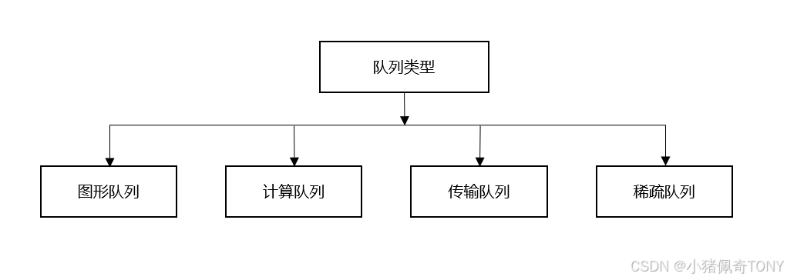

instance与physicaldevice直接交互,physicaldevice与device交互,所以device的create destroy没有instance参数

有哪些性质 需要哪些信息 用到哪些api(包括创建 赋值 使用)

vs OpenGL：
1. reduces driver overhead by allowing programmers to clearly
specify their intent using a more verbose API
2. allows multiple threads to create and submit commands in parallel,通过类似osg的operation queue来实现
3. reduce inconsistencies in shader
compilation by switching to a standardized byte code format with a single com-
piler
4. acknowledges the general purpose processing capabilities of
modern graphics cards by unifying the graphics and compute functionality into
a single API

**Part 1 Drawing A Triangle**

# VkInstance:
VkInstanceCreateInfo
	layer 
	extension 
	VkApplicationInfo 
	pNext = VkDebugUtilsMessengerCreateInfoEXT

vkCreateInstance
vkDestroyInstance

可以同时选择并使用多个物理设备

## VkDebugUtilsMessengerEXT
包含自定义回调函数的字段
vkCreateDebugUtilsMessengerEXT
vkDestroyDebugUtilsMessengerEXT
显式加载auto func = (PFN_vkDestroyDebugUtilsMessengerEXT)
vkGetInstanceProcAddr(instance,
"vkDestroyDebugUtilsMessengerEXT");

# VkPhysicalDevice:

vkEnumeratePhysicalDevices

vkGetPhysicalDeviceQueueFamilyProperties: RTX3050 有6个family,  

vkGetPhysicalDeviceFeatures

vkEnumerateDeviceExtensionProperties

## VkPhysicalDeviceType:显卡类型 独显 集显
	VK_PHYSICAL_DEVICE_TYPE_OTHER = 0,
    VK_PHYSICAL_DEVICE_TYPE_INTEGRATED_GPU = 1,
    VK_PHYSICAL_DEVICE_TYPE_DISCRETE_GPU = 2,
    VK_PHYSICAL_DEVICE_TYPE_VIRTUAL_GPU = 3,
    VK_PHYSICAL_DEVICE_TYPE_CPU = 4,
    VK_PHYSICAL_DEVICE_TYPE_MAX_ENUM = 0x7FFFFFFF

## VkPhysicalDeviceFeatures:显卡硬件支持的一些功能,如几何/细分着色器 逻辑操作 depthClamp 多视口 纹理压缩等
	VkBool32    robustBufferAccess;
    VkBool32    fullDrawIndexUint32;
    VkBool32    imageCubeArray;
    VkBool32    independentBlend;
    VkBool32    geometryShader;
    VkBool32    tessellationShader;
    VkBool32    sampleRateShading;
    VkBool32    dualSrcBlend;
    VkBool32    logicOp;
    VkBool32    multiDrawIndirect;
    VkBool32    drawIndirectFirstInstance;
    VkBool32    depthClamp;
    VkBool32    depthBiasClamp;
    VkBool32    fillModeNonSolid;
    VkBool32    depthBounds;
    VkBool32    wideLines;
    VkBool32    largePoints;
    VkBool32    alphaToOne;
    VkBool32    multiViewport;
    VkBool32    samplerAnisotropy;
    VkBool32    textureCompressionETC2;
    VkBool32    textureCompressionASTC_LDR;
    VkBool32    textureCompressionBC;
	.....
	.....

## VkPhysicalDeviceLimits:硬件决定的一些极值,如最大纹理数 纹理的最大尺寸 uniform-buffer数等
    uint32_t              maxImageDimension3D;
    uint32_t              maxViewports;
    uint32_t              maxClipDistances;
	......

## VkPhysicalDeviceProperties:显卡硬件的驱动版本 厂商 名称 硬件限制等属性
	uint32_t                            apiVersion;
    uint32_t                            driverVersion;
    uint32_t                            vendorID;
    uint32_t                            deviceID;
    VkPhysicalDeviceType                deviceType;
    char                                deviceName[VK_MAX_PHYSICAL_DEVICE_NAME_SIZE];
    uint8_t                             pipelineCacheUUID[VK_UUID_SIZE];
    VkPhysicalDeviceLimits              limits;
    VkPhysicalDeviceSparseProperties    sparseProperties;

## VkExtensionProperties
    char        extensionName[VK_MAX_EXTENSION_NAME_SIZE];
    uint32_t    specVersion;

## VkLayerProperties
    char        layerName[VK_MAX_EXTENSION_NAME_SIZE];
    uint32_t    specVersion;
    uint32_t    implementationVersion;
    char        description[VK_MAX_DESCRIPTION_SIZE];

## layer & extension是instance/physical device级别的
vkEnumerateInstanceExtensionProperties
vkEnumerateDeviceExtensionProperties
vkEnumerateInstanceLayerProperties
vkEnumerateDeviceLayerProperties

## VkQueueFamilyProperties
    VkQueueFlags    queueFlags;
    uint32_t        queueCount;
    uint32_t        timestampValidBits;
    VkExtent3D      minImageTransferGranularity;

# VkDevice:
根据需求，从硬件的features extensions queuefamily创建对应的逻辑设备
VkDeviceCreateInfo:
	uint32_t                           queueCreateInfoCount;
    const VkDeviceQueueCreateInfo*     pQueueCreateInfos;
    // enabledLayerCount is deprecated and should not be used
    uint32_t                           enabledLayerCount;
    // ppEnabledLayerNames is deprecated and should not be used
    const char* const*                 ppEnabledLayerNames;
    uint32_t                           enabledExtensionCount;
    const char* const*                 ppEnabledExtensionNames;
    const VkPhysicalDeviceFeatures*    pEnabledFeatures;

vkCreateDevice
vkDestroyDevice

创建逻辑设备主要的步骤包括：
1. specify queue from queue family
2. specify features

## VkDeviceQueueCreateInfo
    uint32_t                    queueFamilyIndex;
    uint32_t                    queueCount;
    const float*                pQueuePriorities;

## VkQueue
创建逻辑设备后会自动创建VkQueue，但是还需要一个句柄接口来进行交互
Queues are allocated from queue families, where each queue family supports a specific set of operations in its queues. 
For example, there could be separate queue families for
graphics, compute and memory transfer operations. 
The availability of queue families could also be used as a distinguishing factor in physical device selection.

根据VkDeviceQueueCreateInfo创建同一family的多个queue
queue family是pyhsical device级别的
queue是logical device级别的
    
vkGetDeviceQueue(VkDevice                                    device,
    uint32_t                                    queueFamilyIndex,
    uint32_t                                    queueIndex,
    VkQueue*                                    pQueue)
vkQueueSubmit
vkQueueWaitIdle
vkQueueBindSparse

vkQueuePresentKHR

vkQueueBeginDebugUtilsLabelEXT
vkQueueEndDebugUtilsLabelEXT
vkQueueInsertDebugUtilsLabelEXT

VkQueueFlagBits:这个应该是代表了不同的queue family
	VK_QUEUE_GRAPHICS_BIT = 0x00000001,
    VK_QUEUE_COMPUTE_BIT = 0x00000002,
    VK_QUEUE_TRANSFER_BIT = 0x00000004,
    VK_QUEUE_SPARSE_BINDING_BIT = 0x00000008,
    VK_QUEUE_PROTECTED_BIT = 0x00000010,
    VK_QUEUE_VIDEO_DECODE_BIT_KHR = 0x00000020,
    VK_QUEUE_VIDEO_ENCODE_BIT_KHR = 0x00000040,
    VK_QUEUE_OPTICAL_FLOW_BIT_NV = 0x00000100,
    VK_QUEUE_FLAG_BITS_MAX_ENUM = 0x7FFFFFFF

**Part 2 WSI Window System Integration**

# VK_KHR_surface: instance level extension
VK_KHR_win32_surface:platform-specific addition to the extension
VkSurfaceKHR:是vulkan与窗口系统交互的媒介,用来present render result to the window 
vkCreateWin32SurfaceKHR vkCreateXcbSurfaceKHR
vkGetPhysicalDeviceSurfaceSupportKHR
vkDestroySurfaceKHR

VkWin32SurfaceCreateInfoKHR
	HINSTANCE                       hinstance;
    HWND                            hwnd;

presentation to window surface:queue-specific feature

# Swap Chain:
vulkan没有default framebuffer,所以需要一个基础设施来管理render  target,称为swap chain
本质上是一个图像队列,里面的图像等待被展示到window

## 需要支持的扩展
VK_KHR_swapchain:device extension

## 需要设置的属性
除了支持swapchain扩展,最少还需要检查以下属性,才能真正创建对象:
1. VkSurfaceCapabilitiesKHR
   Basic surface capabilities (min/max number of images in swap chain, min/max width and height of images)
1. VkSurfaceFormatKHR: 
   Surface formats (pixel format, color space)
2. VkPresentModeKHR:
   Available presentation modes

## 创建 销毁
vkCreateSwapchainKHR
vkDestroySwapchainKHR
VkSwapchainKHR
VkSwapchainCreateInfoKHR:
	VkSurfaceKHR:由系统窗口决定,opaque
	uint32_t imagecount
	VkFormat
	VkColorSpaceKHR
	VkExtent2D
	VkSharingMode
	VkPresentModeKHR
	VkSwapchainKHR oldSwapChain//窗口resize时等,swap chain会失效,就会参考旧的swap chain创建新的

1. 有了窗口系统及显卡硬件,支持相关扩展
2. 就可以由glfw创建**VkSurfaceKHR**(win32下就是个HINSTANCE HWND),
3. 就可以查询硬件的**VkSurfaceCapabilitiesKHR**  **VkSurfaceFormatKHR** **VkPresentModeKHR**
4. 根据上面的四个结构体,就可以创建**VkSwapchainKHR**

swapchain images可以在不同的queue familiy间使用,产生并发问题
VK_SHARING_MODE_EXCLUSIVE:同一时刻只能被一个queue family占用,需要显式转移所有权
VK_SHARING_MODE_CONCURRENT:没有ownership的显式转移

## Retrieving the swap chain images
VkImage 由swapchain默认创建的,不需要显式create/destroy
vkGetSwapchainImagesKHR

# VkImageView
要使用VkImage(例如,swap-chain/pipeline里)需要创建VkImageView,就是字面意义上的view into image,如何看待这个image
描述了怎样获取image,它的format,哪一块 当做深度缓存还是什么纹理
VkImageViewCreateInfo
	VkImage                    image;
    VkImageViewType            viewType;//1D 2D 3D CUBE 1D_ARRAY,opengl里的target
    VkFormat                   format;//R16F等
    VkComponentMapping         components;//用于swizzle
    VkImageSubresourceRange    subresourceRange;//用到image的哪些部分
vkCreateImageView
vkDestroyImageView

有了VkImageView,这个时候就可以把image作为纹理使用了,
但是还不能作为Render target, 还需要进一步封装成VkFramebuffer才能作为RT

VkImage 对象表示texture和帧缓冲的具体数据

# VkImageLayout
VkImage在内存里的布局,包括:VK_IMAGE_LAYOUT_COLOR_ATTACHMENT_OPTIMAL VK_IMAGE_LAYOUT_PRESENT_SRC_KHR

**Graphics Pipeline:**

# shader modules
the Standard, Portable Intermediate Representation - V (SPIR-V)
SPIR-V byte code for graphics and opencl/compute shader

//glsl编译成spir-v的编译器
glslangValidator/glslc

vulkan 窗口坐标原点变成左上角,z范围变成(0,1),跟Direct3D一样了

# VkShaderModule
VkShaderModuleCreateInfo:把bytecode传进去, 结构体里的指针是uint32类型的
vkCreateShaderModule
vkDestroyShaderModule

VkShaderModule只是对bytecode的简单包装,直到graphics pipeline创建之后,才会被编译链接成可执行的machine code

# VkPipelineShaderStage
VkPipelineShaderStageCreateInfo:指定着色器的shadermodule 阶段/类型 入口函数(一个shadermodule就可以有多个入口函数,执行不同功能了) 以及 VkSpecializationInfo(应该是把constant变量的id/size/offset封装到map数组)

# Fixed Functions
opengl里有默认的状态
vulkan需要显式指定这些状态,这些状态绝大多数会被烘焙到不可变的immutable pipeline state object

## Dynamic State
少部分state可以在draw时改变而不需要重新创建pipeline,包括viewport size, line width, 以及blend的参数

VkDynamicState:opengl state的枚举,这些枚举量包括
	viewport, scissor, line width, color mask, depth, stencil, blend, cull-mode, logic op, line stipple, coverage 
	rasterizer discard, primitive restart, sample location, ray tracing pipeline stack size,
 
VkPipelineDynamicStateCreateInfo:指定的那些dynamic state可以在draw时动态指定/修改

## VkPipelineVertexInputState
VkPipelineVertexInputStateCreateInfo
	VkVertexInputBindingDescription:指定binding,stride,也就是在context中显存的绑定点等存储信息
	VkVertexInputAttributeDescription:指定location, binding, offset, format,也就是顶点属性的数据项特征

## VkPipelineInputAssemblyState
VkPipelineInputAssemblyStateCreateInfo:
	VkPrimitiveTopology:指定图元的拓扑类型,如VK_PRIMITIVE_TOPOLOGY_TRIANGLE_STRIP
	primitiveRestartEnable:是否图元重启

## Viewport and Scissors
VkPipelineViewportState
VkPipelineViewportStateCreateInfo:
	VkViewport* viewports
	VkRect2D* scissors
VkViewport:x,y;w,h;minDepth,maxDepth;

把这俩放到Dynamic state里,就可以一个command buffer使用不同的viewport了,否则改变viewport必须新建pipeline

## Rasterizer
VkPipelineRasterizationState
VkPipelineRasterizationStateCreateInfo
	depthclamp:超过near/far的是clamp还是discard
	rasterizerDiscard
	polygonmode
	cullmode
	frontface
	depthbias

## Multisample 后边再补充
VkPipelineMultisampleState
VkPipelineMultisampleStateCreateInfo

## Depth and stencil testing
VkPipelineDepthStencilState
VkPipelineDepthStencilStateCreateInfo

## Color blending
有两种blend的方式
1. mix新旧颜色得到final
2. 新旧颜色进行位运算

VkPipelineColorBlendAttachmentState:Opengl传统的方式
	blendfactor
	blendop:+ - minus-1

VkPipelineColorBlendStateCreateInfo:
	VkPipelineColorBlendAttachmentState* attachments
	VkLogicOp logicOp
	VkBool32 logicOpEnable

# Pipeline layout
应该是存储uniform等的全局变量
the uniform and push values referenced by the shader that can be updated at draw time
VkPipelineLayout
VkPipelineLayoutCreateInfo:
	VkDescriptorSetLayout*
	VkPushConstantRange*

vkCreatePipelineLayout vkDestroyPipelineLayout 整个生命周期

# VkRenderPass 渲染通道 渲染阶段
需要告诉Vulkan,framebuffer的attachment的数量\类型, 采样数等信息,这些都封装在VkRenderPass里

感觉vkrenderpass就是最后往缓冲里写数据的过程,把这个过程需要用到的资源等元信息封装

vkCreateRenderPass vkDestroyRenderPass
VkRenderPassCreateInfo

要创建VkRenderPass对象,
1. 首先需要的就是attachment的信息
## VkAttachmentDescription
	VkFormat
	samplecount
	VkAttachmentLoadOp 开始/完成渲染时,如何处理color/depth attachment里的数据,clear还是load/store
	VkAttachmentStoreOp
	VkAttachmentLoadOp/VkAttachmentStoreOp stencil 数据如何处理
	VkImageLayout

2. 其次,一个render pass 可以包含多个subpass,以基于前面的framebuffer进行其他操作,如后处理等
每一个subpass都会用到renderpass里的一个或多个attachment,封装成
## VkAttachmentReference
	attachment:应该是VkAttachmentDescription数组的索引,不是color_attach0那种
	VkImageLayout

subpass封装成
## VkSubpassDescription
	VkPipelineBindPoint:VK_PIPELINE_BIND_POINT_GRAPHICS/VK_PIPELINE_BIND_POINT_COMPUTE/VK_PIPELINE_BIND_POINT_RAY_TRACING_KHR
	VkAttachmentReference* pInputAttachments/pColorAttachments/pResolveAttachments/pDepthStencilAttachment
	uint32_t* pPreserveAttachments

3. 创建完准备信息后,开始创建VkRenderPass

## VkRenderPassCreateInfo
	VkAttachmentDescription* pAttachments
	VkSubpassDescription*	 pSubpasses
	VkSubpassDependency*	 pDependencies

## VkSubpassDependency
Remember that the subpasses in a render pass automatically take care of image
layout transitions. These transitions are controlled by subpass dependencies,
which specify memory and execution dependencies between subpasses.

终于能够创建VkGraphicsPipeline了
# VkPipeline

VkGraphicsPipelineCreateInfo:
	上面介绍的各个阶段的state create info, renderpass等信息
	VkPipelineLayout:vulkan handle,而不是struct pointer
	VkRenderPass                                     renderPass;
    uint32_t                                         subpass;
    VkPipeline                                       basePipelineHandle;//方便快速的派生或切换功能类似的pipeline
    int32_t                                          basePipelineIndex;

vkCreateGraphicsPipelines vkDestroyPipeline

VkPipelineCache:存储pipeline创建过程中可以复用的数据,方便后续快速创建pipeline,可以保存到file

**Draw**
# VkFramebuffer
有多少个VkImageView就对应多少个VkFrameBuffer

A framebuffer object references all of the
VkImageView objects that represent the attachments

VkFramebufferCreateInfo:
	VkRenderPass                renderPass;//给哪个renderpass用
    uint32_t                    attachmentCount;
    const VkImageView*          pAttachments;//这俩值就是在VkRenderPass里的VkAttachmentDescription*
    uint32_t                    width;
    uint32_t                    height;
    uint32_t                    layers;
	
vkCreateFramebuffer vkDestroyFramebuffer

# Command Buffers
vulkan里的draw operations, data transfer等不是直接调用函数完成的.
而是把所有的操作record 在command buffer object里. 这样就可以完成准备后一次性提交到vulkan,vulkan可以高效处理全部命令.另外,command record可以多线程执行

## VkCommandPool
有点像线程池,应该就是个内存池,管理存储buffer的内存
用来allocate command buffers
command buffers被提交到某个device queues来执行,如graphics queues\ presentation queues
一个pool只能分配提交到同一类型的queue的command buffer

VkCommandPoolCreateInfo:需要提交到哪种queue family
	VkCommandPoolCreateFlags    flags;
    uint32_t                    queueFamilyIndex;

vkCreateCommandPool
vkDestroyCommandPool

## VkCommandBuffer
VkCommandBufferAllocateInfo
	VkCommandPool           commandPool;
    VkCommandBufferLevel    level;//primary:提交到queue执行 secondary:被primary调用
    uint32_t                commandBufferCount;

vkAllocateCommandBuffers:从指定的commandPool创建几个commandbuffer,类型是一级还是二级
销毁command pool时自动销毁

## recording command
VkCommandBufferBeginInfo 
vkBeginCommandBuffer
    VkRenderPassBeginInfo  VkClearValue	
    vkCmdBeginRenderPass
        vkCmdBindPipeline
        vkCmdSetViewport
        vkCmdSetScissor
        vkCmdDraw
    vkCmdEndRenderPass
vkEndCommandBuffer

vkCmd前缀的函数是record command

# Rendering and Presentation
Synchronization:两种状态,signaled unsignaled
Semaphores:两种,binary和timeline, 用于同步一个queue内的work或者不同queue之间的work,gpu内同步
Fences:同步cpu跟gpu
vkQueueSubmit
vkCreateSemaphore  vkCreateFence
vkDestroySemaphore vkDestroyFence

最长的一帧:
1. 等待上一帧完成 vkWaitForFences vkResetFences 创建一个signaled fence来完成第一帧
2. 从swap-chain获取iamge vkAcquireNextImageKHR:swapchain是个extension feature,所以vkxxxKHR约定
3. 记录command buffer,先vkResetCommandBuffer,然后记录命令
4. submit command buffer:
   vkQueueSubmit向指定queue提交command buffer, 硬件会读取queue里的命令并行执行
   VkSubmitInfo:等待/触发的信号量, 提交的command buffer,
    uint32_t                       waitSemaphoreCount;
    const VkSemaphore*             pWaitSemaphores;
    const VkPipelineStageFlags*    pWaitDstStageMask;
    uint32_t                       commandBufferCount;
    const VkCommandBuffer*         pCommandBuffers;
    uint32_t                       signalSemaphoreCount;
    const VkSemaphore*             pSignalSemaphores;
5. presentation  vkQueuePresentKHR
   VkPresentInfoKHR

# frames in flight
目前最大的缺陷是必须等上一帧完成,才能进行下一帧的绘制
如果每个frame独立的semaphore fence command-buffer,则可以gpu一边绘制,cpu一边提交,

# swapchain recreation
1. 需要重新创建的内容

2. 重新创建的时机:VK_ERROR_OUT_OF_DATE_KHR VK_SUBOPTIMAL_KHR
vkAcquireNextImageKHR:获取image
vkQueuePresentKHR:显示结果

3. dead lock
   vkResetFences要放在command buffer 紧跟前

4. 显式处理resize

**Part II Vertext Buffers**

# Vertex Buffer

## vertex input description
1. VkVertexInputBindingDescription 顶点数据在context里的绑定点
    uint32_t             binding;
    uint32_t             stride;
    VkVertexInputRate    inputRate;
   
2. VkVertexInputAttributeDescription 顶点数据的格式
    uint32_t    location;
    uint32_t    binding;
    VkFormat    format;
    uint32_t    offset;

3. VkPipelineVertexInputStateCreateInfo:告诉VkPipeLine 顶点数据
    uint32_t                                    vertexBindingDescriptionCount;
    const VkVertexInputBindingDescription*      pVertexBindingDescriptions;
    uint32_t                                    vertexAttributeDescriptionCount;
    const VkVertexInputAttributeDescription*    pVertexAttributeDescriptions;

## vertex buffer creation
1. VkBuffer object创建
VkBuffer
VkBufferCreateInfo
    VkBufferCreateFlags    flags;
    VkDeviceSize           size;
    VkBufferUsageFlags     usage;
    VkSharingMode          sharingMode;
    uint32_t               queueFamilyIndexCount;
    const uint32_t*        pQueueFamilyIndices;

vkCreateBuffer
vkDestroyBuffer:这块内存可以一直有效到程序结束,不依赖于SwapChain

2. 缓冲区内存分配&数据写入
   1. VkMemoryRequirements
        VkDeviceSize    size;
        VkDeviceSize    alignment;
        uint32_t        memoryTypeBits;
    vkGetBufferMemoryRequirements
   2. VkMemoryAllocateInfo
        VkDeviceSize       allocationSize;
        uint32_t           memoryTypeIndex;//device提供了不同类型的mem,每种类型的内存允许的操作和执行效率都不一样,是不是对应cuda的register local shared global constant?
   3. VkPhysicalDeviceMemoryProperties
        uint32_t        memoryTypeCount;
        VkMemoryType    memoryTypes[VK_MAX_MEMORY_TYPES];
        uint32_t        memoryHeapCount;
        VkMemoryHeap    memoryHeaps[VK_MAX_MEMORY_HEAPS];
      vkGetPhysicalDeviceMemoryProperties
    

vkBindBufferMemory
vkCmdBindVertexBuffers

**Part III Uniform Buffers**
# Uniform Buffer

# Texture Mapping
# Depth Buffer
# Mipmap
# Multisample

# VkDeviceMemory
VkMemoryAllocateInfo
vkAllocateMemory
vkFreeMemory
vkMapMemory

VkBufferView

VkSampler

# Object Model
dispatchable vs non-dispatchable handle 应该是与硬件相关的结构体就是handle,其他的纯软件层面的就是struct
VK_DEFINE_HANDLE(VkInstance):总共5个handle,
	VkInstance
	VkPhysicalDevice
	VkDevice
	VkQueue
	VkCommandBuffer

VK_DEFINE_NON_DISPATCHABLE_HANDLE(VkImage),总共45+

The only dispatchable handle types are those related to device and instance management, such as VkDevice
是opaque类型的指针 可以用在api调用中作为函数参数

应该都是opaque类型的指针
非opaque的直接就是定义的struct了

# 名词术语

## pass pipeline draw-call
1. Draw call: 调用gl**Draw*一类的函数,启动rendering pipeline
the term "Draw call" means exactly what it says: calling any OpenGL function of the form gl*Draw*. These commands cause vertices to be rendered, and kick off the entire OpenGL rendering pipeline.

2. Rendering pipeline:从输入顶点信息到最终渲染出一幅图像 见opengl wiki

3. render pass:比较模糊 图形学里的render pass应该更多的是渲染阶段, vulkan里的应该更多是包含attachment元信息的渲染通道

## vulkan结构体几个大类
VkStructureType:enum 1140+个枚举,应该是用来定义非opaque类型的struct的ID
	xxx_INFO
	yyy_PROPERTIES
	ZZZ_FEATURES

VkxxxFeatures:
	VkStructureType    sType;
    void*              pNext;

VkxxxProperties:
	VkStructureType    sType;
    void*              pNext;

VkxxxInfo:基本上如下结构
	VkStructureType    sType;
    const void*        pNext;

应该都是为了创建vulkan handle object,其他struct直接赋值就可了,个数跟handle差不多对的上
VkxxxCreateInfo:基本上都是如下结构,
	VkStructureType             sType;
    const void*                 pNext;
    VkxxxCreateFlags       		flags;

## image image-view swap-chain texture framebuffer attachment renderpass
1. VkImage是由硬件在创建VkSwapchainKHR创建的,本质上应该跟VkBuffer一样,是块显存,不需要显式的CreateInfo

2. VkImageView代表了如何看待这块内存,包括格式 texture-target等

3. VkSwapchainKHR是一组VkImage, 用来在VkSurfaceKHR上展示渲染结果
4. VkImageView包装的VkImage就可以看做是texture
5. attachment就是VkImageView,在FB里的称呼
6. VkFramebuffer包含VkImageView数组,以及用于哪个VkRenderPass
7. VkRenderPass 包含了attachment等的元信息,用于VkPipeline

question lists:
1. layer vs extension vs feature vs property vs queue
   1. feature应该是硬件支持的一些功能,如细分/几何着色器 纹理压缩等
   2. property是显卡硬件的属性,如驱动版本 名称 厂商 硬件限制等
   3. VkQueueFlagBits应该是支持的queue类型
2. vkxxxGetyyy vs vkxxxEnumerateyyy
   1. vkEnumeratePhysicalDevices Enumerate是把并列的physical device\extension等一一枚举出来
   2. get是对某个东西获取某个属性,属性就那么多,看这个支持咋样
3. 不同阶段的opengl 变量是通过名还是location还是index链接的? location binding name 修饰符
4. VkPipelineLayout干啥的
5. multisample
6. ~~image imageview framebuffer attachment texture关系~~
7. allocate vs create vs bind vs map vs unmap vs destroy
8. instance extension, device specific extension  PFN_vkEnumerateInstanceExtensionProperties PFN_vkEnumerateDeviceExtensionProperties
   (VkPhysicalDevice physicalDevice, const char* pLayerName, uint32_t* pPropertyCount, VkExtensionProperties* pProperties); 某个物理设备的某个layer的extension
9. instance layer device layer
10. vulkan如何实现的多线程 关键是queue吗?
11. 实例 物理设备 设备 队列 队列族 layer extension feature property
12. xx

看pdf,同时查找资料加深理解,反复添加struct里的细节,建立思维导图
1. 有哪些概念
2. 这些概念是什么
3. 相互之间如何联系

11个layer:好像没在api里写出来
6个queue family:也没见api里有
VK_KHR_SWAPCHAIN_EXTENSION_NAME: VK_orgxxx_featureyyy_EXTENSION_NAME v1.4有380个左右

# 几个名词的解析
好的，这是一个非常核心的Vulkan概念问题。理解这些对象之间的关系和差异对于掌握Vulkan至关重要。我将对它们进行详细的比较和解释，并特别说明新加入的 **Feature (功能)** 概念。

### 核心概念快速概览

| 概念 | 中文 | 比喻 | 目的与关键点 |
| :--- | :--- | :--- | :--- |
| **Instance** | **实例** | **公司的总部** | 连接App和Vulkan驱动。是Vulkan的全局上下文，包含应用信息、启用的**全局Layer和Extension**。 |
| **Layer** | **层** | **质量检测部门或翻译官** | 用于**调试、验证和监控**。在Vulkan调用链中注入额外代码，不影响核心功能。 |
| **Extension** | **扩展** | **公司的特殊技能或设备** | 提供**额外的API功能**（新函数、结构体、枚举）。分为**实例扩展**和**设备扩展**。 |
| **Physical Device** | **物理设备** | **公司办公室里的具体电脑硬件** | 代表一块具体的硬件（如GPU）。用于查询其**属性(Properties)**、**功能(Features)**、**扩展**支持和**队列家族**。 |
| **Feature** | **功能** | **硬件部件的开关** | 代表物理设备支持的**核心硬件功能**（如几何着色器、各向异性过滤）。必须在创建逻辑设备时**显式启用**。 |
| **Queue Family** | **队列家族** | **硬件中的不同专业部门** | 将硬件的执行单元按功能分组（图形、计算、传输等）。每个家族包含一个或多个**队列(Queue)**。 |

---

### 详细分解与比较

#### 1. Vulkan Instance (实例)

*   **是什么？** Vulkan应用的起点，是一个包含应用程序全局状态的对象。它是你与Vulkan驱动之间的桥梁。
*   **何时创建？** 第一个被创建的对象。通过 `vkCreateInstance` 创建。
*   **包含/指定什么？**
    *   应用程序信息（名称、版本等 - `VkApplicationInfo`）。
    *   要启用的**全局层** (Layers) （如验证层）。
    *   要启用的**实例扩展** (Instance Extensions) （通常是平台相关的，如 `VK_KHR_surface`, `VK_KHR_win32_surface`）。
*   **关系：** 它不绑定到任何特定硬件。在你有了Instance之后，你才能枚举系统中的Physical Devices。

#### 2. Layers (层)

*   **是什么？** 可插入的钩子（Hook），用于拦截、监控或增强Vulkan API调用。它们像“中间件”一样工作。
*   **目的：** 主要用于**开发阶段**。
    *   **验证层 (Validation Layers)**：最重要的层，检查参数错误、内存泄漏、线程安全问题等。是Vulkan开发不可或缺的调试工具。
    *   **API 转储层**：记录所有的Vulkan调用。
*   **作用范围：** 在现代Vulkan中，所有层都应在**Instance级别**启用，并作用于Instance和所有Device。

#### 3. Extensions (扩展)

*   **是什么？** 对核心Vulkan API的**功能扩展**。Vulkan的核心API非常精简，许多高级功能都通过扩展提供。
*   **类型：**
    *   **实例扩展 (Instance Extensions)**：在创建Instance时启用（`vkCreateInstance` 的 `ppEnabledExtensionNames` 参数）。通常提供与平台/窗口系统交互的功能（如 `VK_KHR_surface`）。
    *   **设备扩展 (Device Extensions)**：在创建Logical Device时启用（`vkCreateDevice` 的 `ppEnabledExtensionNames` 参数）。提供与特定硬件相关的功能（如 `VK_KHR_swapchain`（交换链）, `VK_NV_ray_tracing`（光追））。
*   **关键点：** 你必须先查询系统或设备支持哪些扩展，然后**显式启用**你需要的扩展。**仅仅支持某个扩展并不代表它被自动启用。**

#### 4. Physical Device (物理设备)

*   **是什么？** 代表系统中一个具体的Vulkan兼容硬件设备（通常是GPU）。
*   **何时获取？** 在创建Instance之后，通过 `vkEnumeratePhysicalDevices` 枚举得到。
*   **你能查询什么？** （这是Physical Device的核心作用）
    *   **属性 (Properties)**：`vkGetPhysicalDeviceProperties` -> `VkPhysicalDeviceProperties`。包含设备名称、类型、驱动版本、API版本、供应商ID等。
    *   **功能 (Features)**：`vkGetPhysicalDeviceFeatures` -> `VkPhysicalDeviceFeatures`。包含一堆布尔值，代表硬件支持的核心功能（如 `geometryShader`, `samplerAnisotropy`）。
    *   **扩展 (Extensions)**：`vkEnumerateDeviceExtensionProperties`。获取该设备支持的所有**设备扩展**列表。
    *   **队列家族 (Queue Families)**：`vkGetPhysicalDeviceQueueFamilyProperties`。获取该设备的队列家族列表及其属性（支持的操作、队列数量等）。
*   **关系：** Physical Device是**只读**的。你基于它的属性、功能、扩展支持和队列家族来做出选择，并最终用它来创建**Logical Device**。

#### 5. Features (功能)

*   **是什么？** 代表物理设备支持的**核心Vulkan硬件功能**的结构体（`VkPhysicalDeviceFeatures` 或通过 `pNext` 链传递的更现代的结构体如 `VkPhysicalDeviceVulkan11Features`）。它包含许多开关，如 `geometryShader`, `tessellationShader`, `samplerAnisotropy`, `multiViewport` 等。
*   **与Extension的区别**：
    *   **Feature** 是**核心API规范的一部分**，但硬件可能不支持。它控制的是“怎么做”（如何执行一个核心指令）。
    *   **Extension** 是**核心API之外的附加功能**。它提供的是“做什么”（全新的指令集和能力）。
*   **关键点：** 即使物理设备支持某项功能（`vkGetPhysicalDeviceFeatures` 返回 `VK_TRUE`），你也**必须在创建Logical Device时**在 `VkDeviceCreateInfo::pEnabledFeatures`（或更现代的 `pNext` 链中）**显式启用它**，否则该功能在逻辑设备中不可用。

#### 6. Queue Family (队列家族) 和 Queue (队列)

*   **Queue Family是什么？** 将硬件的执行单元按其功能进行分类的组。例如：
    *   **图形家族 (Graphics Family)**：可以执行图形管道相关任务（绘制）。
    *   **计算家族 (Compute Family)**：可以执行计算任务。
    *   **传输家族 (Transfer Family)**：专门用于数据拷贝。
*   **Queue是什么？** 队列是队列家族的一个**具体实例**。你向队列提交命令缓冲区（Command Buffers），硬件会从队列中取出命令执行。
*   **关系：** 你通过 `vkGetPhysicalDeviceQueueFamilyProperties` 获取Physical Device的队列家族信息。然后在创建Logical Device时，请求为你需要的队列家族创建一个或多个队列。

---

### 创建流程与关系总结

一个典型的Vulkan初始化流程清晰地展示了这些概念之间的关系和启用顺序：

1.  **创建 Instance**
    *   填写应用信息 (`VkApplicationInfo`)。
    *   指定要启用的**实例层**（如验证层）和**实例扩展**（如 `VK_KHR_surface`）。
    *   调用 `vkCreateInstance`。

2.  **枚举并选择 Physical Device**
    *   调用 `vkEnumeratePhysicalDevices` 获取所有GPU。
    *   遍历每个Physical Device，检查其：
        *   **属性**（是不是独立GPU？）
        *   **功能** (`vkGetPhysicalDeviceFeatures`) -> 记录下你想使用的功能（如各向异性过滤）。
        *   **支持的设备扩展** (`vkEnumerateDeviceExtensionProperties`) -> 检查是否支持 `VK_KHR_swapchain` 等关键扩展。
        *   **队列家族属性** -> 检查是否存在支持图形和呈现(Present)操作的家族。

3.  **创建 Logical Device**
    *   基于选定的Physical Device进行创建。
    *   **启用设备扩展**：在 `ppEnabledExtensionNames` 中指定（如 `VK_KHR_swapchain`）。
    *   **启用设备功能**：填充一个 `VkPhysicalDeviceFeatures` 结构体，将需要的功能设为 `VK_TRUE`，并将其指针传递给 `pEnabledFeatures`。**（关键步骤！）**
    *   填写队列创建信息：指定要从哪些队列家族创建几个队列。
    *   调用 `vkCreateDevice`，得到Logical Device。

4.  **获取队列 (Queues)**
    *   从创建好的Logical Device中，用 `vkGetDeviceQueue` 获取队列的句柄。

**总结一下：**
*   **Instance** 是入口。
*   **Layer** 是开发时的安全保障。
*   你用 **Physical Device** 来查询硬件的一切能力（**Properties、Features、Extensions、Queue Families**）。
*   你根据查询结果，在创建 **Logical Device** 时**显式启用**你需要的 **Extensions** 和 **Features**。
*   **Queue Family** 决定了你的任务（绘图、计算）被哪个硬件单元执行。